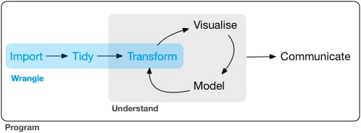
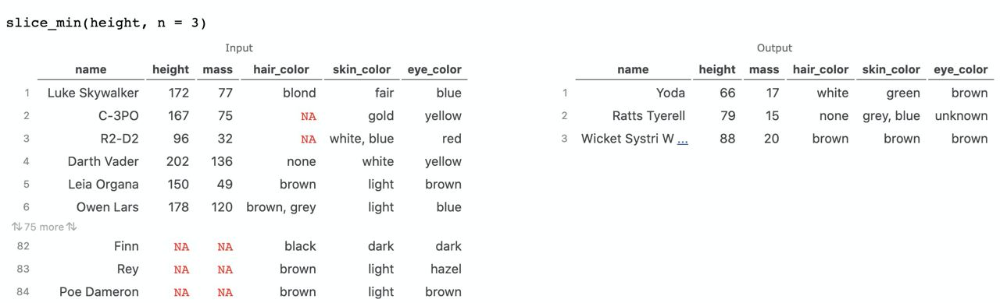
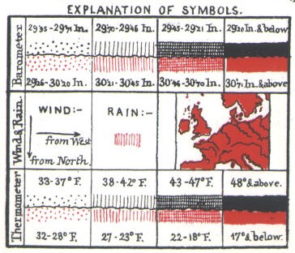
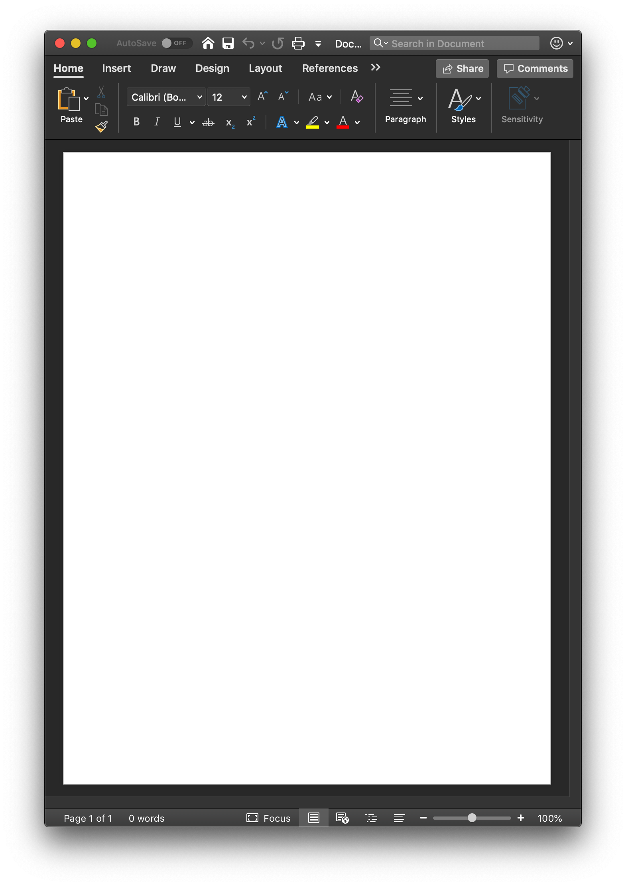

```{r settings, include = FALSE}
options(htmltools.dir.version = FALSE)
knitr::opts_chunk$set(fig.retina = 3, out.width = "100%", cache = FALSE,
                      comment = ">", echo = TRUE, message = FALSE,
                      warning = FALSE, hiline = TRUE, dpi = 100)

# xaringan Extra
# devtools::install_github("gadenbuie/xaringanExtra")
library(xaringanExtra)
library(ymlthis)
use_xaringan_extra(c("tile_view", "animate_css", "tachyons"))
use_tile_view() # panel
# xaringanExtra::use_scribble() # scribble
use_extra_styles(hover_code_line = TRUE,
                 mute_unhighlighted_code = FALSE) # Hover triangle code line
use_clipboard( # About clipboard
  button_text = "Click para copiar código",
  success_text = "Código copiado",
  error_text = "Ctrl+C para copiar"
)
use_freezeframe(responsive = FALSE) # restarting gifs
use_animate_all("fade") # animates
use_panelset() # panels 
xaringanExtra::use_share_again()

```


class: inverse, left, bottom
background-image: url("img/back1.jpg")
background-size: cover


# **`r rmarkdown::metadata$title`**
----

## **`r rmarkdown::metadata$author`**
### `r rmarkdown::metadata$author`
### `r rmarkdown::metadata$institute` | `r rmarkdown::metadata$date`


---


class: inverse, middle, center
background-color: #C0392B


<br><br>

.center[


### [PhD. Student. Orlando Joaqui-Barandica](https://www.joaquibarandica.com) <br/>
### Universidad del Valle
]

<br>


.center[

*PhD. Student in Engineering with emphasis in Engineering Industrial* 
 
*MSc. Applied Economics*
 
*BSc. Statistic*


`r icon::fa("link", animate = "spin")` [www.joaquibarandica.com](https://www.joaquibarandica.com)

]


---


class: inverse center middle

# PRESENTACIÓN DEL CURSO


.left[Pulsa <kbd-black>O</kbd-black> para ver el panel de diapositivas]
.left[Pulsa <kbd-black>H</kbd-black> para ver otros atajos]

---


# Objetivos


¡Bienvenidos!

Tomen asiento, entren a la secta del **software libre** y dejen a Excel en la entrada..

.pull-left[

El **objetivo** del curso no es ser un/a experimentado/a programador/a de `R`, sino adquirir los suficientes conocimientos como para lograr 5 objetivos:


- **Perder el miedo** a programar.
- Entender los [**conceptos básicos de R**](https://cran.rstudio.com/), lenguaje estadístico por excelencia, desde cero.
- Dotarnos de **autonomía en el análisis** de datos.
- Crear programas y flujos de trabajo **reproducibles** y mantenibles.
- Adquirir habilidades en la **visualización de datos** en `R` (haciendo uso también de otras herramientas como [**Datawrapper**](https://www.datawrapper.de/)), incluyendo la visualización de datos en **mapas**.

]

.pull-right[


]


📚 Estas **diapositivas** han sido elaboradas con el propio `R` haciendo uso del paquete `{xaringan}`
y `{xaringanExtra}`.


---

class: inverse middle
background-color: #C0392B

### 👉 BLOQUE I. Introducción a R desde cero

* Instalación de R y RStudio. Primeros pasos. Tipos de datos.
* Datos estructurados: matrices y data.frame
* Extras: estructuras de control, proyectos


### 👉 BLOQUE II. Introducción a tidyverse

* Funciones
* Tibbles y tidy data
* Introducción a tidyverse. Relacionando datos (joins).

### 👉 BLOQUE III. Introducción al dataviz en R

* Dataviz: introducción histórica.
* Introducción a ggplot2
* Dataviz: la importancia de visualizar datos.
* Profundizando en ggplot2

### 👉 BLOQUE IV. Comunicando resultados

* Introducción a rmarkdown.


---

class: inverse center middle

# Bloque I: Introducción a R desde cero.

&nbsp;

.left[

### 👉 [Instalación y primeros pasos](#instalacion-primeros-pasos)

### 👉 [Celdas: tipos de datos](#tipos-datos)

### 👉 [Columnas: vectores](#vectores)

### 👉 [Tablas: estructuras de datos](#matrices-dataframes)

### 👉 [Extras: estructuras de control](#estructuras)

]

---

name: instalacion-primeros-pasos
class: center, middle

# Instalación y primeros pasos

## **Instalación de R**

&nbsp;

Programaremos como escribimos un libro: necesitamos una **gramática** (`R`) y un **Word** (`RStudio`).

---

# Requisitos del curso

Para el presente curso los únicos **requisitos** serán:

1. **Conexión a internet** (para la descarga de algunos datos y paquetes).

2. **Instalar R**: será nuestro **lenguaje**, nuestro **castellano** para poder «comunicarnos con el ordenador. La descarga la haremos (gratuitamente) desde <https://cran.r-project.org/>

3. **Instalar R Studio**. De la misma manera que podemos escribir castellano en un ordenador, en un Word, en un papel o en un tuit, podemos usar distintos IDE (entornos de desarrollo integrados, nuestro Office), para que el trabajo sea más cómodo. Nuestro **Word** para nosotros será **RStudio**.

.left[
  
]
.right[
  
]

---

# Instalación de R

El **lenguaje de programación R** será nuestra **gramática**, nuestra ortografía y nuestro diccionario

&nbsp;


* **Paso 1**: entra en la [web oficial de R](https://cran.r-project.org/) y selecciona la instalación acorde a tu sistema operativo.

* **Paso 2**: para **Mac** basta con que hacer click en el archivo **.pkg**, y abrirlo una vez descargado. Para sistemas **Windows**, debemos clickar en `install R for the first time` y en la siguiente pantalla hacer click en `Download R for Windows`. Una vez descargado, **abrirlo como cualquier archivo de instalación**.

* **Paso 3**: abrir el **ejecutable** de tu escritorio o en tu Launchap (en Windows puede que tengas dos ejecutables i386 y x64, la versión de 32 y de 64 bits; haz click preferiblemente en el de x64).

---

# Primera operación

Para comprobar que se ha instalado correctamente, tras abrir `R`, deberías ver una **pantalla blanca** similar a esta (en realidad se llama **consola**)


Vamos a escribir **nuestra primera operación** en la consola:

* Una variable llamada `a` le asignaremos el valor `1`. En `R` asignaremos valores con `<-`, como una flecha: `a <- 1` significa que a una variable que llamamos a le asignamos el valor 1.

* Una variable llamada `b` le asignaremos el valor `2`.

* **Sumamos las variables** haciendo `a + b`.

```{r eval = FALSE}
# Primera operación
a <- 1 # Una variable a con valor --> 1
b <- 2 # Una variable b con valor --> 2
a + b #<<
```

El **resultado** que nos devuelve la consola será 3 (2 + 1).

```{r echo = FALSE}
a <- 1
b <- 2
a + b
```


---

# Instalación de R Studio

El **Word**  que usaremos para trabajar y escribir en nuestro lenguaje será **RStudio** (lo que se conoce como un IDE: entorno integrado de desarrollo).

&nbsp;


* **Paso 1**: entra la [web oficial de RStudio](https://www.rstudio.com/products/rstudio/download/#download) y selecciona la descarga gratuita.

* **Paso 2**: selecciona el ejecutable que te aparezca acorde a tu sistema operativo. 

* **Paso 3**: tras descargar el ejecutable, hay que abrirlo como otro cualquier otro ejecutable y dejar que termine la instalación.


---

# Organización de RStudio


&nbsp;


* **Consola**: es el nombre para llamar a la ventana grande que te ocupa buena parte de tu pantalla. Prueba a escribir el mismo código que antes (la suma) en ella. La consola será donde **ejecutaremos órdenes y mostraremos resultados**.

* **Environment (entorno de variables)**: la pantalla pequeña (puedes ajustar los márgenes con el ratón a tu gusto) que tenemos en la parte superior derecha. Nos mostrará las **variables que tenemos definidas, el tipo y su valor**.

* **Panel multiusos**: la ventana que tenemos en la parte inferior derecha no servirá para buscar **ayuda de funciones**, además de para **visualizar gráficos**. 


---

# Tips de RStudio: modo oscuro


**Consejo**: cambiar en tu `RStudio` la tonalidad del fondo de tu programa, en tonos oscuros y no blancos.

---

# ¿Qué es R?


&nbsp;


`R` es un **lenguaje estadístico**, creado por y para la estadística, con 4 ventajas fundamentales:


* **Software libre** (como C++, Python, Fortran, y otros tantos lenguajes). El software libre no solo tiene una ventaja evidente (es gratis, ok) sino que permite **acceder libremente a código ajeno**.

* **Lenguaje modular**: en la instalación que hemos realizado no se han instalado todas las funcionalidades, solo el mínimo para poder funcionar, de forma que se ahorra espacio en disco y en memoria. Al ser software libre, existen trozos de **código hechos por otras personas llamados paquetes**, que podemos ir instalando a nuestro gusto según los vayamos necesitando.

--

* **Gran comunidad de usuarios**: `R` tiene una comunidad de usuarios gigante para hacer estadística (Python tiene una enorme comunidad pero más enfocada al Machine Learning), con más de 18 000 paquetes.

--

* **Lenguaje de alto nivel**. Los lenguajes de alto nivel, como `R` o `Python`, facilitan la programación al usuario, teniendo que preocuparte solo de la tarea de programar. Son lenguajes con una menor curva de aprendizaje aunque suelen ser más lentos en su ejecución en comparación con lenguajes de bajo nivel (`C`, `C++` o `Fortran`).

---

class: inverse center middle

COMPRAR un libro --> instalar un paquete (una sola vez) `install.packages()`
<figure>

</figure>

SELECCIONAR un libro (ya comprado) --> acceder a un paquete ya instalado (en cada sesión que queramos usarlo) `library()`
<figure>

</figure>


---

# Paquetes en R

Como hemos mencionado, existen trozos de **código hechos por otras personas llamados paquetes**, que podemos ir instalando a nuestro gusto según los vayamos necesitando.


&nbsp;


A lo largo del curso usaremos varios de esos paquetes, pero el más importante para nuestro objetivo es el paquete `{ggplot2}`, un paquete para la **elaboración de visualizaciones de datos**. Vamos a instalarlo (necesitamos internet para ello) con la orden `install.packages("ggplot")`

```{r eval = FALSE}
install.packages("ggplot2")
```


&nbsp;


La **instalación de un paquete** es el equivalente a comprar a un libro: solo lo debemos hacer **la primera vez** que lo usemos en un ordenador (descargándose los archivos del paquete a nuestro local). Una vez que tenemos comprado nuestro libro, para poder usarlo, simplemente debemos **indicar al programa que nos lo acerque de la estantería** con `library(ggplot2)`.

```{r eval = FALSE}
library(ggplot2)
```

---

class: center middle

# ¿Por qué no usar Excel?


---

class: inverse center middle

# ¿Por qué no usar Excel?


Excel es una excelente cuchara: puedes ser el mejor partiendo un filete con una cuchara, pero seguirás siendo una persona comiendo filete con cuchara.

---

# ¿Por qué no usar Excel?

Excel es una **hoja de cálculo**, ni más ni menos, y el propio **Microsoft desaconseja el uso de Excel para el análisis de datos**. El Excel es una herramienta maravillosa para ser usada como una sencilla hoja de cálculo:

* Llevar las cuentas de tu familia.
* Una declaración de Renta sencilla.
* Planificar viajes

&nbsp;

**NO ESTÁ DISEÑADO** para ser una base de datos, y muchos menos pensado para generar un entorno flexible para el análisis estadístico y la visualización de datos, con algunas desventajas:


* **Software de pago** (bien por el usuario, bien por la administración o empresa).

* **Software cerrado**: solo podemos hacer lo que Excel ha creído que interesante que podamos hacer. Incluso con la programación de macros, las funcionalidades de Excel siguen siendo mucho más limitadas

* **Alto consumo de memoria**.

* **No es universal**: no solo es de pago sino que además, dependiendo de la versión que tengas de Excel, tendrá un formato distinto para datos como fechas, teniendo incluso extensiones distintas.

---


# Epic fails en Excel


.pull-left[


]

.pull-right[


&nbsp;


## Problemas de **versiones**


&nbsp;


&nbsp;


## Problemas de **memoria**


&nbsp;


## Problemas de **codificación**


]

---


# Primeros pasos en R: calculadora

Empecemos por lo sencillo: **¿cómo usar R como una calculadora?** Si escribimos `2 + 1` en la consola y pulsamos ENTER, la consola nos mostrará el resultado de la suma.

```{r}
2 + 1
```

--

Si dicha suma la quisiéramos utilizar para un segundo cálculo: ¿y si la **almacenamos en alguna variable**? Por ejemplo, vamos a guardar la suma en una variable `x`

```{r}
x <- 2 + 1 #<<
```

--

Si te fijas ahora `x` aparece definida en nuestro **panel `environment`**, y puede ser usada de nuevo

```{r}
x + 3
```


---

# Primeros pasos en R: calculadora

### Multiplicación

```{r eval = FALSE}
x * y
```

### Elevar al cuadrado

```{r eval = FALSE}
x^2
```

### Valor absoluto

```{r eval = FALSE}
abs(x)
```

--

##  Errores

Durante tu aprendizaje va a ser **muy habitual que las cosas no salgan a la primera**, ni siquiera a la décima, apareciendo en consola mensajes en un color rojo. A **programar se aprende programando**, así que haz las pruebas que quieras: lo peor que puede pasar es que tengas que reiniciar `R`.

---

# Mensajes de «error»


* **Mensajes de ERROR**: irán precedidos de la frase **«Error in…»**, y serán aquellos **fallos que impidan la ejecución del código** (un error muy habitual es intentar acceder a funciones de algún paquete sin tenerlo instalado: estás intentando leerte un libro de tu biblioteca pero ni siquiera has ido a la tienda a «comprarlo»). Veamos un ejemplo intentando **sumar un número a un texto**.

```{r error = TRUE}
"a" + 1
```

&nbsp;

* Mensajes **WARNING**: irán precedidos de la frase **«Warning in…»**, y son los fallos más delicados ya que son posibles incoherencias pero que no van a hacer que tu código deje de ejecutarse.

```{r warning = TRUE}
sqrt(-1)
```


**¿Ha ejecutado la orden?** Sí, pero te advierte de que el resultado de la operación es un NaN, **Not A Number**, un valor que no existe (al menos dentro de los números reales).


---

# ¿Dónde programamos? Script

Un **script** será el documento en el que programamos, nuestro equivalente a un archivo `.doc`, pero aquí será un archivo con extensión `.R`, donde escribiremos las órdenes.

&nbsp;

Es **importante no abusar de la consola**: todo lo que no escribas en un script, cuando cierres `RStudio`, lo habrás perdido (cómo si en lugar de escribir en un Word y guardarlo, nunca guardases el documento).

&nbsp;

Para **abrir nuestro primero script**, haz click en el menú superior en `File << New File << R Script`.


---

# Ejecutar nuestros scripts

Ahora tenemos una **cuarta ventana**: la ventana donde **escribiremos nuestros códigos**

&nbsp;

### **¿Cómo ejecutar nuestro script?**


1. Escribimos el código que queremos ejecutar (en este caso, la suma de antes).

2. Guardamos el archivo `.R` haciendo click en el botón de guardar (`Save current document`)

3. El código **no se ejecuta salvo que se lo indiquemos**. Tenemos tres opciones:

  - **Copiar y pegar en consola** el código.
  - **Seleccionar las líneas de código** a ejecutar y clickar en `Run` (o con su atajo).
  - Activar el cuadrado `Source on save` a la **derecha del botón de guardar**: no solo se nos guarda sino que se ejecuta el código completo.


---

# Primeros ejercicios: trasteando con la consola


.panelset[
.panel[.panel-name[Ejercicios]


* 📝 **Ejercicio 1**: el código inferior define una variable `a` al que le asigna el valor `2`. Añade debajo otra línea para definir una variable `b` con el valor `5`. Tras asignarles valores, multiplica los números en consola.

```{r}
a <- 2
```

* 📝 **Ejercicio 2**: modifica el código inferior para definir dos variables `c` y `d`, con valores 3 y -1.

```{r eval = FALSE}
c <- # deberías asignarle el valor 3
d <- # deberías asignarle el valor -1
```

* 📝 **Ejercicio 3**: con las variables `a` y `b` del ejercicio 1, crea una nueva variable `e` guardando el resultado de su multiplicación `a * b`. Escribe `e` en consola para ver su resultado

]

.panel[.panel-name[Solución ej. 1]

```{r}
# Para poner comentarios en el código se usa #

# Definición de variables
a <- 2
b <- 5

# Multiplicación
a * b
```
]

.panel[.panel-name[Solución ej. 2]

```{r}
# Definición de variables
c <- 3
d <- -1
```
]

.panel[.panel-name[Solución ej. 3]

```{r}
# Variables
a <- 2
b <- 5

# Resultado
e <- a * b

# Muestro en consola
e
```


]
]


---
name: tipos-datos
class: center, middle

# Tipos de datos 

## **De la celda a la tabla**

&nbsp;

¿De qué tipo pueden ser los datos que tenemos contenidos en cada celda de una «tabla»?

---

# Datos: de la celda a la tabla


* **Celda**: un **dato individual** de un tipo concreto.
* **Variable**: **concatenación de datos** del mismo tipo.
* **Matriz**: **concatenación de variables** del **mismo tipo** y longitud.
* **Tabla**: **concatenación de variables** de **distinto tipo** pero igual longitud.

---

# Celdas: tipos de datos individuales

**¿Existen variables más allá de los números?**


&nbsp;

Piensa por ejemplo en los **datos guardados de una persona**:

* La edad o el peso será un **número**.
* Su nombre será una cadena de **texto**.
* Su fecha de nacimiento será precisamente eso, una **fecha**.
* A la pregunta «¿está usted soltero/a?» la respuesta será lo que llamamos una **variable binaria o lógica** (`TRUE` si está soltero/a o `FALSE` en otro caso).


---

# Variables numéricas

El **dato más sencillo**, dato que ya hemos usado en nuestros primeros pasos como calculadora.

```{r eval = FALSE}
a <- 1
b <- 2
a + b
```

En el código anterior, tanto `a` como `b`, como la suma `a + b` **son de tipo numérico** (podemos comprobarlo con `class()`)

```{r}
# Clase de las variables
class(a) #<<
```

**Operaciones**: con los datos numéricos podemos realizar todas las **operaciones aritméticas** que se nos ocurriría hacer en una **calculadora**.

```{r}
b <- 5
b^3
```


---

# Variables de texto

No solo de números viven los datos: imagina que además de la edad de una persona queremos **guardar su nombre**.

```{r}
edad <- 32
nombre <- "Juanito" #<<
```

&nbsp;

La variable `nombre` es de **tipo caracter**: una **cadena de texto** (conocido en otros lenguajes como string o char) que va **SIEMPRE ENTRE comillas**.

```{r}
class(nombre) #<<
```

Las cadenas de texto son un **tipo especial de dato** con los que obviamente no podremos hacer operaciones aritméticas, pero si podemos hacer **otras operaciones** como pegar cadenas de texto o localizar patrones de letras dentro de ellas.

---

# Nuestra primera función: paste

Una **función** es un **trozo de código encapsulado bajo un nombre**, en función de unos **argumentos de entrada**. Nuestra primera función será `paste()`: dadas **dos cadenas de texto como argumento de entrada** nos permite pegarlas, indicándole en el **argumento** `sep = ` el caracter que queremos entre medias.

```{r}
# todo junto, sin espacios, igual a paste0("Juanito", "Perez")
paste("Juanito", "Perez", sep = "") 
```

```{r}
paste("Juanito", "Perez") # separados por un espacio
```

```{r}
paste("Juanito", "Perez", sep = ".") # separados por un punto .
```

&nbsp;

**Argumentos por defecto**: `paste(nombre, apellido)` es equivalente a `paste(nombre, apellido, sep = " ")`. El argumento `sep` tiene un **valor por defecto** `sep = " "`: si no se le asigna otro, tomará ese por defecto.

---

# Nuestro primer paquete: glue

Otra forma **más intuitiva de trabajar con textos** es usar el **paquete** `{glue}`.


```{r eval = FALSE}
install.packages("glue") # solo la primera vez
library(glue)
```

```{r echo = FALSE}
library(glue)
```

Recuerda que `install.packages()` es solo necesario la primera que «compramos el libro»: cada vez que queramos usarlo bastará con `library()`.

&nbsp;

Con dicho paquete podemos **usar variables dentro de cadenas de texto**. Por ejemplo, vamos a crear «la edad es de ... años», donde la edad concreta la tenemos guardada en una variable `edad`.

```{r}
edad <- 32
glue("La edad es de {edad} años")
```

---

# Variables lógicas

Una **variable lógica, binaria o booleana** es aquella que **solo puede tomar dos valores** (en realidad pueden tomar un tercer valor, ausente):

* `TRUE`, **verdadero**, guardado internamente como un 1.
* `FALSE`, **falso**, guardado internamente como un 0.

```{r}
soltero <- TRUE # ¿Es soltero? --> SÍ
class(soltero)
```

&nbsp;

**NO son variables de texto**: "TRUE" es un texto (como rojo o azul), `TRUE` es una valor lógico.

```{r error = TRUE}
TRUE + 1
"TRUE" + 1
```

---

# Condiciones lógicas

Los valores lógicos suelen ser **resultado de evaluar condiciones lógicas**. Por ejemplo, imaginemos que queremos comprobar si una persona está o no soltero, con el **operador lógico** `==` (¿lo de la izquierda es igual a lo de la derecha) y su opuesto `!=` (distinto de).

```{r}
soltero <- TRUE # persona soltera
soltero == TRUE # ¿está soltero?
soltero != TRUE # ¿no está soltero?
```


Es importante **distinguir** una asignación con `<-` (una variable pasará a tener almacenado dicho valor) a una **comparación lógica** con `==` (no estamos asignando nada, estamos preguntando si la parte de la izquierda es igual a la de la derecha).

---

# Condiciones lógicas


Por el mismo razonamiento podemos **comparar si una variable numérica** cumple una condición.

**¿Tiene la persona menos de 32 años?**

```{r}
edad <- 38 #<<
edad < 32 # ¿Es la edad menor de 32 años?
```

Además de las comparaciones «igual a»  frente «distinto», también comparaciones de orden como `<, <=, > o >=`.

```{r}
edad <= 38
edad > 38
```

---

# Combinar condiciones lógicas

Las **condiciones lógicas pueden ser combinadas**, principalmente de dos maneras:

* **Intersección**: **todas** las condiciones concatenadas se deben cumplir (conjunción y, operador `&`) para devolver un `TRUE`.

* **Unión**: basta con que **una** de las condiciones concatenadas se cumpla (conjunción o, operador `|`) para devolver un `TRUE`.

&nbsp;

Ejemplo: podríamos preguntarnos si la persona tiene menos de 32 años y está soltero (AMBAS deben cumplirse).

```{r}
edad < 32 & soltero
```

El resultado es `FALSE` ya que solo se cumple una de las condiciones. Si nos bastase con una («¿está soltero y/o tiene menos de 32 años?»), el valor devuelto sería `TRUE`

```{r}
edad < 32 | soltero
```

---

# Variables de tipo fecha

Las **variables de tipo fecha** son de un tipo muy especial: no son una simple cadena de texto "2021-04-21", representan un **instante temporal**.

```{r error = TRUE}
# Cadena de texto
fecha_char <- "2021-04-21"
fecha_char + 1
```

Para **convertirlo a una fecha** podemos usar la función `as.Date()` 

```{r}
fecha_date <- as.Date("2021-04-21")
fecha_date 
fecha_date + 1
```

Dado que internamente es un número, **podemos restar fechas** (días entre ambas), podemos sumar números a fechas (fecha días después), etc.

```{r}
as.Date("2021-04-21") - as.Date("2021-02-15")
```

---

# Funcionalidades de fechas

**¿Cómo obtener automáticamente la fecha de hoy?**

```{r}
Sys.Date()
```

&nbsp;

**¿Cómo convertir una cadena de texto a fecha?** Basta usar la función `as.Date()`, pasándole como argumento la fecha y su formato .

```{r}
as.Date("10-03-2020", "%d-%m-%Y") # con día-mes-año (4 cifras)
as.Date("10-03-20", "%d-%m-%y")  # con día-mes-año (2 cifras)
```


Dentro del **paquete `{lubridate}` tenemos bastantes **funciones útiles** para trabajar con fechas como las siguientes.

---

# Paquete lubridate: fechas

En `R` tenemos un paquete muy útil para el manejo de fechas, el paquete `{lubridate}`

```{r eval = FALSE}
install.packages("lubridate") # solo la primera vez
library(lubridate)
```

```{r echo = FALSE}
library(lubridate)
```

Con `today()` por ejemplo podemos obtener directamente la fecha actual.

```{r}
today()
```

Con `now()` puedes obtener la fecha y hora actual.

```{r}
now()
```

---

# Paquete lubridate: fechas

Con `year()`, `month()` o `day()` podemos extraer el año, mes y día de un dato en tipo fecha.

```{r}
fecha <- today()
year(fecha)
month(fecha)
day(fecha)
```

También tenemos funciones como `ymd()` o `my()` para **convertir texto o números** a datos de tipo **fecha**.

```{r}
ymd(20170131)
my("jan-2021")
```

---

# Paquete lubridate: fechas

```{r lubridate-cht, echo = FALSE,  out.width = "97%", fig.align = "center", fig.cap = "Imagen extraída de https://lubridate.tidyverse.org/"}
knitr::include_graphics("https://raw.githubusercontent.com/rstudio/cheatsheets/main/pngs/thumbnails/lubridate-cheatsheet-thumbs.png")
``` 


---

# Paquete stringr

El **paquete `{stringr}`** permite un **manejo más complejo de cadenas de texto** (como el uso de **expresiones regulares**).

```{r stringr-cht, echo = FALSE,  out.width = "87%", fig.align = "center", fig.cap = "Imagen extraída de https://stringr.tidyverse.org/"}
knitr::include_graphics("https://dadosdelaplace.github.io/courses-ECI-2022/img/stringr.png")
``` 

---

# Tips

Si haces click en la consola y pulsas la flecha «arriba» del teclado, te irá apareciendo todo el **historial de órdenes ejecutadas**. Es una manera de ahorrar tiempo para ejecutar órdenes similares a las ya ejecutadas. Si empiezas a escribir el nombre de una variable pero no te acuerdas exactamente de su nombre, pulsando tabulador te autocompletará solo.

&nbsp;

Siempre que veas el símbolo `>` como última línea en la consola significa que está listo para que le escribamos otra orden.


---

# Ejercicios

.panelset[
.panel[.panel-name[Ejercicios]

* 📝 **Ejercicio 1**: define una variable que guarde tu edad y otra con tu nombre

* 📝 **Ejercicio 2**: define otra variable que responda la pregunta «¿tengo hermanos?» y otra con la fecha de tu nacimiento.
 

* 📝 **Ejercicio 3**: define otra variable con tus apellidos. Junta con `paste()` o `glue()` las variables `nombre` y `apellidos` en una sola variable `nombre_completo`.
 

* 📝 **Ejercicio 4**: calcula los días que han pasado desde la fecha de tu nacimiento, haciendo la resta entre la fecha de hoy (`today()`) y la fecha de nacimiento definida en el ejercicio 2. 
 

* 📝 **Ejercicio 5**: obtén una variable lógica que nos diga si se cumplen (todas) las condiciones i) menor de 30 años (`edad < 30`); ii) con hermanos (`hermanos == TRUE`); iii) nacido en 1990 o posterior (`fecha_nacimiento >= as.Date("1990-01-01")`).

* 📝 **Ejercicio 6**: modifica el código del ejercicio anterior para obtener una variable lógica que nos diga si se cumplen (al menos) ALGUNA de las condiciones.
]

.panel[.panel-name[Solución ej. 1]

```{r}
edad <- 32 # tipo numeric
class(edad)

nombre <- "Juanito" # tipo caracter
class(nombre)
```
]

.panel[.panel-name[Solución ej. 2]

```{r}
hermanos <- TRUE # tipo hermanos
class(hermanos)

fecha_nacimiento <- as.Date("1989-09-10") # tipo fecha
class(fecha_nacimiento)
```

]

.panel[.panel-name[Solución ej. 3]

```{r}
# Nombre
nombre <- "Juanito"
# Apellidos
apellidos <- "Perez Liébana"

# Pegamos
library(glue)
nombre_completo <- glue("{nombre} {apellidos}")
nombre_completo

# Otra forma
nombre_completo <- paste(nombre, apellidos)
nombre_completo
```
]

.panel[.panel-name[Solución ej. 4]

```{r}
library(lubridate)
fecha_nacimiento <- as.Date("1989-09-10")
today() - fecha_nacimiento
```
]

.panel[.panel-name[Solución ej. 5]

```{r}
# Se tienen que cumplir todas
edad < 30 & fecha_nacimiento >= as.Date("1990-01-01") & hermanos

# otra forma
edad < 30 & fecha_nacimiento >= as.Date("1990-01-01") & hermanos == TRUE
```

]

.panel[.panel-name[Solución ej. 6]

```{r}
# Se tienen que cumplir todas
edad < 30 | fecha_nacimiento >= as.Date("1990-01-01") | hermanos
```
]
]


---

name: vectores
class: center, middle

# Vectores


## **Variables: colección de datos individuales de igual tipo**

&nbsp;

¿Cómo **concatenar** edades de varias personas? ¿Cómo ordenarlas?

---

# Vectores: concatenar elementos

Los **vectores o arrays** no son más que una **concatenación de elementos del mismo tipo** (de hecho un número individual `x <- 1` es en realidad un vector de longitud uno).

Los crearemos con `c()` (c de concatenar), con sus **elementos entre paréntesis y separados por comas**. 

```{r}
edades <- c(32, 27, 60, 61)
edades
```


La **longitud de un vector** se puede calcular con `length()`

```{r}
length(edades)
```

Dado que un número y un vector es lo mismo (con distinta longitud), podemos **concatenar a vectores uno tras otro**.

```{r}
c(edades, edades, 8)
```


---

# Secuencias numéricas

Es habitual **crear vectores numéricos con un patrón** repetido. Hay un **atajo**: `seq()` nos permite crear una **secuencia desde un elemento inicial hasta un elemento final**, avanzando de uno en uno.

```{r}
seq(1, 11) # secuencia desde 1 hasta 11 de 1 en 1 (equivalente: 1:11)
11:1 # orden inverso
```

También podemos definir **otro tipo de distancia entre dos elementos consecutivos**

```{r}
seq(1, 7, by = 0.5) # secuencia desde 1 a 7 de 0.5 en 0.5
```

Otras veces nos interesará definir una secuencia con un **número concreto de elementos**.

```{r}
seq(1, 50, l = 7) # secuencia desde 1 a 50 de longitud 11
```

---

# Secuencias numéricas

**Vectores repetidos**: otro atajo, para definir vectores de elementos repetidos, es la función `rep()` nos permite repetir un elemento un número fijado de veces.

```{r}
rep(0, 7) # vector de 7 ceros
```

No solo podemos repetir un número sino que podemos **repetir vectores enteros**.

```{r}
rep(c(0, 1, 2), 4) # repetimos el vector c(0, 1, 2) 4 veces
```

Esa repetición además podemos definirla también de **forma intercalada**

```{r}
rep(c(0, 1, 2), each = 4) # cuatro 0, luego cuatro 1, luego cuatro 2
```

---

# Vectores de texto


El concepto de vectores **no solo atañe a los números**

```{r}
mi_nombre <- c("Mi", "nombre", "es", "Juanito")
mi_nombre
```

Cuando tenemos un vector de caracteres podemos colapsarlos con `paste()`, esta vez con `collapse = ...`

```{r}
paste(mi_nombre, collapse = ".") # separados por un punto .
```

Podemos también combinar vectores numéricos con caracteres.

```{r}
glue("persona_{1:5}") # separado por una barra baja
```

---

# Vectores lógicos

Los **vectores lógicos** suelen aparecer de nuevo como la evaluación de condiciones lógicas.  Por ejemplo, si definimos el vector `x <- c(1.5, -1, 2, 4, 3, -4)`, ¿qué numeros de x son menores que 2?

```{r}
x <- c(1.5, -1, 2, 4, 3, -4)
x < 2 
``` 

El primer, segundo y sexto elemento del vector son los únicos elementos (estrictamente) menores que 2, de ahí que en el primer, segundo y sexto elemento aparezca un TRUE y en el resto un FALSE.

&nbsp;

Al igual que antes, las condiciones pueden ser **combinadas**

```{r}
x <- c(1.5, -1, 2, 4, 3, -4)
x < 3 & x > 0 # Solo los que cumplen ambas condiciones
```

---

# Datos ausentes

* **NA** (not available): valores que no tenemos (por ejemplo, el dato de contagios covid los fines de semana).

```{r}
x <- c(1, NA, 3, NA, NA, 5, 6) # Vector numérico con datos faltante
x
2 * x
```

--

* **NaN** (not a number): resultado no permitido

```{r}
sqrt(-1)
```

```{r}
x <- c(1, NA, 3, 4, 6, 7, NaN, NA)
is.na(x)
```

---

# Operaciones aritméticas con vectores

Toda **operación aritmética** que podamos hacer con un número la vamos a poder a hacer con un vector de números: la operación se realizará en **CADA ELEMENTO** del vector (en otros lenguajes no siempre es así).

```{r}
# Multiplicamos por 2 a CADA ELEMENTO del vector
z <- c(2, 4, 6)
2 * z
```

De la misma manera se pueden definir **sumas** de vectores.

```{r}
x <- c(1, 3, 5)
x + z
```

--

Dado que los valores lógicos son guardados internamente como `0/1`  podemos usar operaciones aritméticas con ellos.

```{r}
x <- c(1, 3, 5)
sum(x < 2) # sumamos el vector lógico --> número de valores TRUE
```

---

# Operaciones estadísticas con vectores
 
También podemos realizar **operaciones estadísticas** como la suma, la media o la mediana.

```{r}
y <- c(1, -4, 5, 0, 7)
sum(y)  # suma
mean(y) # media
```

**IMPORTANTE**: las operaciones con ausentes darán como resultado ausente (salvo que los eliminemos antes con `na.rm = TRUE`).

```{r error = TRUE}
y <- c(1, 2, NA, -5, 0)
sum(y)
sum(y, na.rm = TRUE)
```


---

# Seleccionar elementos

¿Y si del vector original queremos **EXTRAER UN SUBCONJUNTO**? La forma más sencilla es **acceder al elemento i-ésimo** con el operador de selección `[i]`, o en base a una **condición lógica**


```{r}
edades <- c(20, 30, 32, NA, 61)
edades[3] # accedemos a la edad de la tercera persona
edades[c(3, 4)] #<<
edades[edades > 30]
```

Otras veces no querremos seleccionar un elemento sino **filtrarlo**, con el operador `[-i]`

```{r}
edades[-1]
```


---

# Nombrando vectores


`R` nos permite dar **significado léxico a nuestros datos**, pudiendo poner **nombres a los elementos** de un vector.

```{r}
x <- c("edad" = 31, "tlf" = 613910687, "cp" = 33007) # cada número tiene un significado distinto
x
```

Esto es una ventaja ya que nos permite su **selección usando dichos nombres**: los números ya representan algo.

```{r}
x[c("edad", "cp")] # seleccionamos los elementos que tienen ese nombre asignado
```

Con la función `names()` podemos, no solo consultar sino cambiar los nombres.

```{r}
names(x) # Consultamos nombres antiguos
names(x) <- c("años", "móvil", "dirección") # Cambiamos nombres
```

---

# Ordenar vectores

Una acción **muy habitual** es **ordenar los datos**: de menor a mayor edad, datos más recientes vs antiguos, etc. Para ello tenemos la función `sort()`: vamos a ordenar, por ejemplo, una colección de edades.

```{r}
edades <- c(81, 7, 25, 41, 65, 20, 32, 23, 77)
sort(edades) # orden de joven a mayor
```

Por defecto `sort()` ordena de menor a mayor: con `decreasing = TRUE` podemos ordenar de mayor a menor.

```{r}
sort(edades, decreasing = TRUE) 
```

Otra forma de ordenar un vector es **pedirle nos devuelva los índices de los elementos ordenados** con `order`, y luego usar dichos índices.

```{r}
x <- c(7, 1, 2, 6)
x[order(x)]
```

---

# Ejercicios con vectores

.panelset[
.panel[.panel-name[Ejercicios]

* 📝 **Ejercicio 1**: modifica el código inferior para crear un vector de nombre `vector_num` que contenga los números 1, 5 y -7.

```{r eval = FALSE}
# Vector de números
vector_num <- c(1)
```

* 📝 **Ejercicio 2**: define un vector que contenga los números `1, 10, -1 y 2`, y obtén su longitud.
 

* 📝 **Ejercicio 3**: crea un vector con las palabras "Hola", "me", "llamo" (y tu nombre y apellidos), y pega luego sus elementos de forma que la frase esté correctamente escrita en castellano. Tras hacerlo, añade "y tengo 30 años".
 
 
* 📝 **Ejercicio 4**: crea una secuencia que empiece en 1 y recorra todos los naturales hasta el 10. Después crea otra secuencia de longitud 7 en la que todos los números sean 3.
 

* 📝 **Ejercicio 5**: crea un vector con las edades de cuatro conocidos o familiares. Tras ello, determina cuáles de ellos tienen menos de 20 años, 30 años o más, menos de 40 años y más de 65 años.

]

.panel[.panel-name[Solución ej. 1]

```{r}
# Vector de números
vector_num <- c(1, 5, -7)
vector_num
```
]

.panel[.panel-name[Solución ej. 2]

```{r}
# Vector de números
vector_num <- c(1, 10, -1, 2)
length(vector_num)
```
]

.panel[.panel-name[Solución ej. 3]

```{r}
# Definiendo el vector
vector_char <- c("Hola", "me", "llamo", "Juanito",
                 "Perez", "Liébana")

# Pegamos
frase <- paste(vector_char, collapse = " ")
frase

# Añadimos frase
glue("{frase} y tengo 30 años.")
```
]

.panel[.panel-name[Solución ej. 4]

```{r}
1:10
rep(3, 7) # secuencia repetida de treses
```
]

.panel[.panel-name[Solución ej. 5]

```{r}
edades <- c(27, 32, 60, 61) # en mi caso, por ejemplo
edades < 20 # menos de 20 años
edades >= 30 # 30 años o más
edades < 40 # menos de 40 años
```
]
]


---

name: matrices-dataframes
class: center, middle


# Datos estructurados: colección de variables


## **matrices: igual tipo y longitud**

&nbsp;

## **data.frame o tabla: distinto tipo pero igual longitud**

---

# Datos estructurados: colección de variables


Ya sabemos:

✅ Los **tipos de datos** que puede contener una **celda**.

✅ Como **concatenar celdas** obteniendo variables (vectores, datos del mismo tipo).

Lo que haremos a continuación será **juntar esas variables**: bien del **mismo tipo** (matrices), bien de **distinto tipo** (`data.frame`), pero en cualquier caso de **igual longitud**.

---

# Matrices: variables del mismo tipo

Cuando analizamos datos solemos tener **varias variables distintas de cada individuo**. Necesitamos una «tabla» que una distintas variables (de IGUAL longitud). Las **matrices** son una **concatenación de variables, del mismo tipo e igual longitud**, dispuestas en columnas (normalmente cada fila representa un individuo y cada columna una variable). La concatenación en columnas la haremos con `cbind()`.

```{r}
estaturas <- c(150, 160, 170, 180)
pesos <- c(60, 70, 80, 90)
datos_matriz <- cbind(estaturas, pesos) # Construimos la matriz por columnas
datos_matriz # nuestra primera matriz
```

```{r echo = FALSE}
knitr::kable(datos_matriz)
```

---

# Matrices


También podemos **construir la matriz por filas** con `rbind()`, que nos permite **añadir filas a una matriz o construirla desde cero** (aunque lo habitual es tener cada variable en una columna y cada individuo en una fila).

```{r}
rbind(estaturas, pesos) # Construimos la matriz por filas
```

```{r echo = FALSE}
knitr::kable(rbind(estaturas, pesos))
```


--

Podemos **visualizar la matriz** en un formato «excelizado» con la función `View()`

```{r eval = FALSE}
View(datos_matriz)
```

---

# Matrices

.panelset[
.panel[.panel-name[Ejemplo] 

Veamos un ejemplo más jugoso para practicar: una matriz con las edades, teléfonos y códigos postales.


```{r}
edades <- c(14, 56, 31, 20, 68) # vector numérico de longitud 4
tlf <- c(NA, 683839390, 621539732, NA, NA)
cp <- c(33007, 28019, 37005, 18003, 28045)

# Construimos la matriz por columnas
datos_matriz <- cbind(edades, tlf, cp) 
datos_matriz
```
]

.panel[.panel-name[Añadir columna] 

Con `cbind()` también podemos **añadir una columna**

```{r}
cbind(datos_matriz, "estaturas" = c(160, NA, 181, 165, 173))
```
]

.panel[.panel-name[Dimensiones] 
Y podemos **ver sus dimensiones** con `dim()`, o por separado con `nrow()` y `ncol()`

```{r}
dim(datos_matriz)
c(nrow(datos_matriz), ncol(datos_matriz))
```

Dada una matriz también podemos **«darle vuelta»** (lo que se conoce como **matriz transpuesta**) con `t()`.

```{r}
t(datos_matriz)
```

]

.panel[.panel-name[matrix()] 

Igual que a veces es útil generar un vector de elementos repetidos, también podemos definir una **matriz de números repetidos** (por ejemplo, de ceros), con la función `matrix()`, indicándole el número de filas y columnas.

```{r}
matrix(0, nrow = 4, ncol = 2) # 4 filas, 2 columnas, todo 0's
```

También podemos **definir una matriz a partir de un vector numérico**, reorganizando los valores en forma de matriz, sabiendo que los elementos se van colocando por columnas.

```{r}
z <- matrix(1:15, ncol = 5) # Matriz con el vector 1:5 con 5 columnas (ergo 3 filas)
z
```

]

.panel[.panel-name[Operaciones] 

Con las matrices sucede como con los vectores: cuando **aplicamos una operación aritmética se la estamos aplicando elemento a elemento**, por ejemplo, dividir entre 5 o sumar una constante

```{r}
datos_matriz / 5
datos_matriz + 3
```
]

.panel[.panel-name[Otras matrices] 

También podemos **crear matrices de otros tipos de datos**, siempre y cuando las columnas sean del mismo tipo e igual longitud.

```{r}
nombres <- c("Juanito", "Carlos", "María", "Paloma")
apellidos <- c("Perez", "García", "Pérez", "Liébana")
cbind(nombres, apellidos)
```

]
]

---

# Matrices

Las matrices son objetos **bidimensionales**: para acceder a la **fila i-ésima** se usa el operador `[i, ]` (dejando el otro sin rellenar), para acceder a la **columna j-ésima** se usa el operador `[, j]`. Para acceder **conjuntamente al elemento (i, j)** se  `[i, j]`. También podemos **acceder por nombres de las columnas**.


```{r}
datos_matriz[2, 3]
datos_matriz[1, ] # fila 1
datos_matriz[, 3] # columna 3
datos_matriz[1, c("edades", "tlf")] # por nombres
```

---

# Ejercicios

.panelset[
.panel[.panel-name[Ejercicios]


* 📝 **Ejercicio 1**: modifica el código para definir una matriz x de ceros de 3 filas y 7 columnas.
 
```{r eval = FALSE}
# Matriz
x <- matrix(0, nrow = 2, ncol = 3)
x
```

* 📝 **Ejercicio 2**: a la matriz anterior, suma un 1 a cada número de la matriz y divide el resultado entre 5.
 
* 📝 **Ejercicio 3**: accede a toda la segunda fila de la matriz anterior. Accede a toda la tercera columna de la matriz anterior. Accede al elemento que ocupa la primera fila y la segunda columna.

]

.panel[.panel-name[Solución Ej. 1]

```{r}
# Matriz
x <- matrix(0, nrow = 3, ncol = 7)
x
```

]

.panel[.panel-name[Solución Ej. 2]

```{r}
(x + 1) / 5
```

]

.panel[.panel-name[Solución Ej. 3]

```{r}
x[2, ] # toda la segunda fila
x[, 3] # toda la tercera columna
x[1, 2] # primera fila y segunda columna
```

]

]
 
---

# data.frame: tablas

**¿Qué sucede si añadimos una columna con los nombres de cada persona en nuestra matriz `datos_matriz`?** En dicha matriz teníamos guardadas las edades, códigos postales y teléfonos de una serie de personas, todas ellas variables numéricas.

```{r}
nombres <- c("Sonia", "Carla", "Pepito", "Carlos")
datos_matriz_nueva <- cbind(nombres, datos_matriz)
datos_matriz_nueva
```

Como una **matriz SOLO puede tener un tipo de dato**, al añadir una variable de tipo texto, `R` se ha visto obligado a convertir los números en texto: hemos **roto la integridad** de los datos.

```{r, error = TRUE} 
datos_matriz_nueva[, "pesos"] + 1
```


---

# data.frame: tablas

El formato de tabla de datos en `R` que vamos a empezar a usar se llama `data.frame`, y no es más que una **colección de variables de igual longitud pero cada una puede ser de un tipo distinto**. Para crear un `data.frame` basta con usar la función `data.frame()`.

```{r}
# Nombres
nombres <- c("Sonia", "Carla", "Pepito", "Carlos")
# Edades
edades <- c(45, 67, NA, 31)
# Estado civil (no lo sabemos de una persona)
casado <- c(TRUE, FALSE, FALSE, NA)
# Fecha de creación (fecha en el que esa persona entra en el sistema)
# lo convertimos a tipo fecha
f_creacion <-
  as.Date(c("2021-03-04", "2020-10-12", "1990-04-05", "2019-09-10"))

# Creamos nuestro primer data.frame
tabla <- data.frame(nombres, edades, casado, f_creacion)
tabla
```

---

# data.frame: tablas

Al igual que con las matrices, podemos **crearlos** indicando además el **nombre de las columnas**.

```{r}
tabla <- data.frame("nombre" = nombres, "edad" = edades,
                    "casado" = casado, "fecha_registro" = f_creacion)
```


Si tenemos un `data.frame` ya creado podemos usar `data.frame()` también para añadir una columna.

```{r}
# Añadimos una nueva columna con nº de hermanos/as
tabla <- data.frame(tabla, "n_hermanos" = c(0, 0, 1, 5))
```

Con `View()` podemos **visualizar nuestra tabla**.

```{r eval = FALSE}
View(tabla)
```

```{r echo = FALSE}
knitr::kable(tabla)
```

---

# Selección de columnas y filas

Si queremos **acceder a una columna, fila o elemento** en concreto, los `data.frame` tienen las mismas ventajas que una matriz, así que bastaría con usar los mismos operadores.

```{r}
tabla[, 3] # Accedemos a la tercera columna
tabla[4, ] # Accedemos a la cuarta fila
```

No solo tiene las ventajas de una matriz si no que también tiene las ventajas de una **«base» de datos**: podemos **aceder a las variables** por su nombre poniendo el nombre de la tabla más el símbolo `$` y, con el tabulador, nos aparecerá un **menú de columnas** a elegir.


---

# Ejercicios


.panelset[
.panel[.panel-name[Ejercicios]


* 📝 **Ejercicio 1**: el `data.frame` llamado `airquality`, del paquete `{datasets}`, contiene variables de la calidad del aire de la ciudad de Nueva York desde mayo hasta septiembre de 1973. Obtén el nombre de las variables.
 

* 📝 **Ejercicio 2**: obtén las dimensiones del anterior conjunto de datos. ¿Cuántas variables hay? ¿Cuántos días se han medido?
 

* 📝 **Ejercicio 3**: filtra del conjunto anterior solo los datos del mes de julio.

* 📝 **Ejercicio 4**: qúedate solo con las variable Ozone y Temp.
 
* 📝 **Ejercicio 5**: añade a los datos originales una columna con la fecha completa (recuerda que es del año 1973 todas las observaciones.

]

.panel[.panel-name[Solución Ej. 1]

```{r}
# install.packages("datasets") si no estuviera ya instalado
library(datasets)
names(airquality)
```

]

.panel[.panel-name[Solución Ej. 2]

```{r}
# Dimensiones
dim(airquality)
nrow(airquality)
ncol(airquality)
```

]

.panel[.panel-name[Solución Ej. 3]

```{r}
filtro_filas <- airquality[airquality$Month == 7, ]
filtro_filas
```

]

.panel[.panel-name[Solución Ej. 4]

```{r}
# Filtramos columnas
filtro_cols <- airquality[, c("Ozone", "Temp")]
filtro_cols
```

]

.panel[.panel-name[Solución Ej. 5]

```{r}
# Construimos las fechas (pegamos año-mes-día con "-")
fechas <- 
  as.Date(paste("1973", airquality$Month, airquality$Day,
                sep = "-"))

# Añadimos
data.frame(airquality, fechas)
```

]

]


---

name: estructuras
class: center, middle

# Extra: estructuras de control

## **if-else y bucles**

&nbsp;

A veces necesitaremos algunas estructuras de control para guiar nuestro código

---

# Estructuras if-else

`if-else` es una de las **estructuras de control** más famosas: **SI** las condiciones impuestas se cumplen (`TRUE`), ejecuta las **órdenes que tengamos dentro del `if {}`. 

```{r}
edades <- c(14, 17, 24, 56, 31, 20, 87, 73)
if (any(edades < 18)) { # TRUE si al menos una persona mayor de edad
  print("existe alguna persona mayor de edad")
}
```

```{r}
if (all(edades >= 18)) { # TRUE si TODOS son mayores de edad
  print("todas las personas son mayores de edad")
}
```

Si no se cumple no hace nada salvo que añadamos un `else {}` (con lo que sucede cuando no sucede)

```{r}
if (all(edades >= 18)) { # TRUE si TODOS son mayores de edad
  print("todas las personas son mayores de edad")
} else { # si hay alguno menor de edad 
  print("existe alguna persona menor de edad")
}
```

---

# Estructuras if-else

Con `ifelse` podemos plantear una **estructura condicional en formato vectorial**, en una sola línea de código, pasándole tres argumentos:

* la condición a cumplir
* lo que asignamos cuando se cumple
* lo que asignamos cuando no se cumple

```{r}
edades <- c(14, 17, 24, 56, 31, 20, 87, 73)
edades_nuevas <-
  ifelse(edades <= 18, "menor", "mayor")
edades_nuevas
```


---

# Bucles (a evitar)

* `for`: bucle que permite **repetir** el mismo código un **número fijo** de veces.

```{r}
library(glue)
nombres <- c("Javi", "Laura")
edades <- c(32, 51)

# Recorremos cada uno de los nombres e imprimimos un mensaje que depende de i
for (i in 1:length(nombres)) { #<<
  print(glue("{nombres[i]} tiene {edades[i]} años")) 
}
```

* `while`: **repetir** un **número indeterminado** de veces hasta que se **deje de cumplir una condición**.

```{r}
ciclos <- 1
while(ciclos <= 3) { #<<
  print(paste("Todavía no, vamos por el ciclo ", ciclos))
  ciclos <- ciclos + 1
}
```

---


# Bucles (a evitar)

Los **bucles** en `R` suelen ser **bastante ineficiente** y solemos tener** estructuras más eficientes**. Por ejemplo, imagina que queremos calcular el cuadrado de todos los números desde el 1 hasta el 500.

* **Opción sin bucle**: definir la secuencia `1:500` y elevarla al cuadrado con `(1:500)^2`

* **Opción con bucle**

```{r eval = FALSE}
for (i in 1:1:500) {
  i^2
}
```

Para comprobar la **eficiencia en tiempo** podemos usar el paquete `{microbenchmark}`: le pasamos las dos órdenes a comparar, y el número de veces `times` que ejecutaremos cada una para calcular tiempos medios.

```{r}
# install.packages("microbenchmark")
library(microbenchmark)
microbenchmark((1:500)^2, for (i in 1:1:500) {i^2}, times = 300)
```

---

class: inverse center middle

# Bloque II: Introducción al manejo de datos.

&nbsp;

.left[

### 👉 [Funciones](#proyecto-funciones)

### 👉 [Datos tibble](#tibble)

### 👉 [Tidy data: ordenando los datos](#tidy-data)

### 👉 [Introducción a Tidyverse](#tidyverse)

### 👉 [Introducción a purrr (listas)](#purrr)

### 👉 [Relacionando datos: joins](#joins)

]

---

name: repaso-1
class: center, middle

# Repaso

Previously on Breaking Bad...


---

# Repaso: tipos de datos


https://medium.com/@tiwarigaurav2512

---

class: center, middle

# **¿SEGUIMOS?**


---

name: proyecto-funciones
class: center, middle

# Uso de funciones

## **encapsulando y ordenando nuestro código**

&nbsp;

Las funciones nos servirán para **encapsular nuestro código** de forma que podamos usarlo muchas veces sin necesidad de escribirlo de nuevo.

---

# Funciones

No solo podemos usar las funciones predeterminadas, como `sum()` o `paste()`, sino que además podemos **crear nuestras propias funciones**, para automatizar **tareas que vayamos a repetir**, y evitarnos líneas y líneas de código, horas y horas de programación.

**¿Cómo crear nuestra propia función?** Veamos su **esquema básico**:

* Un **nombre**, por ejemplo `nombre_funcion`.
* A dicho nombre le asignamos `<-` la palabra reservada `function()`.
* Dentro de `function()` definimos los **argumentos de entrada**.
* Dentro de `{}` incluiremos las órdenes.
* Finalizaremos la función con `return()` indicando lo que queremos **devolver**.

```{r eval = FALSE}
nombre_funcion <- function(argumento_1, argumento_2, ... ) {
  
  # Código que queramos ejecutar en la función
  código
  
  # Salida
  return(variable_salida)
}
```

**IMPORTANTE**: las variables que definamos dentro de la función son **locales, solo existirán dentro de la función** salvo que especifiquemos lo contrario.

---

# Funciones

Un **ejemplo muy simple**: una función para **calcular el área de un rectángulo**. Los **argumentos de entrada** serán los **lados** y el valor a **devolver** será el área (el producto de los lados).

```{r}
# Definición del nombre de función y argumentos de entrada
calcular_area <- function(lado_1, lado_2) {

  # Resultado que devolvemos
  return(lado_1 * lado_2)
  
}
```

**¿Cómo aplicar la función?**

```{r}
# Aplicación de la función con los parámetros por defecto
calcular_area(5, 3) # área de un rectángulo 5 x 3 
```

---

# Funciones

Imagina que nos damos cuenta que el **90% de las veces el área que nos toca calcular fuese la de un cuadrado**, es decir, solo necesitamos un argumento, un lado: `R` nos permite **definir argumentos por defecto** en la función (tomarán dicho valor salvo que le asignemos otro).

**¿Por qué no asignar `lado_2 = lado_1` por defecto?**

```{r}
# Definición del nombre de función y argumentos de entrada
calcular_area <- function(lado_1, lado_2 = lado_1) {
  
  # Cuerpo de la función
  area <- lado_1 * lado_2
  
  # Resultado que devolvemos
  return(area)
  
}
```

Ahora, **si no indicamos nada por defecto el segundo lado será igual al primero** (un cuadrado).

```{r}
calcular_area(lado_1 = 5)
```

---

# Funciones

**Compliquemos un poco la función** y añadamos en la salida los valores de cada lado.

```{r}
calcular_area <- function(lado_1, lado_2 = lado_1) {
  
  # Cuerpo de la función
  area <- lado_1 * lado_2
  
  # Resultado
  return(c("area" = area, "lado_1" = lado_1, "lado_2" = lado_2))
}

salida <- calcular_area(lado_1 = 5, lado_2 = 3)
salida
salida["area"]
```

---

# Ejercicios de funciones


.panelset[
.panel[.panel-name[Ejercicios]


* 📝 **Ejercicio 1**: modifica el código inferior para definir una función llamada `funcion_suma`, de forma que dados dos elementos, devuelve su suma.

```{r eval = FALSE}
# Definimos función
nombre <- function(x, y) {
  # Sumamos
  suma <- # código a ejecutar
  # ¿Qué devolvemos?
  return()
}
```

* 📝 **Ejercicio 2**: modifica el código para definir una función llamada `funcion_producto`, de forma que dados dos elementos, devuelve su producto.

* 📝 **Ejercicio 3**: modifica el código para definir una función llamada `funcion_producto`, pero que por defecto calcule el cuadrado.

* 📝 **Ejercicio 4**: define una función llamada igualdad_nombres que, dados dos `nombres persona_1` e `persona_2`, nos diga si son iguales o no. Hazlo considerando importantes las mayúsculas, y sin que importen las mayúsculas. Recuerda que con `toupper()` podemos pasar todo un texto a mayúscula.

]

.panel[.panel-name[Solución Ej. 1]

```{r}
# Definimos función
funcion_suma <- function(x, y) {
  
  # Sumamos
  suma <- x + y
  
  # Devolvemos la salida
  return(suma)
}

# Aplicamos la función
funcion_suma(3, 7)
```

]

.panel[.panel-name[Solución Ej. 2]

```{r}
# Definimos función
funcion_producto <- function(x, y) {
  
  # Multiplicamos
  producto <- x * y
  
  # Devolvemos la salida
  return(producto)
}

# Aplicamos la función
funcion_producto(3, -7)
```

]

.panel[.panel-name[Solución Ej. 3]

```{r}
# Definimos función
funcion_producto <- function(x, y = x) {
  
  # Multiplicamos
  producto <- x * y
  
  # Devolvemos la salida
  return(producto)
}

# Aplicamos la función
funcion_producto(3) # por defecto x = 3, y = 3
funcion_producto(3, -7)
```
]

.panel[.panel-name[Solución Ej. 4]
```{r}
# Distinguiendo mayúsculas
igualdad_nombres <- function(persona_1, persona_2) {
  
  return(persona_1 == persona_2)
}
igualdad_nombres("Javi", "javi")
igualdad_nombres("Javi", "Lucía")

# Sin importar mayúsculas
igualdad_nombres <- function(persona_1, persona_2) {
  
  return(toupper(persona_1) == toupper(persona_2))
}
igualdad_nombres("Javi", "javi")
igualdad_nombres("Javi", "Lucía")
```
]

]

---

name: tibble
class: center, middle

# Mejorando los datos: tibble


## **mejorando los data.frame**

&nbsp;

Un **dato de tipo tibble** será un `data.frame` mejorado: más ágil, más rápido y más cómodo.

---

# Tibble

Los **datos en formato tibble** (del paquete `{tibble}` incluido ya en `{tidyverse}`) son un tipo de `data.frame` mejorado, para una **gestión más ágil, eficiente y coherente**. Las tablas en formato `tibble` tienen **4 ventajas principales**:

* Imprime **mayor información de las variables**, y solo **imprime por defecto las primeras filas**.

```{r}
library(tibble)
# tibble
tabla_tb <- tibble("x" = 1:30, "y" = rep(c("a", "b", "c"), 10),
                   "z" = 31:60, "logica" = rep(c(TRUE, TRUE, FALSE), 10))
tabla_tb
```

---

# Tibble

Los **datos en formato tibble** (del paquete `{tibble}`) son un tipo de `data.frame` mejorado, para una **gestión más ágil, eficiente y coherente**. Las tablas en formato `tibble` tienen **4 ventajas principales**:

* Mantiene la **integridad de los datos** (no cambia los tipos de las variables y hace una carga de datos inteligente).

```{r}
tibble("fecha" = as.Date(c("1989-01-01", "1989-02-01", "1989-03-01")),
       "valores" = 1:3)
```

---

# Tibble

Los **datos en formato tibble** (del paquete `{tibble}`) son un tipo de `data.frame` mejorado, para una **gestión más ágil, eficiente y coherente**. Las tablas en formato `tibble` tienen **4 ventajas principales**:

* La función `tibble()` **construye las variables secuencialmente**.

```{r error = TRUE}
# data.frame
data.frame("x" = 1:3, "z" = 11:13, "x*z" = x * z)
```

```{r}
# tibble
tabla_tb <- tibble("x" = 1:3, "z" = 11:13, "x*z" = x * z)
tabla_tb
```

---

# Tibble

Puedes consultar **más funcionalidades** de dichos datos en <https://tibble.tidyverse.org/>. Ahora además de poder ver una cabecera de las filas con `head()` tenemos la función `glimpse()`, que nos permite **obtener el resumen de columnas**

```{r}
glimpse(tabla_tb)
```

Si ya tienes un `data.frame` es altamente recomendable **convertirlo a tibble** con `as_tibble()`. Prueba además el paquete `{datapasta}`, que nos permite **copiar y pegar tablas de páginas web**, conviertiéndolas en formato `tribble` (tablas `tibble` fila a fila).

```{r}
datos <- tribble(
  ~colA, ~colB,
  "a",   1,
  "b",   2,
)
datos
```

---

name: tidy-data
class: center, middle

# Importando datos

## **Cargando datos**

&nbsp;

En `{tidyverse}` no solo tenemos distintas funciones para cargar archivos (los paquetes `{readr}`, `{readxl}`, `{haven}`, `{rvest}` o `{googlesheets4}` como ejemplos) sino que disponemos de distintos paquetes para la carga de datos desde API como las del **AEMET, Our World in Data, Eurostat, Twitter o Spotify**.

---

# Importando archivos

El paquete `{readr}` dentro del entorno `{tidyverse}` contiene distintas funciones útiles para la carga de **datos rectangulares** (sin formatear).

* `read_csv()`: archivos `.csv` cuyo separador sea la coma `,`
* `read_csv2()`: archivos `.csv` cuyo separado sea la coma `;`
* `read_tsv()`: archivos cuyos valores estén separados por un tabulador.
* `read_delim()`: función general para leer archivos delimitados por caracteres.

Todos necesitan como argumento la **ruta del archivo**, amén de otros argumentos opcionales (saltar o no cabecera, si los decimales son con punto o coma, etc)

```{r readr, echo = FALSE,  out.width = "65%", fig.align = "center", fig.cap = "Resumen del paquete `{readr}`. Ver más en https://readr.tidyverse.org/"}
knitr::include_graphics("https://github.com/rstudio/cheatsheets/raw/main/pngs/thumbnails/data-import-cheatsheet-thumbs.png")
``` 

---

# Importando archivos

El paquete `{readxl}` contiene distintas funciones útiles para la carga de **archivos formateados por Excel** 

* `read_excel()`: para archivos Excel en general.
* `read_xls()`: para archivos `.xls` en particular
* `read_xlsx()`: para archivos `.xlsx` en particular

&nbsp;

El paquete `{haven}` contiene distintas funciones útiles para la carga de **archivos de SAS, SPSS y Stata**. En todos los paquetes mencionados, podemos ejecutar funciones equivalentes `write_...()` para exportar dichos datos y guardarlos en los formatos mencionados.

&nbsp;

El paquete `{rvest}` contiene distintas funciones útiles para screpear web sencillas como wikipedia. Puedes ver más información en <https://rvest.tidyverse.org/>


---

name: tidy-data
class: center, middle

# Tidy data

## **Ordenando los datos**

&nbsp;

> Tidy datasets are all alike, but every messy dataset is messy in its own way (Hadley Wickham, Chief Scientist en RStudio).

---

# Tidy data: filosofía de trabajo

Hasta ahora solo le hemos dado importancia al «qué» pero no al **«cómo» manejamos los datos**.

```{r flujo-tidy-data2, echo = FALSE,  out.width = "60%", fig.align = "center", fig.cap = "Flujo deseable de datos según Hadley Wickham, extraída de https://r4ds.had.co.nz/wrangle-intro.html"}

``` 

La **organización de nuestros datos** es fundamental para que su preparación y explotación sea lo más eficiente posible.

&nbsp;

El concepto **tidy data** fue introducido por **Hadley Wickham** como el primer paso a realizar del entorno de paquetes que posteriormente se fueron desarrollando bajo el nombre de `{tidyverse}`, desarrollando un flujo de trabajo desde la carga hasta la visualización


---

# Tidy data

Los **conjuntos tidy o datos ordenados** tienen tres objetivos principales:

1. **Estandarización** en su estructura.
2. **Sencillez** en su manipulación.
3. Listos para ser **modelizados y visualizados**.

Para ello, los **datos ordenados o tidy data** deben cumplir:

* Cada **variable en una columna**.
* Cada **observación/registro/individuo en una fila** diferente.
* Cada **celda con un único valor**.
* Cada **conjunto** o unidad observacional conforma una **tabla**.

```{r tidy-data, echo = FALSE,  out.width = "67%", fig.align = "center", fig.cap = "Infografía con datos ordenados (tidy data) extraída de https://r4ds.had.co.nz/tidy-data.html"}
knitr::include_graphics("./img/tidy_data.png")
``` 

Lo contrario lo llamaremos **datos desordenados** o _messy data_. 

---


# Messy data: valores en el nombre

Veamos un primer ejemplo con el conjunto `table4a` del paquete `{tidyr}`.

```{r}
library(tidyr)
table4a
```

En este ejemplo de 3 filas y 3 columnas, tenemos dos columnas `1999` y `2000` que **no están representando cada una a una sola variable**: ambas son la misma variable, solo que medida en años distintos, **cada fila está representando dos observaciones (1999, 2000) en lugar de un solo registro**.

Lo que haremos será **incluir una nueva columna llamada `year`** que nos marque el año y otra `values` que nos diga el valor de la variable de interés en cada uno de esos años.

---

# pivot_longer: pivotando tablas


.pull-left[

Con la función `pivot_longer` del mencionado paquete le indicaremos lo siguiente:

* `cols`: **nombre de las columnas a pivotar**.
* `names_to`: nombre de la columna a la que vamos a mandar los valores que figuran ahora en los nombres de las columnas.
* `values_to`: nombre de la columna a la que vamos a mandar los valores.

```{r}
table4a %>%
  pivot_longer(cols = c("1999", "2000"),
               names_to = "year",
               values_to = "values") #<<
```

]

.pull-right[

```{r tidy1, echo = FALSE,  out.width = "99%", fig.align = "center", fig.cap = "Imagen extraída de https://github.com/rstudio/cheatsheets/blob/main/tidyr.pdf"}
knitr::include_graphics("./img/tidy1.jpg")
``` 

]


---

# Segundo ejemplo: relig_income

```{r}
relig_income[1:3, ]
```

Salvo la primera, el **resto de columnas tienen como nombre los valores de una variable en sí misma (ingresos)**. Ahora en lugar de indicarle el nombre de todas vamos a indicarle **la columna que NO queremos pivotar**.

```{r}
# No necesitamos comillas en el nombre salvo que tengan caracteres que no sean letras
relig_income %>% pivot_longer(-religion, names_to = "ingresos", values_to = "frec") #<<
```

---

# Messy data: un registro en varias filas

.pull-left[

El **caso inverso**: tener un mismo registro (datos de un mismo individuo) pero dividido en varias filas con `pivot_wider()` **«ampliaremos» la tabla a lo ancho**

```{r}
table2[1:3, ]
```


```{r}
table2 %>%
  pivot_wider(names_from = type,
              values_from = count) #<<
```

]

.pull-right[

```{r tidy2, echo = FALSE,  out.width = "99%", fig.align = "center", fig.cap = "Imagen extraída de https://github.com/rstudio/cheatsheets/blob/main/tidyr.pdf"}

``` 

]

---

# Messy data: múltiples valores en celda

.pull-left[

```{r eval = FALSE}
table3
```

```{r echo = FALSE}
table3[1:4, ]
```

En la columna `rate` hay **guardados dos valores, separados por /**, en una **celda no hay un único valor**. La función `separate()` nos permitirá **separar los múltiples valores**

```{r}
table3 %>%
  separate(rate,
           into = c("cases",
                    "population")) #<<
```

]

.pull-right[

```{r tidy3, echo = FALSE,  out.width = "99%", fig.align = "center", fig.cap = "Imagen extraída de https://github.com/rstudio/cheatsheets/blob/main/tidyr.pdf"}
knitr::include_graphics("./img/tidy3.jpg")
``` 

]

---

# Messy data: múltiples valores en celda

Si **queremos un caracter concreto para dividir** podemos indicárselo explícitamente

```{r}
table3 %>%
  separate(rate,
           into = c("cases",
                    "population"),
           sep = "/")
```

---

# Messy data: unite()

.pull-left[

De la misma manera que **podemos separar columnas también podemos unirlas**. Para ello vamos a usar la tabla `table5`: con la función `unite()` vamos a **unir el siglo (en century) y el año (en year)**.

```{r}
table5 %>%
  unite(date, century, year) #<<
```

]

.pull-right[

```{r tidy4, echo = FALSE,  out.width = "99%", fig.align = "center", fig.cap = "Imagen extraída de https://github.com/rstudio/cheatsheets/blob/main/tidyr.pdf"}
knitr::include_graphics("./img/tidy4.jpg")
``` 

]

---

# Convertir al tipo adecuado

Una opción muy útil que podemos usar al **aplicar la separación de los múltiples valores** es **convertir los datos al tipo adecuado**. Los datos unidos en `rate` eran **caracteres** (no podían ser numéricos). Al separarlos, por defecto, aunque ahora ya son solo números, **los separa como si fueran textos**. Con `convert = TRUE` podemos indicarle que identifique el tipo de dato y lo convierta.

```{r}
table3 %>%
  separate(rate, 
           into = c("cases",
                    "population"),
           convert = TRUE)
```

---

# Ejercicios

.panelset[
.panel[.panel-name[Ejercicios]

* 📝 **Ejercicio 1**: convierte en _tidy data_ el siguiente _data.frame_.

```{r}
tabla_tb <- tibble("trimestre" = c("T1", "T2", "T3"),
                   "2020" = c(10, 12, 7.5),
                   "2021" = c(8, 0, 9))
```

* 📝 **Ejercicio 2**: convierte en _tidy data_ el siguiente _data.frame_.
 
```{r}
tabla_tb <- tibble("año" = c(2019, 2019, 2020, 2020, 2021, 2021),
                   "variable" = c("A", "B", "A", "B", "A", "B"),
                   "valor" = c(10, 9383, 7.58, 10839, 9, 32949))
```

* 📝 **Ejercicio 3**: convierte en _tidydata_ la tabla `table5` del paquete `{tidyr}`.

]

.panel[.panel-name[Solución Ej. 1]

El problema es que las dos columnas con nombres de año son en realidad valores que deberían pasar a ser variables, así que deberíamos disminuir aplicar `pivot_longer()`.

```{r}
library(tidyr)
tabla_tb <- tibble("trimestre" = c("T1", "T2", "T3"),
                   "2020" = c(10, 12, 7.5),
                   "2021" = c(8, 0, 9))

# Aplicamos pivot_longer
tabla_tb %>% pivot_longer(cols = c("2020", "2021"),
                          names_to = "año", values_to = "valores")
```


]


.panel[.panel-name[Solución Ej. 2]

El problema es que las filas que comparten año son el mismo registro (pero con dos características que tenemos divididas en dos filas), así que deberíamos disminuir aplicar `pivot_wider()`.

```{r}
tabla_tb <- tibble("año" = c(2019, 2019, 2020, 2020, 2021, 2021),
                   "variable" = c("A", "B", "A", "B", "A", "B"),
                   "valor" = c(10, 9383, 7.58, 10839, 9, 32949))

# Aplicamos pivot_wider
tabla_tb %>% pivot_wider(names_from = "variable",
                         values_from = "valor")
```

]

.panel[.panel-name[Solución Ej. 3]

Primero uniremos el siglo y las dos últimas cifras del año para obtener el año completo (guardado en año). Tras ello deberemos separar el valor del ratio en denominador y numerador (ya que ahora hay dos valores en una celda), y convertiremos el tipo de dato en la salida para que sea número.

```{r}
table5 %>%
  unite(año, century, year, sep = "") %>%
  separate(rate, c("numerador", "denominador"), convert = TRUE)
```

]

]


---

name: tidyverse
class: center, middle

# Introducción a tidyverse

## **Manipulando (para bien) los datos**

&nbsp;

El conjunto de paquetes de `{tidyverse}` supuso un antes y un después en el preprocesamiento de los datos en `R`

---

# Entorno tidyverse

Aunque conocemos ya un formato «excelizado» de almacenar los datos, muchas veces los **datos no los tenemos en el formato deseado**, o directamente queremos realizar algunas **transformaciones en los mismos**. Para trabajar con los datos vamos a cargar `{tidyverse}`, un **entorno de paquetes para el manejo de datos**.

```{r eval = FALSE}
install.packages("tidyverse") # SOLO la primera vez
library(tidyverse)
```

```{r include = FALSE}
library(tidyverse)
```

```{r flujo-tidyverse, echo = FALSE,  out.width = "60%", fig.align = "center", fig.cap = "Imagen extraída de https://sporella.github.io/datos_espaciales_presentacion/#30"}
knitr::include_graphics("https://dadosdelaplace.github.io/courses-ECI-2022/img/flujo_tidyverse.png")
``` 

---

# Entorno tidyverse

El **entorno tidyverse** es una de las **herramientas más importantes en el manejo de datos en R**, una **colección de paquetes** pensada para el manejo, la exploración, el análisis y la visualización de datos, **compartiendo una misma filosofía y gramática**.

```{r flujo-tidyverse-2, echo = FALSE,  out.width = "90%", fig.align = "center", fig.cap = "Imagen extraída de https://www.storybench.org/getting-started-with-tidyverse-in-r/"}
knitr::include_graphics("https://dadosdelaplace.github.io/courses-ECI-2022/img/flujo_tidyverse_1.png")
``` 

---

# Paquetes de tidyverse

* `{tidyr}`: para **adecuar los datos a tidy data**

* `{tibble}`: **mejorando los data.frame** para un manejo más eficiente.

* Paquetes `{readr}` para una **carga rápida y eficaz de datos rectangulares** (formatos .csv, .tsv, etc). Paquete `{readxl}` para **importar archivos .xls y .xlsx**. Paquete `{haven}` para importar archivos desde **SPSS, Stata y SAS**. Paquete `{httr}` para **importar desde web**. Paquete `{rvest}` para **web scraping**.

* `{dplyr}`: una **gramática de manipulación de datos** para facilitar su procesamiento.

* `{ggplot2}`: una **gramática para la visualización** de datos.

* Paquete `{stringr}` para un manejo sencillo de **cadenas de texto**. Paquete `{forcast}` para un manejo de **variables cualitativas** (en R conocidas como factores).

* `{purrr}`: manejo de **listas**.

* `{lubridate}` para el **manejo de fechas**.

&nbsp;

Puedes ver su **documentación completa** en <https://www.tidyverse.org/>.

---

# Intro a tidyverse: conjunto starwars

Para nuestra **introducción de tidyverse** vamos a trastear con el conjunto de datos `starwars` del paquete `{dplyr}` (incluido en `{tidyverse}`).


.pull-left[

```{r luke-starwars, echo = FALSE,  out.width = "90%", fig.align = "left", fig.cap = "Imagen extraída de https://rstudio-education.github.io/"}
knitr::include_graphics("https://rstudio-education.github.io/bootcamper/slides/02-visualize-data/img/luke-skywalker.png")
``` 
]

.pull-right[

```{r}
starwars
```

]

---

# Intro a tidyverse: conjunto starwars


```{r}
glimpse(starwars) #<<
```

Dicho conjunto de datos, extraído de la [Star Wars API](https://swapi.dev/), recopila **14 variables para 87 personajes de Star Wars**. 

```{r}
dim(starwars)
```

---

# Intro a tidyverse: conjunto starwars

```{r}
print(starwars, n = 3, width = Inf)
```

* `int`: números enteros (`height`).
* `dbl`: números reales (`mass`, `birth_year`).
* `chr`: cadenas de texto (`name`, `hair_color`, `skin_color`, `eye_color`, `sex`, `gender`, `homeworld`, `species`).
* `list`: listas (`films`, `vehicles`, `starships`).

---

# Intro a tidyverse: conjunto starwars

Los **datos de tipo lista** (aparecen con un icono distinto en el menú de variables) son el dato más flexible de `R`: permiten **concatenar datos de cualquier tipo PERO también de cualquier longitud**.

Por ejemplo en `starwars` tenemos guardados las películas de cada personaje en modo lista en la variable `starwars$films`. Por ejemplo, podemos extraer las películas en las que aparecen los tres primeros personajes, basta con ejecutar (del conjunto starwars –> accedemos a la variable films con `$`)

```{r}
starwars$films[1:2]
```

El paquete `{purrr}` contienen multitud de herramientas para **aplicar de forma sencilla funciones a cada elemento de una lista**.

---

# dplyr: manipulando datos

```{r dplyr, echo = FALSE,  out.width = "63%", fig.align = "center", fig.cap = "Cheet sheet de las opciones del paquete dplyr para la manipulación de datos extraída de https://github.com/rstudio/cheatsheets/blob/master/data-transformation.pdf"}
knitr::include_graphics("https://dadosdelaplace.github.io/courses-ECI-2022/img/dplyr.png")
``` 

---

# Pipeline (tuberías) %>%

En este entorno de trabajo tendremos un **operador clave**: el **operador pipeline (%>%)**, el cual lo debemos interpretar como una **tubería conectada a los datos por el que pasan operaciones**, de una forma legible. Con el **pipeline %>%** podremos escribir (y leer) la concetanción de órdenes de forma sencilla y **léxicamente interpertable**

```{r eval = FALSE}
# Idea
datos %>%
  filtro(...) %>%
  ordeno(...) %>%
  selecciono(...) %>%
  modifico(...) %>%
  agrupo(...) %>%
  resumo(...) %>%
  visualizo(...)
```

&nbsp;

Dicho operador depende del paquete `{magrittr}`: para evitar esta dependencia (cuantos menos paquetes, mejor), desde la **versión 4.1.0 de R** disponemos de un operador nativo de R, el **operador |>** (disponible además fuera de tidyverse).

---

# Visualizar el flujo de datos

Existe una **reciente herramienta** que nos va a permitir **entender mejor y visualizar el flujo de trabajo** en `{tidyverse}`: <https://tidydatatutor.com/>. 
Basta con poner el código que queremos ejecutar, y nos **muestra visualmente las operaciones en los datos**.


---

# Filtrar filas: filter()

.pull-left[

Una de las **operaciones más comunes** es **filtrar registros en base a alguna condición**: con `filter()` se seleccionarán solo individuos que cumplan ciertas condiciones.


```{r eval = FALSE}
# Idea
starwars %>%
  filtro(cond1, cond2, ...)
```

&nbsp;

Por ejemplo, vamos a **filtrar aquellos personajes con ojos marrones** (cumpliendo la condición `eye_color == "brown"`)

```{r}
starwars %>%
  filter(eye_color == "brown") #<<
```

]

.pull-right[

```{r filter1, echo = FALSE,  out.width = "150%", fig.align = "center", fig.cap = "Flujo de https://tidydatatutor.com/"}
knitr::include_graphics("./img/filter1.jpg")
``` 

]

---

# Filtrar filas: filter()

.pull-left[

El operador de comparación `==` puede ser cambiado por otros:


* `!=`: parte de la izq distinta la dcha.
* `<`, `>`: menor, mayor que...
* `<=`, `>=`: menor o igual, mayor igual que...
* `%in%`: si los valores pertenecen a una lista finita de opciones permitidas.
* `between(variable, val1, val2)`: si los valores (normalmente continuos) son mayores que `val1` y menores que `val2`

```{r}
starwars %>%
  filter(eye_color != "brown")
```


]

.pull-right[

```{r filter2, echo = FALSE,  out.width = "150%", fig.align = "center", fig.cap = "Flujo de https://tidydatatutor.com/"}
knitr::include_graphics("./img/filter2.jpg")
``` 

]

---

# Filtrar filas: filter()

.pull-left[

```{r eval = FALSE}
# con ojos marrones o azules o rojos
starwars %>% 
  filter(eye_color %in% c("brown", "blue"))
```

```{r echo = FALSE}
# con ojos marrones o azules o rojos
starwars %>% 
  select(name, height, mass, eye_color) %>%
  filter(eye_color %in% c("brown", "blue")) %>%
  slice(1:5)
```

```{r eval = FALSE}
# con estatura entre 120 y 160 cm
starwars %>%
  filter(between(height, 120, 160))
```

```{r echo = FALSE}
# con estatura entre 120 y 160 cm
starwars %>%
  select(name, height, mass, eye_color) %>%
  filter(between(height, 120, 160)) %>%
  slice(1:5)
```

]

.pull-right[

```{r filter3, echo = FALSE,  out.width = "150%", fig.align = "center", fig.cap = "Flujo de https://tidydatatutor.com/"}
knitr::include_graphics("./img/filter3.jpg")
``` 

]

---


# Filtrar filas: filter()

.pull-left[

Las condiciones se pueden **concatenar**, pudiendo en pocas líneas realizar un filtro complejo

* `a & b`: solo devolverá `TRUE` cuando se cumpla tanto `a` como `b`.
* `a | b`: devolverá `TRUE` cuando se cumpla al menos una de ellas (a y no b, b y no a, o ambas).

Por ejemplo, seleccionamos los **personajes con ojos marrones Y ADEMÁS NO humanos**, o los personajes con más de 60 años.

```{r}
starwars %>%
  filter((eye_color == "brown" &
            species != "Human") |
           birth_year > 60)
```

]

.pull-right[

```{r filter5, echo = FALSE,  out.width = "150%", fig.align = "center", fig.cap = "Flujo de https://tidydatatutor.com/"}
knitr::include_graphics("./img/filter5.jpg")
``` 


]

---

# Ejercicios con filter() 

.panelset[
.panel[.panel-name[Ejercicios]


* 📝 **Ejercicio 1**: selecciona del conjunto de `starwars` solo los personajes que sean humanos (`species == "Human"`)

* 📝 **Ejercicio 2**: selecciona del conjunto de `starwars` solo los personajes cuyo peso esté entre 65 y 90 kg.

* 📝 **Ejercicio 3**: selecciona del conjunto de `starwars` los personajes con ojos marrones o rojos.

* 📝 **Ejercicio 4**: selecciona del conjunto de `starwars` los personajes no humanos, hombres y que midan más de 170 cm, o los personajes con ojos marrones o rojos.

]

.panel[.panel-name[Sol. Ej. 1]

```{r}
starwars %>%
  filter(species == "Human")
```

]

.panel[.panel-name[Sol. Ej. 2]

```{r}
starwars %>%
  filter(between(mass, 65, 90))
```

]

.panel[.panel-name[Sol. Ej. 3]

```{r}
starwars %>%
  filter(eye_color %in% c("brown", "red"))
```

]

.panel[.panel-name[Sol. Ej. 4]

```{r}
starwars %>%
  filter((species != "Human" &
            sex == "Male" &
            height > 170) |
           eye_color %in% c("brown", "red"))
```

]

]

---

# Rebanadas de los datos: slice()

También podemos **seleccionar filas por su posición** con `slice()`.

```{r}
# slice: extraemos filas por índice de fila.
starwars %>% slice(1) #<<
```

Podemos **extraer varias a la vez**, incluso **usar una secuencia de índices a extraer**, por ejemplo solo las filas pares.

```{r}
# filas pares hasta la octava
starwars %>%
  slice(seq(2, 8, by = 2)) 
```


---

# Rebanadas de los datos: slice()

.pull-left[

Disponemos además de opciones por defecto

* `slice_head(n = ...)`: extraer las n primeras filas.
* `slice_tail(n = ...)`: extraer las n últimas filas.
* `slice_sample(n = ...)`: extrae n filas elegidas aleatoriamente.
* `slice_min(var, n = ...)` y `slice_max(var, n = ...)`: **extrae las n filas con menor/mayor de una variable** (si hay empate, mostrará todas salvo que `with_ties = FALSE`). 


```{r}
# los 3 más bajitos
starwars %>%
  slice_min(height, n = 3) 
```

]

.pull-right[

```{r filter6, echo = FALSE,  out.width = "150%", fig.align = "center", fig.cap = "Flujo de https://tidydatatutor.com/"}

``` 


]

---

# Reordenar filas: rearrange()

Otra operación habitual en las filas es **ordenar las filas en función del valor de alguna de las variables** con `arrange()`,  pasándole como argumento el nombre de la variable que usaremos para la ordenación. Por defecto la ordenación es de menor a mayor pero podemos invertirlo usando `desc()`.

```{r eval = FALSE}
datos %>%
  filtro(cond1, cond2) %>%
  ordeno(var1, desc(var2)) #<<
```
Por ejemplo, vamos a **ordenar** los personajes por altura, de bajitos a altos, y en caso de empate, por peso (pero al revés, de pesados a ligeros).


```{r}
starwars %>%
  arrange(height, desc(mass)) #<<
```

---

# Eliminar filas

La misma lógica que hemos usado para seleccionar filas podemos usarla para **eliminar filas**:

* `filter(!condicion)`: filtramos aquellas filas que NO CUMPLEN la condición (eliminando las que sí).
* `slice(-indices)`: eliminamos las filas que ocupan los indices.

Por ejemplo, vamos a eliminar las 80 primeras filas.

```{r}
# eliminamos las 80 primeras filas
starwars %>%
  slice(-(1:80)) 
```

---

# Eliminar datos ausentes (NA)

Podemos también **eliminar los registros ausentes** en alguna de sus variables con `drop_na()`. Si no especificamos variables, elimina todos los registros que tenga alguno de sus campos ausente.

```{r}
starwars %>%
  drop_na()
```

Podemos indicarle que nos elimine filas con datos ausentes fijándonos solo en **algunos campos en concreto**.

```{r eval = FALSE}
starwars %>%
  drop_na(mass, height, sex, gender, birth_year)
```

---

# Eliminar duplicados: distinct()

Otra opción es **eliminar filas duplicadas** con `distinct()`, pasándole como argumentos el nombre de las variables que usaremos para quitar duplicados, por ejemplo, personajes con igual par de color de pelo y ojos.

Por defecto, solo extrae las columnas en base a las cuales hemos eliminado duplicados. Si queremos que nos mantenga todas deberemos explicitarlo con `.keep_all = TRUE`.

```{r}
# Elimina filas con igual (color_pelo, color_ojos)
starwars %>%
  distinct(hair_color, eye_color)
```
  
---

# Añadir filas: bind_rows()

Si quisiéramos añadir un nuevo registro manualmente, podremos hacerlo con `bind_rows()`, asegurándonos que las **variables en el nuevo registro son las mismas que en el original**. Por ejemplo, vamos a añadir al fichero original los 3 primeros registros (al final).

```{r}
starwars_nuevo <-
  bind_rows(starwars, starwars[1:3, ]) #<<
dim(starwars)
dim(starwars_nuevo)
```

---


# Ejercicios

.panelset[
.panel[.panel-name[Ejercicios]


* 📝 **Ejercicio 1**: selecciona solo los personajes que sean humanos y de ojos marrones, para después ordernarlos en altura descendente y peso ascendente.

* 📝 **Ejercicio 2**:  extrae 3 registros aleatoriamente. Vuelve a hacerlo para comprobar que salen diferentes.

* 📝 **Ejercicio 3**:  extrae el 10% de los registros aleatoriamente, llamando a `slice_sample()` asignando valor al argumento `prop`

* 📝 **Ejercicio 4**: selecciona los 3 personajes más mayores y los 3 personajes más bajitos.

* 📝 **Ejercicio 5**: para saber que valores únicos hay en el color de pelo, elimina duplicados por dicha variable `hair_color`, eliminando antes los ausentes de dicha variable


]

.panel[.panel-name[Sol. Ej. 1]

```{r}
# Podemos combinar varias acciones en pocas líneas
starwars %>%
  filter(eye_color == "brown",
         species == "Human") %>%
  arrange(height, desc(mass))
```

]

.panel[.panel-name[Sol. Ej. 2]

```{r}
starwars %>%
  slice_sample(n = 3)
```

```{r}
starwars %>%
  slice_sample(n = 3)
```


]

.panel[.panel-name[Sol. Ej. 3]

```{r}
starwars %>%
  slice_sample(prop = 0.1)
```

]

.panel[.panel-name[Sol. Ej. 4]


```{r}
starwars %>%
  slice_max(birth_year, n = 3)
```

```{r}
starwars %>%
  slice_min(height, n = 3)
```
]

.panel[.panel-name[Sol. Ej. 5]


```{r}
starwars %>%
  drop_na(hair_color) %>%
  distinct(hair_color)
```

]

]

---


# Seleccionar columnas: select()

.pull-left[

La opción más sencilla para **seleccionar variables** es `select()`, con argumentos los nombres de columnas (¡SIN COMILLAS!).

```{r eval = FALSE}
# Idea
datos %>%
  filtro(cond1, cond2) %>%
  ordeno(var1, desc(var2)) %>%
  selecciono(col1, col2, ...)

```

Seleccionamos por ejemplo la columna `hair_color`

```{r}
# seleccionamos 1 columna
starwars %>%
  select(hair_color) #<<
```

]

.pull-right[

```{r select1, echo = FALSE,  out.width = "150%", fig.align = "center", fig.cap = "Flujo de https://tidydatatutor.com/"}
knitr::include_graphics("./img/select1.jpg")
``` 

]

---

# Seleccionar columnas: select()

.pull-left[

Como sucedía al filtrar, la función `select()` es bastante versatil y nos permite:

* Seleccionar **varias variables a la vez** (concatenando sus nombres)
* **Deseleccionar** columnas con `-`
* Seleccionar columnas que **comiencen por un prefijo** (`starts_with()`), **terminen** con un sufijo (`ends_with()`), **contengan** un texto (`contains()`) o cumplan una **expresión regular** (`matches()`)
* Seleccionar columnas de **un tipo** haciendo uso de `where(is.numeric)`, etc.

```{r}
# color de piel y de pelo (en ese orden)
starwars %>%
  select(c(skin_color, hair_color))
```

]


.pull-right[

```{r select2, echo = FALSE,  out.width = "150%", fig.align = "center", fig.cap = "Flujo de https://tidydatatutor.com/"}

``` 

]

---

# Seleccionar columnas: select()

.pull-left[

```{r eval = FALSE}
# desde name hasta hair_color
starwars %>% select(c(name:hair_color))
```

```{r echo = FALSE}
# desde name hasta hair_color
starwars %>%
  select(c(name:hair_color)) %>%
  slice(1:5)
```

```{r eval = FALSE}
# nombre acaba en "color"
starwars %>%  select(ends_with("color"))
```

```{r echo = FALSE}
# nombre acaba en "color"
starwars %>%
  select(ends_with("color")) %>%
  slice(1:5)
```

]

.pull-right[

```{r eval = FALSE}
# empiezan por h
starwars %>% select(starts_with("h"))
```

```{r echo = FALSE}
# nombre acaba en "color"
starwars %>%
  select(starts_with("h")) %>%
  slice(1:5)
```

```{r eval = FALSE}
# Solo columnas numéricas
starwars %>% select(where(is.numeric))
```

```{r echo = FALSE}
# Solo la columnas numéricas
starwars %>%
  select(where(is.numeric)) %>%
  slice(1:5)
```

]

---

# Recolocar columnas: relocate()

Fíjate que con `select()` podrías además recolocar columnas, indícandole el orden, ayudándote también del selector `everything()`

```{r eval = FALSE}
starwars %>%
  select(c(species, name, birth_year, everything()))
```

Para facilitar la recolocación tenemos una función para ello, `relocate()`,  indicándole en `.after` o `.before` detrás o delante de qué columnas queremos moverlas.

```{r}
starwars %>% relocate(species, .before = name)
```

---

# Extraer columnas: pull()

.pull-left[

Si observas la salida de los `select()`, sigue siendo una tabla `tibble`, nos preserva la naturaleza de nuestros datos.

```{r}
starwars %>% select(name)
```

]

.pull-right[

A veces no querremos dicha estructura sino **extraer literalmente la columna en un vector**, algo que podemos hacer con `pull()`

```{r}
starwars %>% pull(name)
```

]

---

# Renombrar columnas: rename()

.pull-left[

A veces también podemos querer **modificar la «metainformación» de los datos**, renombrando las columnas. Para ello usaremos la función `rename()` poniendo **primero el nombre nuevo y luego el antiguo**. Como ejemplo, vamos a traducir el nombre de las columnas `name, height, mass` a castellano.

```{r}
starwars %>% 
  rename(nombre = name,
         altura = height,
         peso = mass)
```

]
.pull-right[

```{r rename1, echo = FALSE,  out.width = "150%", fig.align = "center", fig.cap = "Flujo de https://tidydatatutor.com/"}
knitr::include_graphics("./img/rename1.jpg")
``` 

]

---

# Modificadores: at, if

Muchas de las funciones vistas pueden ir acompañadas de `at` o `if`, como `rename_if`, que nos permite hacer operaciones más personalizadas. Por ejemplo, vamos a renombrar solo las columnas que sean de tipo numérico, y además les aplicaremos la función `toupper()`, pasándolas a mayúsculas.

```{r}
starwars %>%
  rename_if(is.numeric, toupper)
```

---

# Ejercicios: select() y rename()

.panelset[
.panel[.panel-name[Ejercicios]


* 📝 **Ejercicio 1**: filtra el conjunto de personajes y quédate solo con aquellos que en la variable `height` no tengan un dato ausente.

* 📝 **Ejercicio 2**: con los datos obtenidos del filtro anterior, selecciona solo las variables `name`, `height`, así como todas aquellas variables que CONTENGAN la palabra `color` en su nombre.

* 📝 **Ejercicio 3**: con los datos obtenidos del ejercicio, traduce el nombre de las columnas a castellano

* 📝 **Ejercicio 4**: con los datos obtenidos del ejercicio, coloca la variable de color de pelo justo detrás de la variable de nombres.

* 📝 **Ejercicio 5**: con los datos obtenidos del ejercicio, comprueba cuántas modalidades únicas hay en la variable de color de pelo.

]

.panel[.panel-name[Sol. Ej. 1]

**IMPORTANTE**: todo lo que hagas en la tabla original, si el resultado final no se lo asignas `<-` a otra variable, lo verás en consola pero no se guardará en ningún sitio. Lo que no guardes, no existe.


```{r}
starwars_NA <- starwars %>% drop_na(height)
starwars_NA 
```

]

.panel[.panel-name[Sol. Ej. 2]

```{r}
starwars %>%
  drop_na(height) %>%
  select(c(name, height, contains("color")))
```

]

.panel[.panel-name[Sol. Ej. 3]


```{r}
starwars %>%
  drop_na(height) %>%
  select(c(name, height, contains("color"))) %>%
  rename(nombre = name, altura = height,
         color_pelo = hair_color,
         color_piel = skin_color,
         color_ojos = eye_color)
```

]

.panel[.panel-name[Sol. Ej. 4]


```{r}
starwars %>%
  drop_na(height) %>%
  select(c(name, height, contains("color"))) %>%
  rename(nombre = name, altura = height,
         color_pelo = hair_color,
         color_piel = skin_color,
         color_ojos = eye_color) %>%
  relocate(color_pelo, .after = nombre)
```

]

.panel[.panel-name[Sol. Ej. 5]

```{r}
starwars %>% drop_na(height) %>% select(c(name, height, contains("color"))) %>%
  rename(nombre = name, altura = height, color_pelo = hair_color,
         color_piel = skin_color, color_ojos = eye_color) %>%
  relocate(color_pelo, .after = nombre) %>% distinct(color_pelo)
```

**IMPORTANTE**: recuerda que `distinct()` de mantener todas las columnas añadiendo `.keep_all = TRUE`.

]

]

---


# Modificar/crear variables: mutate()

.pull-left[

A veces queremos **modificar o crear  variables**. Para ello tenemos la función `mutate()`. 

```{r eval = FALSE}
# Idea
datos %>%
  filtro(cond1, cond2) %>%
  ordeno(var1, desc(var2)) %>%
  selecciono(col1, col2, ...) %>%
  modifico(var_nueva = funcion(var_existentes))
```

Para empezar, vamos a crear una **nueva variable** `height_m` con la altura en centímetros.

```{r eval = FALSE}
# altura en metros
starwars %>%
  mutate(height_m = height / 100)
```

```{r echo = FALSE}
# altura en metros
starwars %>%
  mutate(height_m = height / 100) %>%
  select(c(name, mass, height, height_m))
```


]

.pull-right[

```{r mutate1, echo = FALSE,  out.width = "150%", fig.align = "center", fig.cap = "Flujo de https://tidydatatutor.com/"}
knitr::include_graphics("./img/mutate1.jpg")
``` 

]

---

# Modificar/crear variables: mutate()

Otra opción es **quedarnos solo con las columnas nuevas** creadas con `transmute()`

```{r control, eval = FALSE}
starwars %>%
  transmute(height_m = height / 100)
```

```{r control-2, echo = FALSE}
starwars %>%
  transmute(height_m = height / 100) %>%
  slice(1:5)
```

También se pueden aplicar **funciones más complejas** como `if_else()` o `case_when()`

```{r eval = FALSE}
starwars %>%
  mutate(humano = if_else(species == "Human", "humano", "no humano"))
```

```{r echo = FALSE}
starwars %>%
  mutate(humano =
           if_else(species == "Human", "humano",
                   "no humano")) %>%
  select(c(name, height, mass, species, humano))
```

---

# Recategorizar: case_when()

Una operación también muy habitual es querer **recategorizar nuestras variables**. Supongamos por ejemplo que queremos crear una **categoría en función de su altura**. Para ello podemos podemos usar  `case_when`, en el que le podemos indicar que valores asignamos en función de condiciones. Vamos a crear una variable nueva de altura

* Si `height > 180` –> serán `"altos"`.
* Si `height <= 180` y `height > 120` –> serán `"bajos"`
* Si `height <= 120` y `height > 0` –> serán `"enanos"`
* Si no se cumple lo anterior –> serán `"ausentes"`

```{r eval = FALSE}
starwars %>%
  mutate(altura = case_when(height > 180 ~ "altos",
                               height > 120 ~ "bajos",
                               height > 0 ~ "enanos",
                               TRUE ~ "ausentes"))
```

```{r echo = FALSE}
starwars %>%
  mutate(altura = case_when(height > 180 ~ "altos",
                               height > 120 ~ "bajos",
                               height > 0 ~ "enanos",
                               TRUE ~ "ausentes")) %>%
   select(c(name, height, mass, altura))
```
  
---

# Ejercicios


.panelset[
.panel[.panel-name[Ejercicios]


* 📝 **Ejercicio 1**: define una función llamada `IMC()`, que dados dos argumentos `peso` y `estatura` (en metros), nos devuelve el índice de masa corporal ($IMC = \frac{peso}{altura^2}$).
 
* 📝 **Ejercicio 2**: con esa función definida, añade a `starwars` una nueva columna que indique el IMC de cada personaje.

* 📝 **Ejercicio 3**: selecciona los 3 personajes con mayor IMC y los 3 con menos.

* 📝 **Ejercicio 4**: define una nueva variable llamada `edad` que nos recategorice la variable `birth_year`: `"menor"` para los que tengan menos de 18 años; `"adulto"` entre 18 y 65 años (ambos inclusive); `"mayor"` de 66 a 99 años; y `"centenario"` de 100 en adelante.

]

.panel[.panel-name[Sol. 1]

Primero definimos la función `IMC` (calcula el IMC dada estatura y peso).

```{r}
# Suponiendo a la altura ya en metros
IMC <- function(peso, estatura) {
  
  IMC <- peso / estatura^2
  return(IMC)
}

IMC(90, 1.60)
IMC(71, 1.73)
```

]

.panel[.panel-name[Sol. 2]

La función definida como `IMC()` podemos ahora aplicarla dentro del `mutate()`.

```{r}
starwars %>%
  mutate(height_m = height / 100,
         IMC = IMC(mass, height_m)) %>%
  # Las movemos al inicio (por defecto las mete al final)
  relocate(height_m, IMC, .after = name)
```

]

.panel[.panel-name[Sol. 3]

 
```{r mutate-ej-3}
starwars_IMC <- 
  starwars %>%
  mutate(height_m = height / 100, IMC = IMC(mass, height_m))
starwars_IMC %>% slice_max(IMC, n = 3)
starwars_IMC %>% slice_min(IMC, n = 3)
```

]

.panel[.panel-name[Sol. 4]

 
```{r}
starwars %>%
  mutate(edad =
           case_when(birth_year < 18 ~ "menor",
                     between(birth_year, 18, 65) ~
                       "adulto",
                     between(birth_year, 66, 99) ~
                       "mayor",
                     TRUE ~ "centenario"))
```

]

]

---


# Contar: count()

Tenemos además la función `count()` que nos permitirá contar los datos.

```{r eval = FALSE}
# Idea
datos %>%
  filtro(cond1, cond2) %>%
  ordeno(var1, desc(var2)) %>%
  selecciono(col1, col2, ...) %>%
  modifico(var_nueva = funcion(var_existentes)) %>%
  cuento(var1, var2)
```


Cuando lo usamos en solitario, `count()` nos devolverá simplemente el **número de registros**

```{r}
starwars %>% count()
```

---

# Contar: count()

Cuando lo usamos pasándole como argumento una o varias variables, `count()` nos cuenta lo que se conoce en estadística como **frecuencias absolutas**: el número de elementos pertenecientes a cada una de las **modalidades**. En el caso por ejemplo del fichero de `starwars` `sex` tiene 4 modalidades `female, hermaphroditic, male, none`.

```{r}
starwars %>% count(sex)
```

Si pasamos varias variables nos calcula las **frecuencias absolutas n-dimensionales**

```{r}
starwars %>% count(sex, gender)
```

---

# Paréntesis: estadística descriptiva

En estadística, como en probabilidad, podemos distinguir las variables en función de las modalidades permitidas en dos grandes categorías:

* **Variables categóricas (nominales o cualitativas)**. Son variables que representan categorías o cualidades. Ejemplos: color, forma, estado civil, religión, etc. Estas variables las podemos **subdividir en función de si admiten o no un orden**:
  - **Cualitativas ordinales**: aunque representen cualidades, tienen una jerarquía de orden. Ejemplos: suspenso-aprobado-notable, sano - herido leve - grave, etc.
  - **Cualitativas nominales**: no admiten (salvo problemas nuestros) una jerarquía de orden. Ejemplos: ateo-católico-musulmán, soltero-casado, homber-mujer, etc.

&nbsp;

* **Variables cuantitativas**:  representan una **cantidad numérica** medible, una característica cuantificable matemáticamente. A su vez se pueden subdividir en dos grupos.
  - **Cuantitativas discretas**: se pueden **contar** y **enumerar (aunque sean infinitos)**, detrás de un valor puedo saber cuál viene después (personas, granos de arena, etc).
  - **Cuantitativas continuas**: no solo toman infinitos valores sino que entre dos valores cualesquiera, también hay infinitos términos, no se puede determinar el siguiente valor a uno dado (estaturas, pesos, temperatura, etc).

---

# Paréntesis: estadística descriptiva

En estadística llamamos **medidas de centralización** a aquellas medidas que nos indican en torno a qué **valores se concentran los datos**

* **Media**: medida de centralización basada en el valor que nos **minimiza el promedio de desviaciones al cuadrado**. La media es el valor que está más «cerca» de todos los puntos a la vez, pero **SOLO se puede calcular para variables cuantitativas**: solo podemos calcular medias de números.

* **Mediana**: medida de centralización definida como el **valor que ocupa el centro de los datos** cuando los **ordenamos de menor a mayor**, un valor que nos deja por debajo al menos el 50% y por encima al menos el 50%, y **SOLO se puede calcular para variables cuantitativas** o **variables cualitatives ordinales** (solo podemos calcular el valor de en medio en datos que permitan ser ordenados).

* **Moda**: medida de centralización definida como el **valor más repetido**. Al contrario que la media y la mediana, la moda **no tiene porque ser única**: podemos tener un empate. Si todos se repiten por igual, al no destacar ninguno, se dice que es **amodal**. Se puede **calcular para todo tipo de variables**.

---

# Paréntesis: estadística descriptiva

.pull-left[

Es importante saber las **diferencias entre las medidas de centralización** respecto a lo que en estadística se llama **robustez**

* La **media es muy poco robusta**: valores extremos la perturban muy fácil. Piensa en una baraja de cartas: si extraemos 10 ases, la media será 1. Si cambiamos uno por un 10, solo por cambiar el 10% de los datos la media casi se duplica.

```{r}
mean(c(1, 1, 1, 1, 1, 1, 1, 1, 1, 10))
```

* La **mediana es algo más robusta** pero la **moda es la más robusta**: para que cambie en el ejemplo se necesitarían cambiar más de la mitad de los datos Y ADEMÁS que los nuevos sean todos repetidos.

]

.pull-right[


La **falta de robustez** de la media es la razón por la que, a la hora de analizar por ejemplo datos tan desiguales como los salarios en España, el **salario medio** no nos aporta realmente información útil sobre la centralidad de los datos, ya que personas extremadamente ricas hacen que la media sea bastante más elevada que el **salario más frecuente**.

]

---

# Paréntesis: estadística descriptiva

De la misma manera podemos pedirle que nos calcule **medidas de dispersión** (varianza, desv. típica y cv), que nos indican cómo de **dispersos están los datos respecto a un centro**, normalmente la media, y **medidas de localización (percentiles)**, valores que nos parten los datos en trozos iguales)


&nbsp;

El **coeficiente de variación (CV)** es una medida de dispersión adimensional: nos permita comparar entre variables para saber cuál es más dispersa.

---


# Agrupar: group_by()


Una de las funciones más potentes es `group_by()`  que nos permitirá **agrupar nuestros registros**

```{r eval = FALSE}
# Idea
datos %>%
  filtro() %>%
  ordeno() %>%
  selecciono() %>%
  modifico() %>%
  agrupo(var1, var2, ...) %>%
  cuento(var) %>%
  desagrupo() #<<
```

Cuando aplicamos `group_by()` es importante entender que **NO MODIFICA los datos**: nos crea una variable de grupo que **modificará las acciones futuras que apliquemos**. Internamente, es como generar **múltiples subtablas**, y las operaciones aplicadas después se **aplicarán a cada una por separado**.

---

# Agrupar: group_by()

.pull-left[

Por ejemplo, vamos a **agrupar por las variables `sex` y `gender`**, y después aplicaremos `count()`: ya no realiza el conteo de filas en general, sino que cuenta los registros para cada par sexo-género distinto (realiza la acción en cada subtabla).

```{r}
starwars %>%
  group_by(sex, gender) %>% #<< 
  count() %>%
  ungroup() #<<
```

**IMPORTANTE**: siempre que agrupes, acuérdate de desagrupar con `ungroup()`.

]

.pull-right[

```{r group1, echo = FALSE,  out.width = "150%", fig.align = "center", fig.cap = "Flujo de https://tidydatatutor.com/"}
knitr::include_graphics("./img/group_1.jpg")
``` 

```{r group-count, echo = FALSE,  out.width = "150%", fig.align = "center", fig.cap = "Flujo de https://tidydatatutor.com/"}

``` 

]

---

# Resumir: summarise()


La función `summarise()` unida a `group_by()` es de las más útiles de `{tidyverse}`: nos permite **sumarizar o resumir nuestros datos**.

```{r eval = FALSE}
# Idea
datos %>%
  filtro() %>%
  selecciono() %>%
  agrupo(var1, var2, ...) %>% #<<
  resumo() %>%
  desagrupo() #<<
```

Un ejemplo: vamos a calcular la **media de las alturas**. Si lo hacemos sin `group_by()` se hará de todos los personajes.

```{r}
starwars %>% drop_na(height) %>%
  summarise(media_altura = mean(height)) #<<
```

---

# Resumir: summarise()

.pull-left[

```{r eval = FALSE}
# Idea
datos %>%
  filtro() %>%
  selecciono() %>%
  agrupo(var1, var2, ...) %>% #<<
  resumo() %>%
  desagrupo() #<<
```

Si la misma acción la realizamos con un `group_by()` previo, la media de las alturas se hará ahora **de forma independiente, en cada subtabla por grupo creada**.

```{r}
starwars %>% drop_na(height) %>% group_by(sex) %>% 
  summarise(media = mean(height)) %>%
  ungroup()
```


]

.pull-right[

```{r group-summa, echo = FALSE,  out.width = "150%", fig.align = "center", fig.cap = "Flujo de https://tidydatatutor.com/"}
knitr::include_graphics("./img/group_summarise.jpg")
``` 

]


---

# Resumir: summarise()

Podemos **resumir varias variables a la vez**, haciendo uso de la función `across()`

* primero indicamos **las variables a recorrer** (en este caso `height:mass`)
* después indicamos la función a aplicar (en este caso, la media `mean()`
* por último indicamos  argumentos extras si fuesen necesarios (en este caso, `na.rm = TRUE` para eliminar los ausentes en la media)

```{r}
starwars %>%
  group_by(sex) %>% #<<
  summarise(medias = across(height:mass, mean, na.rm = TRUE)) %>% #<<
  ungroup()
```

---

# Resumir: summarise()

Además la función `across()` podemos combinarla con `where()`, para que resuma las variables de un mismo tipo, por ejemplo `where(is.numeric)` selecciona solo las numéricas.

```{r}
starwars %>%
  drop_na(height, mass) %>%
  group_by(sex, gender) %>%
  summarise(across(where(is.numeric), mean)) %>%
  ungroup()
```

Algunas de las funciones más útiles dentro de `summarise()`:

* `sum()`, `mean()`, `median()`
* `min()`, `which.min()`, `max()`, `which.max()`
* `n()` (número de registros), `n_distinct()` (número de registros únicos).

---

# Resumir: skim()

En el paquete `{skimr}` tenemos una función `skim()` que noes permite **resumir rápidamente nuestras variables**, proporcionándonos los principales parámetros de centralización, dispersión y localización.

```{r eval = FALSE}
library(skimr)
starwars %>%
  select(name:gender) %>%
  skim()
```

---

# Operaciones por filas: rowwise()

Una opción muy útil usada antes de una operación también es `rowwise()`: toda operación que venga después se aplicará **en cada fila por separado**. Por ejemplo, vamos a definir un conjunto dummy de notas.

```{r eval = FALSE}
notas <- tibble("mates" = sample(0:10, size = 4, replace = TRUE),
                "lengua" = sample(0:10, size = 4, replace = TRUE))
```

```{r echo = FALSE}
notas <- tibble("mates" = sample(0:10, size = 4, replace = TRUE),
                "lengua" = sample(0:10, size = 4, replace = TRUE))
```


Si aplicamos la media directamente, en cada fila el valor `media_curso` es **idéntico ya que nos ha hecho la media global**.  En realidad a nosotros nos gustaría **sacar una media por registro, por alumno**. Para eso usaremos `rowwise()` antes del cálculo.

```{r}
# Aplicado por fila
notas %>% rowwise() %>% mutate(media_curso = mean(c(mates, lengua)))
```

---

# Ejercicios


.panelset[
.panel[.panel-name[Ejercicios]


* 📝 **Ejercicio 1**: con `group_by()` y `count()`, extrae cuántas personajes a cada especie de `starwars`

* 📝 **Ejercicio 2**: determina con `summarise()` y `n_distinct()` el número de especies distintas


* 📝 **Ejercicio 3**: tras eliminar ausentes de peso y altura, añade una nueva variable que nos calcule el IMC de cada personaje, y determina el IMC medio de nuestros datos desagregados por sexo.

* 📝 **Ejercicio 4**: obtén la edad mínima y máxima de cada sexo.

]

.panel[.panel-name[Sol. Ej. 1]

```{r}
starwars %>% 
  group_by(species) %>%
  count() %>%
  ungroup()
```

]

.panel[.panel-name[Sol. Ej. 2]

```{r}
starwars %>%
  summarise(especies_distintas = n_distinct(species))
```

]

.panel[.panel-name[Sol. Ej. 3]


```{r}
starwars %>%
  drop_na(height, mass) %>%
  mutate(IMC = mass / (height/100)^2) %>%
  group_by(sex) %>%
  summarise(media_IMC = mean(IMC)) %>%
  ungroup()
```


]


.panel[.panel-name[Sol. Ej. 4]

```{r}
starwars %>% drop_na(birth_year) %>%
  group_by(sex) %>%
  summarise(edad_min = min(birth_year),
            edad_max = max(birth_year))
```


]

]

---

name: purr
class: center, middle

# Introducción al manejo de listas

## **Concatenando cualquier objeto**

&nbsp;

Las listas son un tipo de objeto que permite incluir cualquier tipo de dato y longitud, y el paquete `{purrr}` de `{tidyverse}` permite su manejo como si fuesen vectores.

---

# Purrr: listas

Las **listas** son el tipo de dato **más flexible** ya que permite **concatenar variables de diferente tipo pero también de diferente longitud**, con estructuras totalmente heterógeneas.

Un ejemplo: vamos a crear una lista con un vector de textos (nombre de  padres), un valor lógico (si están casado o no) y un vector numérico (edades de los miembros que viven con nosotros)

```{r}
var1 <- c("Paloma", "Gregorio")
var2 <- TRUE
var3 <- c(61, 62, 28)
```

Para reunirlas en un solo objeto de tipo lista basta con usar `list()`, indicándole si queremos el nombre de cada elemento.

```{r}
lista <- list("nombres_padres" = var1, "casados" = var2, "edades_familia" = var3)
lista
```

---

# Purrr: listas

* **Longitud**: las variables de tipo lista solo tienen una dimensión, como un vector (solo que en cada elemento hay a su vez otro objeto)

```{r}
length(lista)
```

Si los juntásemos con un data.frame o tibble, al tener distinta longitud, obtendríamos un error: 

```{r error = TRUE}
data.frame("nombres_padres" = var1,
           "casados" = var2,
           "edades_familia" = var3)
```

---
  
# Purrr: listas

  
Para **acceder a un elemento de la lista** tenemos dos opciones:


* **Acceder por índice**: con el operador `[[i]]` accedemos al elemento i-ésimo de la lista (con el corchete doble, en contraposición con el corchete simple que nos permite acceder a varios elementos a la vez)


* **Acceder por nombre**: con el operador `$` accedemos al elemento por su nombre

```{r}
# Accedemos por índice
lista[[1]]
lista$progenitores
lista[1:2]
```

---

# Purrr: listas

Una lista no se puede vectorizar de forma inmediata, por lo cualquier operación aritmética aplicada a una lista dará error.

```{r error = TRUE}
datos <- list("a" = 1:5, "b" = 10:20)
datos
datos / 2
```

Para ello están disponibles las funciones del paquete `{purrr}`.

---

# Purrr: listas

La más sencilla es `map()`, que **recorre cada elemento de la lista** y nos aplica la función que le indiquemos.

```{r}
datos %>% map(mean)
```

Puede ser una función predefinida o una propia

```{r}
datos %>% map(function(x) { x / 2})
```

---

# Purrr: listas

Si te fijas por defecto `map()` devuelve a su vez una lista

```{r}
datos %>% map(mean)
```

¿Cómo indicarle que **queremos que nos devuelva un vector numérico** con las medias? Tenemos a nuestra disposición distintas funciones `map_xxx()`, como `map_dbl()`, para indicarle el formato de salida

```{r}
datos %>% map_dbl(mean)
```


---

name: joins
class: center, middle

# Relacionando datos

## **Cruzando tablas con joins**

&nbsp;

No siempre tenemos la información en una sola tabla y a veces nos interesará cruzar las tablas por algún identificador como un DNI o un id.


---

# Relacionando datos: join

Un clásico de todo lenguaje que maneja datos son los famosos **join**: siempre que veamos un join, lo debemos imaginar es que estamos **cruzando una o variables tablas**, haciendo uso de una columna identificadora de cada una de ellas (por ejemplo, imagina que cruzamos datos de hacienda y de antecedentes penales, haciendo _join_ por la columna `DNI`).


```{r joins, echo = FALSE,  out.width = "60%", fig.align = "center", fig.cap = "Esquema con los principales tipos de join, extraído de https://estradawebgroup.com/Post/-Que-es-y-para-que-sirve-SQL-Joins-/4278"}
knitr::include_graphics("https://dadosdelaplace.github.io/courses-ECI-2022/img/sql-joins.jpg")
``` 


---

# Relacionando datos: join

.pull-left[

```{r eval = FALSE}
tabla_1 %>% 
  xxx_join(tabla_2)
```

Disponemos de distintos tipos de join:

* `inner_join()`: solo **sobreviven los registros cuyos id esté en ambas** tablas.
* `left_join()`: **mantiene todos los registros de la primera tabla**, y busca cuales tienen id también en la segunda (en caso de no tenerlo, se rellena con ausente los campos de la segunda tabla).
* `right_join()`: **mantiene todos los registros de la segunda tabla**, y busca cuales tienen id también en la primera (en caso de no tenerlo, se rellena con ausente los campos de la primera tabla).
* `anti_join()`: nos devuelve los **registros que estén en la primera tabla y no en la segunda**.

]


.pull-right[

```{r left-join, echo = FALSE,  out.width = "50%", fig.align = "center", fig.cap = "Esquema del left join"}
knitr::include_graphics("https://dadosdelaplace.github.io/courses-ECI-2022/img/left_join.jpg")
``` 

```{r right-join, echo = FALSE,  out.width = "50%", fig.align = "center", fig.cap = "Esquema del right join"}
knitr::include_graphics("https://dadosdelaplace.github.io/courses-ECI-2022/img/right_join.jpg")
``` 

```{r full-join, echo = FALSE,  out.width = "50%", fig.align = "center", fig.cap = "Esquema del full join, extraído de https://r4ds.had.co.nz/relational-data.html#mutating-joins"}
knitr::include_graphics("https://dadosdelaplace.github.io/courses-ECI-2022/img/full_join.jpg")
``` 

]

---

# Relacionando datos: join

Para los ejemolos usaremos las tablas disponibles en el paquete `{nycflights13}`

```{r}
library(nycflights13)
```

* airlines: nombre de aerolíneas (con su abreviatura).
* airports: datos de aeropuertos (nombres, longitud, latitud, altitud, etc).
* flights: datos de vuelos.
* planes: datos de los aviones.
* weather: datos meteorológicos horarios de las estaciones LGA, JFK y EWR.

```{r}
# Seleccionamos antes columnas para que sea más corto
flights_filtrada <- flights %>%
  select(year:day, arr_time, carrier:dest)
flights_filtrada
```

---

# Left join

.pull-left[

* `left_join()`: **mantiene todos los registros de la primera tabla**, y busca cuales tienen id también en la segunda (en caso de no tenerlo, se rellena con ausente los campos de la segunda tabla).

```{r eval = FALSE}
flights_filtrada %>%
  left_join(airlines)
```

]


.pull-right[

```{r left-join2, echo = FALSE,  out.width = "60%", fig.align = "center", fig.cap = "Esquema del left join"}
knitr::include_graphics("https://dadosdelaplace.github.io/courses-ECI-2022/img/left_join.jpg")
``` 

]


Queremos **TODAS las filas de los vuelos** con la información extra que tenemos de la aerolínea que opere los vuelos. El campo común que nos permite cruzarla, la **clave (key)**, es el código abreviado de las aerolíneas (`by = carrier`).

```{r}
flights_filtrada %>% left_join(airlines, by = "carrier")
```

---

# Left join

La tabla `airlines` tenía 2 columnas, una la clave y otra con el nombre `name` de la aerolínea. ¿Y si en flights hay algún vuelo operado por alguna aerolínea que no estuviese en esa segunda tabla `airlines`? Al estar haciendo `left_join()`, nos mantendrá todos los registros de la primera tabla pero si no los encuentra en la segunda, imputará ausente.

```{r}
# Eliminamos una aerolínea
airlines_sin_UA <- airlines %>% filter(!(carrier %in% c("UA")))
flights_filtrada %>% left_join(airlines_sin_UA, by = "carrier")
```

---

# Right join


.pull-left[

* `right_join()`: **mantiene todos los registros de la segunda tabla**, y busca cuales id en la primera.

```{r eval = FALSE}
tabla_1 %>%
  right_join(tabla_2)
```

]

.pull-right[

```{r right-join2, echo = FALSE,  out.width = "60%", fig.align = "center", fig.cap = "Esquema del right join"}
knitr::include_graphics("https://dadosdelaplace.github.io/courses-ECI-2022/img/right_join.jpg")
``` 

]

```{r}
tabla_1 <- tibble("key_1" = 1:5, "valor" = paste0("x", 1:5))
tabla_2 <- tibble("key_2" = 3:7, "valor" = paste0("x", 3:7))
```

.pull-left[

```{r}
# Left
tabla_1 %>%
  left_join(tabla_2, by = c("key_1" = "key_2"))
```
]

.pull-right[

```{r}
# Left
tabla_1 %>%
  right_join(tabla_2, by = c("key_1" = "key_2"))
```
]


---

# Claves y sufijos

* `by = c("var_t1" = "var_t2")`: le indicaremos en qué columna de cada tabla están las claves por las que vamos a cruzar (si se llaman igual, basta con `by = "var_t1"`).

.pull-left[

```{r}
# Left
tabla_1 %>%
  left_join(tabla_2, by = c("key_1" = "key_2"))
```
]

.pull-right[

```{r}
# Left
tabla_1 %>%
  right_join(tabla_2, by = c("key_1" = "key_2"))
```
]


Además podemos **cruzar por varias columnas a la vez** (interpretará como igual registro aquel que tenga el conjunto de claves igual), con `by = c("var1_t1" = "var1_t2", "var2_t1" = "var2_t2", ...)`


---

# Claves y sufijos


* `suffix`: si al unir dos tablas, hay columnas que se llaman igual, por defecto nos añade los sufijos `_x` y `_y`.

```{r}
# Left
tabla_1 %>% left_join(tabla_2, by = c("key_1" = "key_2"))
```

Dicho **sufijo podemos especificárselo** en `suffix`, que nos permita distingar la variable de una tabla y de otra.


```{r}
# Left
tabla_1 %>% left_join(tabla_2, by = c("key_1" = "key_2"), suffix = c("_tab1", "_tab_2"))
```
]

---

# Inner, full y anti join

* `inner_join()` vs `full_join()`: solo los registros comunes vs todos de ambas.

```{r}
# Inner
tabla_1 %>% inner_join(tabla_2, by = c("key_1" = "key_2"), suffix = c("_tab1", "_tab_2"))
```

```{r}
# full
tabla_1 %>% full_join(tabla_2, by = c("key_1" = "key_2"), suffix = c("_tab1", "_tab_2"))
```

* `anti_join()`: los que están en la primera y no en la segunda.

```{r}
# antijoin
tabla_1 %>%
  anti_join(tabla_2, by = c("key_1" = "key_2"), suffix = c("_tabla1", "_tabla_2"))
```

---

# Ejercicios


.panelset[
.panel[.panel-name[Ejercicios]


* 📝 **Ejercicio 1**: del paquete `{nycflights13}` cruza la tabla `flights` con `airlines`. Queremos mantener todos los registros de vuelo, añadiendo la información de las aerolíneas a la tabla de aviones. 

* 📝 **Ejercicio 2**: a la tabla obtenida del apartado anterior, cruza con los datos de los aviones en `planes`, pero incluyendo solo aquellos vuelos de los que tengamos información de sus aviones (y viceversa). 

* 📝 **Ejercicio 3**: repite el ejercicio anterior pero conservando ambas variables `year` (en una es el año del vuelo, en la otra es el año de construcción del avión).

]

.panel[.panel-name[Sol. Ej. 1]

```{r}
flights %>% left_join(airlines, by = "carrier")
```

]

.panel[.panel-name[Sol. Ej. 2]

```{r}
flights %>% left_join(airlines, by = "carrier") %>%
  inner_join(planes, by = "tailnum")
```
]

.panel[.panel-name[Sol. Ej. 2]

```{r}
flights %>% left_join(airlines, by = "carrier") %>%
  inner_join(planes, by = "tailnum",
             suffix = c("_vuelo", "_const"))
```
]

]

---

class: inverse center middle

# Bloque III: Introducción al dataviz en R.

&nbsp;

.left[

### 👉 [Dataviz: Introducción histórica.](#intro-historica)

### 👉 [Introducción a ggplot2](#intro-ggplot2)

### 👉 [La importancia de visualizar datos](#importancia-dataviz)

### 👉 [Profundizando en ggplot2](#importancia-dataviz)

]

---

name: intro-historica
class: center, middle

# Dataviz: introducción histórica

## **La historia de los gráficos estadísticos**

&nbsp;

La aparición de gráficos estadísticos es relativamente reciente en la ciencia (hasta la Edad Media solo se acercaban a la idea los mapas)

---

# Breve historia del dataviz


## Punto de partida: los mapas


Podríamos considerar los **mapas** como las primeras **visualización de datos**, con la representación de nuestra realidad en **superficies bidimensionales**. Las propias palabras _chart_ y _cartography_ derivan del mismo origen latino, _charta_, así como otros términos matemáticos relacionados como contornos, niveles, curvas, escalas o dominios <sup>2</sup>, aunque el primer uso datado de coordenadas parece venir de los egipcios. <sup>3</sup>

Parte de esta introducción está basada en:

.footnote[[1] [«Gramática de las gráficas: pistas para mejorar las representaciones de datos» de Joaquín Sevilla](http://academica-e.unavarra.es/bitstream/handle/2454/15785/Gram%C3%A1tica.pdf)

[2] [«Presentation Graphics» de Leland Wilkinson. International Encyclopedia of the Social & Behavioral Sciences](https://www.cs.uic.edu/~wilkinson/Publications/iesbs.pdf)

[3] [«Quantitative Graphics in Statistics: A Brief History» de James R. Beniger y Dorothy L. Robyn. The American Statistician (1978)](https://www.jstor.org/stable/2683467)]

---

# Breve historia de la estadística

.pull-left[

* Del (neo)latín «statisticum collegium»: consejo de **Estado**.
* Del alemán «statistik» (ciencia del **Estado**, intoducido por G. Achenwall).

&nbsp;

**Origen**: una herramienta para la **administración** eficiente del Estado, pero **sin intención de comunicar ni de convertir el dato en información**.

#### Primeros usos: elaboración de censos

Los **primeros usos** documentados de la estadística fueron la elaboración de **censos** por parte de **mesopotámicos, chinos y egipcios**, con tres fines:

* Cobrar **impuestos** (un saludo, Willyrex).
* Reparto de **tierras** y optimización de su uso.
* **Reclutamiento de soldados**.

]

.pull-right[

## Estadística en la guerra

Según Tucídides, conceptos estadísticos como la **moda** datan del **siglo V a.C.**: para asaltar la muralla de la ciudad de Platea, ponían a contar a varios soldados el número de ladrillos vistos en la muralla, quedándose con el **conteo más repetido (la moda, el más frecuente)**, permitiendo el cálculo de la altura de la muralla.

```{r echo = FALSE, out.width = "70%", fig.align = "center"}
knitr::include_graphics("./img/peloponeso.jpg")
```

]

---

# ¿Qué han hecho los romanos por nosotros?


.pull-left[

Precisamente por el tamaño de su Imperio, fueron los **romanos** quienes hicieron un uso más intenso de la estadística:

* **Censos** (elaborados por la censura, que elaboraba no solo el censo sino la supervisión de la moralidad pública).
* Primeras **tablas de natalidad/mortalidad**
* Primeros **catastros** (registros oficiales de propiedades, primeros impuestos)

```{r echo = FALSE, out.width = "60%", fig.align = "center"}
knitr::include_graphics("./img/catastro.jpg")
```

]

.pull-right[

```{r echo = FALSE, out.width = "95%", fig.align = "left"}
knitr::include_graphics("https://www.publico.es/tremending/wp-content/uploads/2019/02/lifeofbrian3.jpg")
```

]

---

# Breve historia de la estadística

.pull-left[

## **ÁRABES**

Autores de los **primeros tratados de estadística**, como el manuscrito de **Al-Kindi (801-873)**, que usó la distribución de **frecuencias de palabras** para el desarrollo de métodos de cifrado y descifrado de **mensajes encriptados**.

]

.pull-right[

## **MÉXICO**

Ya en el **año 1116, el rey Xólotl** implementó un **censo** que consistía en la **estimación de piedras**, tirando cada súbdito una a un montón (Nepohualco).
]


&nbsp;

.pull-left[

## **INGLATERRA**

Desde el siglo XII se realiza la **Prueba del Pyx**, considerado uno de los **primeros controles de calidad**: se extre una de las monedas acuñadas y se deposita en una caja, para un año después comprobar su calidad y pureza.

]

.pull-right[

## **ITALIA**

En paralelo al **auge de los primeros «sistemas financieros» en Italia**, «La Nuova Crónica» de G. Villani fue considerado durante mucho tiempo el primer tratado de estadística (hasta el descubrimiento de los trabajos de Al-Kindi).

]

---

# Navegación y astronomía

Y es de aquella época medieval, en la que la navegación y la astronomía empezaban a tomar relevancia científica, cuando aparece la que se considera la primera gráfica (aunque no propiamente estadística) <sup>3</sup>, representando el **movimiento cíclico de los planetas** (entre los siglos X y XI)

```{r echo = FALSE,  out.width = "60%", fig.align = "center", fig.cap = "Gráfica extraída de Beniger y Robyn (1978)"}
knitr::include_graphics("./img/dataviz_historico_1.png")
``` 

[3] [«Quantitative Graphics in Statistics: A Brief History» de James R. Beniger y Dorothy L. Robyn. The American Statistician (1978)](https://www.jstor.org/stable/2683467)

 
---

# Navegación y astronomía

Con una motivación similar, en torno a 1360 el matemático **Nicole Oresme** diseñó el **primer gráfico de barras** (no estadístico), con la idea de **visualizar a la vez dos magnitudes físicas teóricas**.


```{r echo = FALSE,  out.width = "30%", fig.align = "center", fig.cap = "Gráfica extraída de Friendly y Valero-Mora (2010), de «Tractatus De Latitudinibus Formarum»"}
knitr::include_graphics("./img/dataviz_historico_2.jpeg")
``` 

[5] [«The First (Known) Statistical Graph: Michael Florent van Langren and the 'Secret' of Longitude» de M. Friendly y P. M. Valero-Mora. The American Statistician (2010)](https://www.researchgate.net/publication/227369016_The_First_Known_Statistical_Graph_Michael_Florent_van_Langren_and_the_Secret_of_Longitude)

 
---

# Primer gráfico estadístico

La mayoría de expertos, como Tufte <sup>6,7</sup>, consideran **este gráfico** casi longitudinal como la **primera visualización de datos** de la historia, hecha por **van Langren** en 1644, representando la **distancia (en longitud) entre Toledo y Roma** (un poco mal medida ya que la distancia real es de 16.5º).

```{r echo = FALSE,  out.width = "45%", fig.align = "center", fig.cap = "Gráfica original extraída de Friendly y Valero-Mora (2010)"}
knitr::include_graphics("./img/longitud_dataviz.jpg")
``` 

```{r echo = FALSE,  out.width = "45%", fig.align = "center", fig.cap = "Adaptación extraída de Friendly y Valero-Mora (2010)"}
knitr::include_graphics("./img/dataviz_historico_3.jpeg")
``` 

[6] [«Visual explanations: images and quantities, evidence and narrative» de E. Tufte](https://archive.org/details/visualexplanatio00tuft)

[7] [«PowerPoint is evil» de E. Tufte](https://www.wired.com/2003/09/ppt2/)

---

# ¿Qué es una gráfica estadística?

¿Por qué ese gráfico se considera la primera visualización estadística de la historia? ¿Qué es lo que hace que una visualización sea una gráfica estadística? **¿Cuál es la frontera entre una ilustración y una gráfica (de datos)?**

&nbsp;

Esas mismas preguntas se hizo **Joaquín Sevilla** en su manual <sup>1</sup>, argumentando que deben cumplir **3 requisitos**:

1. Que se base en el esquema de composición de **eje métrico** (proceso de medida): **no cualquier dibujo que incluya números** lo podemos denominar «gráfica estadística». 

.pull-left[

```{r echo = FALSE,  out.width = "55%", fig.align = "center", fig.cap = "INFOGRAFÍA extraída del manual de Joaquín Sevilla"}

``` 

]

.pull-right[

```{r echo = FALSE,  out.width = "53%", fig.align = "center", fig.cap = "GRÁFICA extraída del manual de Joaquín Sevilla"}
knitr::include_graphics("./img/grafica_dinero_sevilla.jpg")
``` 

]

[1] [«Gramática de las gráficas: pistas para mejorar las representaciones de datos» de Joaquín Sevilla](http://academica-e.unavarra.es/bitstream/handle/2454/15785/Gram%C3%A1tica.pdf)


---

# Vizfail

.pull-left[

```{r echo = FALSE,  out.width = "99%", fig.align = "center", fig.cap = "Ejemplo de metáfora visual mal ejecutada"}
knitr::include_graphics("./img/persona_dataviz.jpg")
``` 

]

.pull-right[

* La figura elegida (una persona caminando) no guarda relación alguna con lo que se pretende representar.

* Los sectores señalados no tienen relación con el ítem a representar, lo que dificulta su interpretación

* Los colores no dan información de ningún tipo.

* La forma hace imposible la comparación entre áreas (salvo que leas el % adjunto).

* La suma total supera el 100% ¿?

* **Sin la fuente de los datos**.

]

---

# ¿Qué es una gráfica estadística?

Ese **proceso de medida** en el que una gráfica se debe apoyar lo ilustra muy bien Alberto Cairo <sup>8</sup> con esta **infografía**.


* ¿Sabrías decir en 5 segundos en que región el empleo ha crecido más? ¿Y menos?
* ¿Sabrías decir en 5 segundos si la variación ha sido mayor en Madrid, La Rioja o Canarias?

```{r echo = FALSE,  out.width = "65%", fig.align = "center", fig.cap = "INFOGRAFÍA extraída de Alberto Cairo"}
knitr::include_graphics("./img/mapa_cairo_esp.jpg")
``` 

[8] «The Functional Art: an introduction to information graphics and visualization» de Alberto Cairo.

---

# ¿Qué es una gráfica estadística?


```{r echo = FALSE,  out.width = "90%", fig.align = "center", fig.cap = "GRÁFICA extraída de Alberto Cairo"}
knitr::include_graphics("./img/mapa_cairo_2.jpg")
``` 

La principal diferencia entre otro tipo de comunicación visual y una **gráfica estadística** radica en proporcionar **herramientas de medida**.

---

# ¿Qué es una gráfica estadística?

1. Que se base en el esquema de composición de **eje métrico**

2. Debe incluir **información cuantitativa** (debe visualizar datos)

3. La relación de representatividad debería **ser reversible**: los **datos deberían poder «recuperarse»** a partir de la gráfica (una gráfica estadística es un tipo particular de **aplicación** matemática).


```{r echo = FALSE,  out.width = "50%", fig.align = "center", fig.cap = "Gráfica extraída del manual de Joaquín Sevilla"}
knitr::include_graphics("./img/sevilla_densidad.jpg")
``` 

[1] [«Gramática de las gráficas: pistas para mejorar las representaciones de datos» de Joaquín Sevilla](http://academica-e.unavarra.es/bitstream/handle/2454/15785/Gram%C3%A1tica.pdf)


---

# ¿Qué es una gráfica estadística?

Hay muchas formas de hacer una gráfica estadística, y **no suele pasar** por hacer un gráfico de tartas. Los **diagramas de tartas o sectores** tiene un problema de reversibilidad:

* Si hay **muchas variables**: salvo que conozcas el montante total y tengas un transportador de ángulos a mano, es muy complicado que obtengas información.

* Si hay **pocas variables**: ¿aporta algo distinto (y/o mejor) que una tabla?


```{r echo = FALSE,  out.width = "40%", fig.align = "center", fig.cap = "Gráfica extraída del manual de Joaquín Sevilla"}

``` 

---

# ¿Qué es una gráfica estadística?

El principal problema de un **diagrama de sectores** es que la posible información está contenido en los **ángulos**, pero nuestra interpretación la realizamos a través de la **comparación de áreas** (nuestros ojos no miden bien ángulos), las cuales dependen no solo del ángulo sino del radio.

Algo similar sucede con los mal llamados **gráficos tridimensionales** (son bidimensionales con perspectiva en realidad): los valores más cercanos aparecen sobredimensionados, siendo prácticamente imposible la reversibilidad.


```{r echo = FALSE,  out.width = "70%", fig.align = "center", fig.cap = "Gráfica extraída del manual de Joaquín Sevilla"}
knitr::include_graphics("./img/sectores_3D_sevilla.jpg")
``` 

---

# Vizfail

Además, dado que un diagrama de sectores solo permite una **visualización relativa** de los datos, no son comparables con otros diagramas de tartas.

```{r echo = FALSE,  out.width = "78%", fig.align = "center"}
knitr::include_graphics("https://pbs.twimg.com/media/BgDR4urIMAAnHmG?format=jpg&name=medium")
``` 

Gráfica extraída de <https://twitter.com/Dave_Andrade/status/432576336872624129?t=FGjLtxE8V1BJR_QdXdtZgQ&s=19>

---

# Historia de la estadística: navegación y astronomía

.pull-left[

### T. Brahe

Uno de los primeros usos «modernos» de la estadística fue en la **navegación y la astronomía**, siendo Tycho Brahe de los primeros en utilizar la estadística para **reducir los errores** observacionales.
]

.pull-right[

### E. Wright

Fue el primero en usar en 1599 lo que hoy llamamos **mediana** en su libro «Certaine errors in navigation», aplicada a la navegación.

]

.pull-left[

### G. Galileo

Aunque la fama se la llevó **Gauss**, fue el primero en plantear una idea similar a la que hoy llamamos **método de mínimos cuadrados**: los valores más probables serían aquellos que minimizaran los errores.

]

.pull-right[
### C. F. Gauss y A. M. Legendre

El **método de los mínimos cuadrados**, en el que basan modelos actuales como la regresión, fue desarrollado por **Legendre y Gauss** (el último lo aplicó a la detección más probable del planeta enano Ceres).

]

---

# Historia de la estadística: demografía, epidemiología y fisiología

.pull-left[

#### J. Graunt

Autor de «Natural and Political Observations Made upon the Bills of Mortality» (1662), uno de los primeros trabajos en los que ya se hablaba de **exceso de mortalidad** a partir de las primeras tablas de natalidad y mortalidad, **estimando la población de Londres**.
]

.pull-right[

#### G. Neumann

Las **fakes news** ya existían en el siglo XVII: Gaspar Neumann también un precursor en el **análisis estadístico de tablas de mortalidad**, para desmentir bulos (ejemplo: desmontó la creencia de que en los años acabados en siete morían más personas).
]


Son precisamente las tablas de Graunt las que usó **Christiaan Huygens** (pionero en teoría de probabilidad con su «De ratiociniis in ludo aleae» en 1656) para generar la **primera gráfica de densidad** de una distribución continua, visualizando la **esperanza de vida** (en función de la edad).


---

# Primer gráfico de densidad

Son precisamente las tablas de Graunt las que usó **Christiaan Huygens** (pionero en teoría de probabilidad con su «De ratiociniis in ludo aleae» en 1656) para generar la **primera gráfica de densidad** de una distribución continua, visualizando la **esperanza de vida** (en función de la edad).


```{r echo = FALSE,  out.width = "50%", fig.align = "center", fig.cap = "Primera función de densidad, extraída de https://omeka.lehigh.edu/exhibits/show/data_visualization/vital_statistics/huygen"}
knitr::include_graphics("https://omeka.lehigh.edu/files/fullsize/65fc32c11a768f1d3263a99caca28dff.jpg")
``` 

---

# El gran boom: los gráficos de Playfair

La figura que cambió el dataviz fue, sin lugar a dudas, el economista y político **William Playfair (1759-1823)**. En 1786 publicó el **«Atlas político y comercial»** con 44 gráficas (43 series temporales y el **diagrama de barras más famoso**, aunque no el primero).

.pull-left[

```{r echo = FALSE, out.width = "85%", fig.align = "center", fig.cap = "Gráficas de Playfair, extraídas de Funkhouser y Walker (1935)"}
knitr::include_graphics("./img/playfair_1.jpg")
``` 

]

.pull-right[

```{r echo = FALSE, out.width = "35%", fig.align = "center", fig.cap = "Gráficas de Playfair, extraídas de Funkhouser y Walker (1935)"}
knitr::include_graphics("./img/playfair_2.jpg")
``` 

]

[10] [«Atlas político y comercial» de William Playfair (1786)](https://www.amazon.es/Playfairs-Commercial-Political-Statistical-Breviary/dp/0521855543)

[11] [«Playfair and his charts» de H. Gray Funkhouser and  Helen M. Walker (1935)](https://www.jstor.org/stable/45366440)

---

# El gran boom: los gráficos de Playfair

Playfair no solo fue el primero en usar el dataviz para entender (y no solo describir) la realidad: fue el primero en usar **conceptos modernos** como el _grid_ o el color como un elemento no solo estético.

.pull-left[

```{r echo = FALSE, out.width = "99%", fig.align = "center", fig.cap = "Gráficas de Playfair, extraídas de https://friendly.github.io/HistDataVis"}
knitr::include_graphics("./img/playfair_3.jpg")
``` 

]

.pull-right[

```{r echo = FALSE, out.width = "99%", fig.align = "center", fig.cap = "Gráficas de Playfair, extraídas de la wikipedia."}
knitr::include_graphics("./img/playfair_4.png")
``` 

]

[10] [«Atlas político y comercial» de William Playfair (1786)](https://www.amazon.es/Playfairs-Commercial-Political-Statistical-Breviary/dp/0521855543)

---

# Primer gráfico de barras

Playfair es además el **autor del gráfico de barras más famoso** (aunque no fue el primero, pero sí el que sentó un precedente, quien lo hizo _mainstream_).

.pull-left[

```{r echo = FALSE, out.width = "95%", fig.align = "center", fig.cap = "Gráficas de Playfair de importaciones (barras grises) y exportaciones (negras) de Escocia en 1781, extraídas de la wikipedia."}
knitr::include_graphics("./img/playfair_5.jpg")
``` 

]

.pull-right[

```{r echo = FALSE, out.width = "95%", fig.align = "center", fig.cap = "Primer diagrama de barras (Philippe Buache y Guillaume de L’Isle), visualizando los niveles del Sena desde 1732 hasta 1766, extraída de https://friendly.github.io/HistDataVis"}
knitr::include_graphics("./img/playfair_6.jpg")
``` 

]

[10] [«Atlas político y comercial» de William Playfair (1786)](https://www.amazon.es/Playfairs-Commercial-Political-Statistical-Breviary/dp/0521855543)

---

# El gran boom: los gráficos de Playfair


Playfair además fue el primero en **combinar gráficos en la misma visualización**

.pull-left[

```{r echo = FALSE, out.width = "92%", fig.align = "center", fig.cap = "Gráfica de Playfair, visualizando 3 series temporales: precios (barras)f a quarter of wheat (the histogram bars), salarios (línea) y time-line con reinados, extraída de https://friendly.github.io/HistDataVis."}
knitr::include_graphics("./img/playfair_7.jpg")
``` 

]

.pull-right[

```{r echo = FALSE, out.width = "92%", fig.align = "center", fig.cap = "Gráfica de Playfair, visualizando un time-line histórico, extraída de https://friendly.github.io/HistDataVis."}
knitr::include_graphics("./img/playfair_8.jpg")
``` 
]

[12] [«A Letter on Our Agricultural Distresses, Their Causes and Remedies» de William Playfair (1821)](http://onlinebooks.library.upenn.edu/webbin/book/lookupid?key=ha009726110)

[13] [«An Inquiry Into the Permanent Causes of the Decline and Fall of Powerful and Wealthy Nations» de William Playfair (1821)](https://www.amazon.com/Permanent-Powerful-Nations-Prosperity-Prolonged/dp/140691830X)


---

# Gráficos combinados en mapas

**Minard** fue además el primero en 1858 que se atrevió a **incorporar gráficas en mapas**, mostrando la proporción de consumo de carne (ternera, cerdo, cordero) proporcionado por el mercado central de París.

```{r echo = FALSE, out.width = "43%", fig.align = "center", fig.cap = "Mapa con diagramas de sectores de Minard, extraída de https://friendly.github.io/HistDataVis."}
knitr::include_graphics("./img/minard.png")
``` 


---

# Mapas figurativos de Minard

Minard fue el autor del famoso «Carte figurative des pertes successives en hommes de l'Armée Française dans la campagne de Russie 1812-1813», según Tufte «el mejor gráfico estadístico jamás dibujado», publicado en 1869 sobre la **desastrosa campaña rusa de las tropas de Napoleón en 1812**, mostrando 3 variables en un gráfico bidimensional

```{r echo = FALSE, out.width = "73%", fig.align = "center", fig.cap = "Gráfico de Minard sobre el avance de las tropas de Napoleón hacia Rusia, extraída de https://friendly.github.io/HistDataVis."}
knitr::include_graphics("./img/minard_2.png")
``` 


---

# Primera función de distribución

Años antes, en  1821, el **matemático J. B. J. Fourier** publicó  el primer **gráfico de una distribución acumulada** (la población de Paris en 1817 por grupos de edad), aunque nacieron para ser leídas al revés de lo usual actualmente (de derecha a izquierda).

```{r echo = FALSE, out.width = "57%", fig.align = "center", fig.cap = "Primera función de distribución acumulada, extraída de Beniger y Robyn (1978)."}

``` 

---

# Primer diagrama de dispersión

Según Sevilla <sup>1</sup>, se considera al astrónomo británico **John Frederick William Herschel** el primero que publicó un **diagrama de dispersión o scatterplot** en 1833, visualizando el movimiento de la estrella doble Virginis (tiempo en el eje horizontal, posición angular en el eje vertical)


```{r echo = FALSE, out.width = "36%", fig.align = "center", fig.cap = "Primer scatterplot, extraído de https://friendly.github.io/HistDataVis."}
knitr::include_graphics("./img/herschel.jpg")
``` 

[15] [«On the investigation of the orbits of revolving double stars: being a supplement to a paper entitled micrometrical measures of 364 double stars», de John F. W. Herschel (1833)](https://adsabs.harvard.edu/full/1833MmRAS...5..171H)

---

# Primera pirámide poblacional

La **primera pirámide de población** (en realidad es un doble histograma de población, en función de dos variables, edad y sexo), fue publicada por **Francis Amasa Walker**, superintendente del censo de EE.UU., en 1874.

```{r echo = FALSE, out.width = "55%", fig.align = "center", fig.cap = "Primera pirámide de población, extraída de https://www.depauw.edu/learn/dew/wpaper/workingpapers/DePauw2016-02-Barreto-DemographyEconomics.pdf"}
knitr::include_graphics("./img/walker_piramide.jpg")
``` 


---

# Primer gráfico de mosaico

Walker también fue el autor del **primera gráfico de mosaico** en 1874, visualizando la población de Missouri por origen racial, según el censo de 1870

```{r echo = FALSE, out.width = "75%", fig.align = "center", fig.cap = "Primer gráfico de mosaico, extraído de https://friendly.github.io/HistDataVis."}

``` 

---

# El boom de la estadística: epidemiología y bioestadística

.pull-left[

#### F. Galton

Primo de Charles Darwin, inventor de los **silbatos para perretes**, de los mapas de predicción meteorológica y la persona que acuñó el concepto de **regresión** (y el de eugenesia :/).

```{r echo = FALSE, out.width = "93%", fig.align = "center"}
knitr::include_graphics("https://www.bogleheads.org/w/images/thumb/9/95/Screen_Shot_2012-01-03_at_7.36.29_AM.png/600px-Screen_Shot_2012-01-03_at_7.36.29_AM.png")
``` 


]

.pull-right[

```{r echo = FALSE, out.width = "58%", fig.align = "center"}

``` 

```{r echo = FALSE, out.width = "58%", fig.align = "center"}
knitr::include_graphics("./img/galton_2.png")
``` 

]


---

# El boom de la estadística: epidemiología y bioestadística

.pull-left[

#### John Snow

Se le considera uno de los pioneros de la **epidemiología moderna** y la **estadística espacial**: aunque los **diagramas de Voronoi** tardarían años en ser formalizados, John Snow aplicó el mismo concepto para mitigar la **epidemia de cólera en Londres**, con su **mapa con diagrama de barras**, localizando el foco en la conocida fuente de Broad Street.

]

.pull-right[

```{r echo = FALSE, out.width = "100%", fig.align = "center"}
knitr::include_graphics("https://media.revistagq.com/photos/5cc84a91c46d3a2b7435d7cf/2:3/w_1799,h_2699,c_limit/pelo%20jon%20snow.jpg")
``` 

]

---


# El boom de la estadística: epidemiología y bioestadística


.pull-left[

#### John Snow

Se le considera uno de los pioneros de la **epidemiología moderna** y la **estadística espacial**: aunque los **diagramas de Voronoi** tardarían años en ser formalizados, John Snow aplicó el mismo concepto para mitigar la **epidemia de cólera en Londres**, con su **mapa con diagrama de barras**, localizando el foco en la conocida fuente de Broad Street.


[📚 «El mapa fantasma», Steven Johnson, sobre la historia de John Snow](https://capitanswing.com/libros/el-mapa-fantasma/)


]

.pull-right[

```{r echo = FALSE, out.width = "100%", fig.align = "center", fig.cap = "John Snow, el epidemiólogo"}
knitr::include_graphics("https://s1.eestatic.com/2016/04/22/reportajes/reportajes_119248513_3987143_854x640.jpg")
``` 

]

---

# Nacimiento de la estadística espacial

```{r echo = FALSE, out.width = "77%", fig.align = "center", fig.cap = "Mapa de Londres, mostrando los casos de cólera del 19 de agosto al 30 de septiembre de 1854, extraído de https://friendly.github.io/HistDataVis."}
knitr::include_graphics("./img/snow_mapa.jpg")
``` 

---

# Cólera en Londres

Esa **epidemia de cólera** en Londres fue una catástrofe en términos humanos pero supuso un verdadero auge de la **bioestadística y visualización de datos**. Unos años antes que Snow, **William Farr** ya usaba el dataviz para **monitorizar las muertes diarias** de cólera (abajo, cólera en azul, diarre en amarillo), en función del tiempo meteorológico (arriba)


```{r echo = FALSE, out.width = "48%", fig.align = "center"}

``` 

[16] [«General Register Office, Report on the Mortality of Cholera in England, 1848–49» publicado en 1852](https://wellcomecollection.org/works/pajtrpez/items?canvas=9)


---

# Primer diagrama de área polar

Fue también Farr al que se le atribuye el primer **diagrama de área polar o radial**, cambiando por completo el **paradigma cartesiano** de la época: para visualizar la estacionalidad de la mortalidad en función de la temperatura, Farr decidió visualizarlo con coordenadas polares o esféricas.

```{r echo = FALSE, out.width = "48%", fig.align = "center"}
knitr::include_graphics("./img/farr_colera_2.png")
``` 

[16] [«General Register Office, Report on the Mortality of Cholera in England, 1848–49» publicado en 1852](https://wellcomecollection.org/works/pajtrpez/items?canvas=9)


---

# Florence Nigthingale: una revolución

.pull-left[


* El 21 de octubre de 1854 **Florence Nigthingale** fue enviada para mejorar las **condiciones sanitarias** de los **soldados británicos en la guerra de Crimea**. 

* A su regreso se dedicó a demostrar que los **soldados fallecían por las condiciones sanitarias**: eran **muertes evitables**. Nigthingale es la creadora del famoso **diagrama de rosa**, permitiendo pintar tres variables a la vez y su estacionalidad.

* El 8 de febrero de 1955, The Times la describió como la **«ángel guardián» de los hospitales**, y al finalizar la contienda, fue recibida como una heroína, conocida como **«The Lady with the Lamp»** tras un poema de H. W. Longfellow publicado en 1857.

* Años después se convirtió en la **primera mujer en la Royal Statistical Society** y renunció a su puesto para crear las primeras escuelas de enfermería

]

.pull-right[

```{r echo = FALSE, out.width = "90%", fig.align = "center"}
knitr::include_graphics("https://www.researchgate.net/profile/Miguel-Guevara-4/publication/325622727/figure/fig1/AS:635977265582080@1528640204506/FIGURA-2-La-dama-con-la-lampara-1891-en-ingles-The-lady-with-the-lamp.png")
``` 

]

---

# Los gráficos en espiral no son novedosos

**Florence Nigthingale** es la creadora del famoso **diagrama de rosa**, permitiendo pintar tres variables a la vez y su estacionalidad: **tiempo** (cada **gajo** es un mes), **nº de muertes** (**área** del gajo) y **causa** de la muerte (**color** del gajo: azules enfermedades infecciosas, rojas por heridas, negras otras causas).


```{r echo = FALSE, out.width = "75%", fig.align = "center"}
knitr::include_graphics("./img/rosa_nightingale.jpg")
``` 

---

# La espiral de la polémica

.pull-left[

```{r echo = FALSE, out.width = "100%", fig.align = "center", fig.cap = "Gráfica en espiral del New York Times"}
knitr::include_graphics("https://www.memo.com.ar/files/image/30/30306/61e162fc784b3_715_896!.jpg?s=8418d87978ab79e1a76da127f6b37bb2&d=1642160894")
``` 

]


.pull-right[

**¿A favor? ¿En contra?**

✖️ No es novedosa (la novedad tampoco debería ser un argumento a favor per se)

✔️ Las **coordenadas polares** son un **acierto**: los datos estacionales como los datos epidemiológicos o las temperaturas son precisamente los casos en los que está más justificado representar los datos en coordenadas polares o en espiral.

✖️ **No respeta la reversibilidad**: es más una ilustración que una gráfica estadística. La forma de llevarlo a cabo **infraestima los datos** actuales y, por su **distorsión de la realidad**, no permite **medir** precisamente el patrón estacional que se propone visualizar.

✔️ **Metáfora visual** de la pandemia.

✖️ Opinión personal: buena idea, buena como ilustración, error como gráfica estadística en su ejecución.
]

---

# La espiral de la polémica

.pull-left[

```{r echo = FALSE, out.width = "60%", fig.align = "center", fig.cap = "Gráfica en espiral del New York Times"}
knitr::include_graphics("https://www.memo.com.ar/files/image/30/30306/61e162fc784b3_715_896!.jpg?s=8418d87978ab79e1a76da127f6b37bb2&d=1642160894")
``` 

]

.pull-right[

```{r echo = FALSE, out.width = "100%", fig.align = "center", fig.cap = "Mejora de la espiral realizada por Paula Casado https://elartedeldato.com/blog/the-new-york-times-spiral-graph-en-r/"}
knitr::include_graphics("https://elartedeldato.com/blog/the-new-york-times-spiral-graph-en-r/featured-the_nyt_spiral_hu8f42fa4590b2c04399b29318317fd771_501398_720x0_resize_lanczos_3.png")
``` 

]

✖️ El **eje que recorre la espiral no aporta**, distrae de los datos a representar, **aumenta la distorsión producida** por la no linealidad de la espiral y duplica información, dificultando la comparación estacional.


---

# La espiral de la polémica


```{r echo = FALSE, out.width = "90%", fig.align = "center", fig.cap = "Misma idea, distinta ejecución, de https://twitter.com/abmakulec/status/1479496579040034822"}
knitr::include_graphics("https://pbs.twimg.com/media/FIgzfW4XMAsWYMs?format=jpg&name=large")
``` 

---

# La espiral de la polémica


.pull-left[

```{r echo = FALSE, out.width = "100%", fig.align = "center", fig.cap = "Mejora de https://twitter.com/abmakulec/status/1479496581439238152"}
knitr::include_graphics("https://pbs.twimg.com/media/FIg4FiIXIAITUq6?format=jpg&name=medium")
``` 

]

.pull-right[

✖️ La **inclusión de colores** codificando los datos hubiese mejorado el gráfico, máxime cuando no se añade ningún tipo de escala al gráfico (aunque mida la estacionalidad, para visualizar algo estacional es fundamental que precisamente los periodos puedan ser comparables para percibir ese patrón periódico)

]


El **uso de colores** no es solo algo estético: es una variable más, y la paleta elegida así como su uso es fundamental (por ejemplo, la inclusión de colores nos permite centrarnos en los oscuros, y comparar entre tonalidades).


---

# ¿Líneas rojas?

* Entender el contexto y respetar el dato

```{r echo = FALSE, out.width = "60%", fig.align = "center", fig.cap = "Infografía extraída de https://twitter.com/storywithdata"}
knitr::include_graphics("https://pbs.twimg.com/media/FIgZcF4X0AAzLnC?format=jpg&name=medium")
``` 

(en lo de los diagramas de tartas discrepamos :P)

---

# Contexto

Una **buena idea** puede estar mejor o peor ejecutada, y la forma de llevarla a cabo es importante

```{r echo = FALSE, out.width = "30%", fig.align = "center", fig.cap = "Un semáforo no es una mala idea, la forma de instalarlo sí puede serlo. Imagen extraída del manual de Joaquín Sevilla"}
knitr::include_graphics("./img/semaforo.jpg")
``` 

---

# Fundamentos de la visualización de datos estadísticos

## **Recomendaciones**

[«The Functional Art: an introduction to information graphics and visualization» de Alberto Cairo](https://www.amazon.es/Functional-Art-Voices-That-Matter/dp/0321834739)


[«Gramática de las gráficas: pistas para mejorar las representaciones de datos» de Joaquín Sevilla](https://academica-e.unavarra.es/bitstream/handle/2454/15785/Gram%C3%A1tica.pdf)


[«A Brief History of Visualization» de Friendly et al. (2008)](https://www.researchgate.net/publication/226400313_A_Brief_History_of_Data_Visualization)

[«Quantitative Graphics in Statistics: A Brief History» de James R. Beniger y Dorothy L. Robyn. The American Statistician (1978)](https://www.jstor.org/stable/2683467)]

[«Presentation Graphics» de Leland Wilkinson. International Encyclopedia of the Social & Behavioral Sciences](https://www.cs.uic.edu/~wilkinson/Publications/iesbs.pdf)

[«The Grammar of Graphics» de Leland Wilkinson](https://www.amazon.es/Grammar-Graphics-Statistics-Computing/dp/0387245448)


[«The Minard System: The Graphical Works of Charles-Joseph Minard» de Sandra Rendgen](https://www.amazon.es/gp/product/1616896337/ref=sw_img_1?smid=A1AT7YVPFBWXBL&psc=1)


[«The Visual Display of Quantitative Information» de E. W. Tufte](https://www.amazon.es/Visual-Display-Quantitative-Information/dp/0961392142)

---

name: intro-ggplot2
class: center, middle

# Dataviz e introducción a ggplot2

## **La gramática de los gráficos**

&nbsp;

El paquete `{ggplot2}` se basa en la idea propuesta en «Grammar of graphics» del recién fallecido Wilkinson.

---

## ggplot2: grammar of graphics (gg)

.pull-left[

```{r echo = FALSE,  out.width = "70%", fig.align = "center", fig.cap = "Imagen extraída de Reddit"}
knitr::include_graphics("https://dadosdelaplace.github.io/courses-ECI-2022/img/telling-dataviz")
``` 

]

.pull-right[

Una de las **principales fortalezas** de `R` no solo es el manejo de datos con `{tidyverse}`, también la visualización con uno de sus paquetes: el paquete `{ggplot2}`.

La **visualización de datos** debería ser una parte fundamental de todo análisis de datos. No es solo una cuestión estética. La visualización de datos es fundamental para convertir el dato en información.

]


---

## ggplot2: grammar of graphics (gg)

.pull-left[

La idea de la filosofía detrás de `{ggplot2}` es entender los **gráficos como parte integrada del flujo de datos**, dotándoles de una **gramática**, basándose en la idea de 
[«The Grammar of Graphics» de Leland Wilkinson](https://www.amazon.es/Grammar-Graphics-Statistics-Computing/dp/0387245448).

El objetivo es empezar con un lienzo en blanco e ir **añadiendo capas a tu gráfico**, como harías por ejemplo en Photoshop, con la diferencia de que nuestras capas podemos **ligarlas al conjunto de datos**.

La ventaja de `{ggplot2}` es poder **mapear atributos estéticos** (color, forma, tamaño) de **objetos geométricos** (puntos, barras, líneas) en **función de los datos**, añadiendo transformaciones de los datos, resúmenes estadísticos y transformaciones de las coordenadas.


La **documentación** del paquete puedes consultarla en <https://ggplot2-book.org/introduction.html> 
]

.pull-right[

```{r echo = FALSE,  out.width = "100%", fig.align = "center", fig.cap = "Idea detrás de la «Grammar of graphics» de Wilkinson"}
knitr::include_graphics("https://dadosdelaplace.github.io/courses-ECI-2022/img/grammar.jpg")
``` 
]


---

## ggplot2: grammar of graphics (gg)

.pull-left[


```{r echo = FALSE,  out.width = "100%", fig.align = "center", fig.cap = "Idea detrás de la «Grammar of graphics» de Wilkinson"}
knitr::include_graphics("https://dadosdelaplace.github.io/courses-ECI-2022/img/grammar.jpg")
``` 

]

.pull-right[

Un gráfico se podrá componer de las siguientes **capas**

* **Datos**
* **Mapeado de elementos estéticos (aesthetics)**: ejes, color, forma, tamaño, etc (en función de los datos)
* **Elementos geométricos (geom)**: puntos, líneas, barras, polígonos, etc.
* **Componer gráficas (facet)**: visualizar varias gráficas a la vez.
* **Transformaciones estadísticas (stat)**: ordenar, resumir, agrupar, etc.
* **Sistema de coordenadas (coord)**: coordenadas, grids, etc.
* **Temas (theme)**: fuente, tamaño de letra, subtítulos, captions, leyenda, ejes, etc.

]

---

# Primer intento: scatter plot

Veamos un **primer intento** para entender la filosofía. Imagina que queremos dibujar un **scatter plot** o **diagrama de (dispersión) de puntos**.

&nbsp;

Para ello vamos a usar el **conjunto de datos** `gapminder`, del paquete homónimo: un fichero con **datos de esperanzas de vida, poblaciones y renta per cápita** de distintos países en distintos momentos temporales.

```{r}
library(gapminder)
gapminder
```

---

# Primer intento: scatter plot

El fichero consta de 1704 registros y 6 variables: `country`, `continent`, `year`, `lifeExp` (esperanza de vida), `pop` (población)  y `gdpPercap` (renta per cápita).

```{r}
glimpse(gapminder)
```

Para empezar con algo sencillo **filtraremos solo los datos de 1997**

--

```{r}
gapminder_1997 <- gapminder %>% filter(year == 1997)
gapminder_1997
```

---

# Primer intento: scatter plot

.pull-left[

Vamos a realizar un **diagrama de puntos**:

* **Eje X**: renta per cápita (variable `gdpPercap`)
* **Eje Y**: población (variable `pop`)

**¿Qué necesitamos?**

* **Datos**: el conjunto filtrado `gapminder_1997`.
* **Mapeado**: indicarle dentro de `aes()` (aesthetics) las variables a pintar en cada coordenada. Todo lo que esté **dentro de aes() dependerá de los datos** (en este caso `aes(x = gdpPercap, y = pop)`).


```{r eval = FALSE}
ggplot(gapminder_1997, aes(x = gdpPercap, y = pop)) #<<
```

* **Elegir una geometría**: optaremos por **puntos** con `geom_point()`.

```{r eval = FALSE}
ggplot(gapminder_1997,
       aes(x = gdpPercap, y = pop)) +
  geom_point() #<< Geometría
```

]

.pull-right[

```{r echo = FALSE}
ggplot(gapminder_1997, aes(x = gdpPercap, y = pop)) +
  geom_point()
```
]

---


# Primer intento: scatter plot

.pull-left[

Vamos a profundizar en ese mapeado, cambiando el rol de los ejes:

* **Eje X**: población (variable `pop`)
* **Eje Y**: renta per cápita (variable `gdpPercap`)


```{r eval = FALSE}
ggplot(gapminder_1997,
       aes(y = gdpPercap, x = pop)) + #<<
  geom_point() 
```

]

.pull-right[

```{r echo = FALSE}
ggplot(gapminder_1997, aes(y = gdpPercap, x = pop)) +
  geom_point() 
```
]

---


# Primer intento: scatter plot

.pull-left[

La idea podemos repetirla enfrentando ahora la **esperanza de vida** frente a **la renta per cápita**.

* **Eje X**: esperanza de vida (variable `lifeExp`)
* **Eje Y**: renta per cápita (variable `gdpPercap`)


```{r eval = FALSE}
ggplot(gapminder_1997,
       aes(y = gdpPercap, x = lifeExp)) + #<<
  geom_point()
```

]

.pull-right[

```{r echo = FALSE}
ggplot(gapminder_1997, aes(y = gdpPercap, x = lifeExp)) +
  geom_point()
```
]

---

# Colores, tamaños y formas (constantes)

.pull-left[

Para **cambiar el color de los puntos**, indicaremos dentro de `geom_point()` el color de la geometría con `color = ...` (en este caso, el color del punto). Empezaremos por un **color fijo**, por ejemplo `"red"` (existen otros como `"blue"`, `"black"`, `"yellow"`, etc)

```{r eval = FALSE}
# Color con palabra reservada
ggplot(gapminder_1997,
       aes(y = gdpPercap, x = lifeExp)) +
  geom_point(color = "red") #<<
```
]

.pull-right[

```{r echo = FALSE}
ggplot(gapminder_1997, aes(y = gdpPercap, x = lifeExp)) +
  geom_point(color = "red")
```

]

---

# Colores, tamaños y formas (constantes)

.pull-left[

Los colores también podemos asignárselos por su **código hexadecimal**, consultando en la página <https://htmlcolorcodes.com/es/>, eligiendo el color que queramos. El código hexadecimal siempre comenzará con `#`


```{r eval = FALSE}
# Color en hexadecimal
# https://htmlcolorcodes.com/es/
ggplot(gapminder_1997,
       aes(y = gdpPercap, x = lifeExp)) +
  geom_point(color = "#2EA2D8") #<<
```
]

.pull-right[

```{r echo = FALSE}
ggplot(gapminder_1997, aes(y = gdpPercap, x = lifeExp)) +
  geom_point(color = "#2EA2D8")
```

]


---

# Colores, tamaños y formas (constantes)

.pull-left[
  
De la misma manera podemos **indicarle el tamaño de la geometría** (en este caso el **tamaño de los punto**) con `size = ...` (cuanto mayor sea el número, mayor será el tamaño de la geometría).

```{r eval = FALSE}
# Color y tamaño
ggplot(gapminder_1997,
       aes(y = gdpPercap, x = lifeExp)) +
  geom_point(color = "#A02B85", size = 5) #<<
```
]

.pull-right[

```{r echo = FALSE}
ggplot(gapminder_1997, aes(y = gdpPercap, x = lifeExp)) +
  geom_point(color = "#A02B85", size = 5)
```

]
  
  

---

# Colores, tamaños y formas (constantes)

.pull-left[
  
También podemos jugar con la **transparencia del color** con `alpha = ...`: si `alpha = 1`, el color será totalmente opaco (por defecto); si `alpha = 0` será totalmente transparente.


```{r eval = FALSE}
# Color, tamaño y transparencia
ggplot(gapminder_1997,
       aes(y = gdpPercap, x = lifeExp)) +
  geom_point(color = "#A02B85", size = 9,
             alpha = 0.4) #<<
```
]

.pull-right[

```{r echo = FALSE}
ggplot(gapminder_1997,
       aes(y = gdpPercap, x = lifeExp)) +
  geom_point(color = "#A02B85", size = 9,
             alpha = 0.4)
```

]
  
  
---

# Mapear aesthetics

.pull-left[
  
Hasta ahora los **parámetros estéticos** se los hemos pasado fijos y **constantes**. Pero la verdadera potencia y versatilidad de `ggplot` es entender todos esos parámetros como entendemos el mapeado coordenadas: podemos **mapear los atributos estéticos** en `aes()` para que dependan de variables de los datos

&nbsp;

Por ejemplo, vamos a **asignar un color a cada dato en función de su continente**.

```{r eval = FALSE}
# Tamaño fijo
# Color por continentes
ggplot(gapminder_1997,
       aes(y = gdpPercap, x = lifeExp,
           color = continent)) + #<<
  geom_point(size = 5)
```
]

.pull-right[

```{r echo = FALSE}
ggplot(gapminder_1997,
       aes(y = gdpPercap, x = lifeExp, color = continent)) +
  geom_point(size = 5)
```

]
  
  
---


# Mapear aesthetics

.pull-left[
  
Podemos combinarlo con lo que hemos hecho anteriormente:


* **color** en función del **continente**.
* **tamaño** en función de la **población**
* **transparencia** fija del 70%

```{r eval = FALSE}
ggplot(gapminder_1997,
       aes(y = gdpPercap, x = lifeExp,
           color = continent, size = pop)) + #<<
  geom_point(alpha = 0.7)
```
]

.pull-right[

```{r echo = FALSE}
ggplot(gapminder_1997,
       aes(y = gdpPercap, x = lifeExp,
           color = continent, size = pop)) +
  geom_point(alpha = 0.7)
```

]
  
  
---

# Mapear aesthetics

.pull-left[
  
En lugar de jugar con el color, también podríamos añadir las variables en función de la **forma de la geometría** (en este caso la forma de los «puntos») con `shape = ...`.

```{r eval = FALSE}
ggplot(gapminder_1997,
       aes(y = gdpPercap, x = lifeExp,
           shape = continent, size = pop)) +
  geom_point(alpha = 0.7)
```
]

.pull-right[

```{r echo = FALSE}
ggplot(gapminder_1997,
       aes(y = gdpPercap, x = lifeExp,
           shape = continent, size = pop)) +
  geom_point(alpha = 0.7)
```

]
  

---

# Gráfico multidimensional en 2D

.pull-left[
  
Reflexionemos sobre el gráfico anterior:

* **color** en función del **continente**.
* **tamaño** en función de la **población**
* **transparencia** fija del 70%

Usando los datos hemos conseguido **dibujar en un gráfico bidimensional 4 variables** (`lifeExp` y `gdpPercap` en los ejes $(X, Y)$), `continent` como color y `pop` como tamaño de la geometría) con muy pocas líneas de código.

```{r eval = FALSE}
ggplot(gapminder_1997,
       aes(y = gdpPercap, x = lifeExp,
           color = continent, size = pop)) +
  geom_point(alpha = 0.7)
```
]

.pull-right[

```{r echo = FALSE}
ggplot(gapminder_1997,
       aes(y = gdpPercap, x = lifeExp,
           color = continent, size = pop)) +
  geom_point(alpha = 0.7)
```

]
  
---

# Escala de los ejes

.pull-left[
  
A veces nos puede ser más conveniente **representar alguna de las variables** en otras escalas, por ejemplo en **escala logarítmica** (importante indicarlo en el gráfico), lo que podemos hacer facilmente con `scale_x_log10()` y/o `scale_y_log10()`.


```{r eval = FALSE}
ggplot(gapminder_1997,
       aes(y = gdpPercap, x = lifeExp,
           color = continent, size = pop)) +
  geom_point(alpha = 0.7) +
  # Eje Y con escala logarítmica
  scale_y_log10() #<<
```
]

.pull-right[

```{r echo = FALSE}
ggplot(gapminder_1997,
       aes(y = gdpPercap, x = lifeExp,
           color = continent, size = pop)) +
  geom_point(alpha = 0.7) +
  # Eje Y con escala logarítmica
  scale_y_log10()
```

]

---

# Paletas de colores

.pull-left[

Si no indicamos nada, `R` selecciona automáticamente una **paleta de colores**, pero podemos indicarle alguna paleta concreta de varias maneras.

&nbsp;

La primera y más inmediata es indicarle los **colores manualmente**: con `scale_color_manual` le podemos indicar un **vector de colores**.

```{r eval = FALSE}
pal <- c("#A02B85", "#2DE86B", "#4FB2CA",
         "#E8DA2D", "#E84C2D")
ggplot(gapminder_1997,
       aes(y = gdpPercap, x = lifeExp,
           color = continent, size = pop)) +
  geom_point(alpha = 0.7) +
  scale_y_log10() +
  # Escala manual de colores
  scale_color_manual(values = pal) #<<
```
]

.pull-right[

```{r echo = FALSE}
pal <- c("#A02B85", "#2DE86B", "#4FB2CA",
         "#E8DA2D", "#E84C2D")
ggplot(gapminder_1997,
       aes(y = gdpPercap, x = lifeExp,
           color = continent, size = pop)) +
  geom_point(alpha = 0.7) +
  scale_y_log10() +
  scale_color_manual(values = pal)
```

]

---

# Paletas de colores

.pull-left[

Otra opción es elegir alguna de las **paletas de colores disponibles** en el paquete `{ggthemes}`:

* `scale_color_economist()`: paleta de colores basada en los colores de The Economist.

```{r eval = FALSE}
library(ggthemes)

# scale_color_economist()
ggplot(gapminder_1997,
       aes(y = gdpPercap, x = lifeExp,
           color = continent, size = pop)) +
  geom_point(alpha = 0.8) +
  scale_y_log10() +
  scale_color_economist()
```
  
]

.pull-right[

```{r echo = FALSE}
library(ggthemes)
ggplot(gapminder_1997,
       aes(y = gdpPercap, x = lifeExp,
           color = continent, size = pop)) +
  geom_point(alpha = 0.8) +
  scale_y_log10() +
  scale_color_economist()
```

]

---

# Paletas de colores

.pull-left[

Otra opción es elegir alguna de las **paletas de colores disponibles** en el paquete `{ggthemes}`:

* `scale_color_excel()`: paleta de colores basada en los colores del Excel.

```{r eval = FALSE}
library(ggthemes)
ggplot(gapminder_1997,
       aes(y = gdpPercap, x = lifeExp,
           color = continent, size = pop)) +
  geom_point(alpha = 0.8) +
  scale_y_log10() +
  scale_color_excel()
```

]

.pull-right[

```{r echo = FALSE}
library(ggthemes)
ggplot(gapminder_1997,
       aes(y = gdpPercap, x = lifeExp,
           color = continent, size = pop)) +
  geom_point(alpha = 0.8) +
  scale_y_log10() +
  scale_color_excel()
```

]

---

# Paletas de colores

.pull-left[

Otra opción es elegir alguna de las **paletas de colores disponibles** en el paquete `{ggthemes}`:

* `scale_color_tableau()`: paleta de colores basada en los colores de Tableau.

```{r eval = FALSE}
library(ggthemes)
ggplot(gapminder_1997,
       aes(y = gdpPercap, x = lifeExp,
           color = continent, size = pop)) +
  geom_point(alpha = 0.8) +
  scale_y_log10() +
  scale_color_tableau()
```

]

.pull-right[

```{r echo = FALSE}
library(ggthemes)
ggplot(gapminder_1997,
       aes(y = gdpPercap, x = lifeExp,
           color = continent, size = pop)) +
  geom_point(alpha = 0.8) +
  scale_y_log10() +
  scale_color_tableau()
```

]

---

# Paletas de colores

.pull-left[

También existen **múltiples paquetes** que nos proporcionan **paletas de colores** basados en:

* **películas**: paquete `{harrypotter}` (repositorio de Github `aljrico/harrypotter`) usando `scale_color_hp_d()`.

```{r eval = FALSE}
library(devtools)

install_github(repo = "https://github.com/aljrico/harrypotter")
library(harrypotter)

ggplot(gapminder_1997,
       aes(y = gdpPercap, x = lifeExp,
           color = continent, size = pop)) +
  geom_point(alpha = 0.9) +
  scale_y_log10() +
  scale_color_hp_d(option = "ravenclaw")
```

]

.pull-right[


```{r echo = FALSE,  out.width = "21%", fig.align = "center", fig.cap = "Paleta basada en la casa Ravenclaw"}
knitr::include_graphics("https://raw.githubusercontent.com/aljrico/harrypotter/master/readme_raw_files/palettes/ravenclaw.png")
``` 

```{r echo = FALSE}
library(harrypotter)
ggplot(gapminder_1997,
       aes(y = gdpPercap, x = lifeExp,
           color = continent, size = pop)) +
  geom_point(alpha = 0.9) +
  scale_y_log10() +
  scale_color_hp_d(option = "ravenclaw")
```

]

---

# Paletas de colores

.pull-left[

También existen **múltiples paquetes** que nos proporcionan **paletas de colores** basados en:


* **cuadros**(paquete `{MetBrewer}` descargado desde el repositorio de Github `BlakeRMills/MetBrewer`).

```{r eval = FALSE}
devtools::install_github("BlakeRMills/MetBrewer") 
library(MetBrewer)
MetBrewer::met.brewer("Renoir")
```

```{r echo = FALSE, out.width = "60%"}
library(MetBrewer)
MetBrewer::met.brewer("Renoir")
```


]


.pull-right[

```{r echo = FALSE}
library(MetBrewer)
ggplot(gapminder_1997,
       aes(y = gdpPercap, x = lifeExp,
           color = continent, size = pop)) +
  geom_point(alpha = 0.9) +
  scale_y_log10() +
  scale_colour_manual(values = met.brewer("Renoir"))
```

]

---

# Paletas de colores

.pull-left[

También existen **múltiples paquetes** que nos proporcionan **paletas de colores** basados en:


* **cuadros**(paquete `{MetBrewer}` descargado desde el repositorio de Github `BlakeRMills/MetBrewer`).

```{r eval = FALSE}
devtools::install_github("BlakeRMills/MetBrewer") 
library(MetBrewer)
MetBrewer::met.brewer("Klimt")
```

```{r echo = FALSE, out.width = "60%"}
library(MetBrewer)
MetBrewer::met.brewer("Klimt")
```

]


.pull-right[

```{r echo = FALSE}
library(MetBrewer)
ggplot(gapminder_1997,
       aes(y = gdpPercap, x = lifeExp,
           color = continent, size = pop)) +
  geom_point(alpha = 0.9) +
  scale_y_log10() +
  scale_colour_manual(values = met.brewer("Klimt"))
```

]

---


# Geometrías (geom)

.pull-left[

Hemos jugado un poco con las formas, tamaños y colores, pero siempre ha sido un diagrama de dispersión con puntos. Al igual que hemos usado `geom_point()`, podríamos usar otras geometrías como **líneas** con `geom_line()`.

```{r eval = FALSE }
ggplot(gapminder_1997,
       aes(y = gdpPercap, x = lifeExp)) +
  geom_line(alpha = 0.8) + #<<
  scale_y_log10() +
  scale_color_tableau()
```
  
]

.pull-right[

```{r echo = FALSE }
ggplot(gapminder_1997,
       aes(y = gdpPercap, x = lifeExp)) +
  geom_line(alpha = 0.8) + 
  scale_y_log10() +
  scale_color_tableau()
```
]

---

# Geometrías (geom)

.pull-left[

Asignado los colores a la variable `continent`, automáticamente obtenemos cada curva separada por continente.

```{r eval = FALSE}
# Separando por continente
ggplot(gapminder_1997,
       aes(y = gdpPercap, x = lifeExp,
           color = continent)) +
  geom_line(alpha = 0.8) +
  scale_y_log10() +
  scale_color_tableau()
```
  
]

.pull-right[

```{r echo = FALSE}
ggplot(gapminder_1997,
       aes(y = gdpPercap, x = lifeExp,
           color = continent)) +
  geom_line(alpha = 0.8) +
  scale_y_log10() +
  scale_color_tableau()
```
]

---

# Geometrías (geom)

.pull-left[

La **filosofía es siempre la misma**: dado que cada elemento lo podemos tratar de forma individual, pasar de un gráfico a otro es relativamente sencillo, sin más que cambiar `geom_point()` por `geom_line()`.

De la misma manera podemos dibujar un diagrama de dispersión con **formas hexagonales** con `geom_hex()`. Dado que ahora nuestra geometría **tiene volumen** tendremos dos parámetros: `color` para el contorno y `fill` para el **relleno**  (fíjate que también cambiamos `scale_color_tableau()` por `scale_fill_tableau()`)

```{r eval = FALSE}
ggplot(gapminder_1997,
       aes(y = gdpPercap, x = lifeExp,
           fill = continent, size = pop)) +
  geom_hex(alpha = 0.8) + #<<
  scale_y_log10() +
  scale_fill_tableau() #<<
```
  
]

.pull-right[


```{r echo = FALSE}
ggplot(gapminder_1997,
       aes(y = gdpPercap, x = lifeExp,
           fill = continent, size = pop)) +
  geom_hex(alpha = 0.8) +
  scale_y_log10() +
  scale_fill_tableau()
```

]

---

# Geometrías (geom)

.pull-left[

Tenemos varias funciones de este tipo, como `geom_tile()`, que nos visualiza los datos con «mosaicos» (como baldosas), o `geom_text()`, con la podemos hacer que en lugar de una forma geométrica aparezcan **textos que tengamos en alguna variable**, que la pasaremos en `aes()` por el **parámetro label** (en este caso, la variable de la que tomará los nombres será `country`).


```{r eval = FALSE}
ggplot(gapminder_1997,
       aes(y = gdpPercap, x = lifeExp,
           color = continent, size = pop, label = country)) +
  geom_text(alpha = 0.8) + #<<
  scale_y_log10() +
  scale_color_tableau()
```
  
]

.pull-right[


```{r echo = FALSE}
ggplot(gapminder_1997,
       aes(y = gdpPercap, x = lifeExp,
           color = continent, size = pop, label = country)) +
  geom_text(alpha = 0.8) + #<<
  scale_y_log10() +
  scale_color_tableau()
```

]

---

# Componer (facet)

.pull-left[

Hasta ahora hemos pintado una sola gráfica, **codificando información en colores y formas**. Pero también podemos **dividir/desagregar los gráficos (facetar) por variables**, pintando por ejemplo un **gráfico por continente**, mostrando todos los gráficos a la vez pero por separado, con `facet_wrap()`.

```{r eval = FALSE}
ggplot(gapminder_1997,
       aes(y = gdpPercap, x = lifeExp)) +
  geom_point(alpha = 0.9) +
  scale_y_log10() +
  facet_wrap(~ continent) #<<
``` 

]

.pull-right[

```{r echo = FALSE}
ggplot(gapminder_1997,
       aes(y = gdpPercap, x = lifeExp)) +
  geom_point(alpha = 0.9) +
  scale_y_log10() +
  facet_wrap(~ continent)
``` 

]

---

# Componer (facet)

.pull-left[

También le podemos pasar **argumentos opcionales** para indicarle el **número de columnas o de filas** que queremos.

```{r eval = FALSE}
ggplot(gapminder_1997,
       aes(y = gdpPercap, x = lifeExp)) +
  geom_point(alpha = 0.9) +
  scale_y_log10() +
  facet_wrap(~ continent, nrow = 3) #<<
```

]

.pull-right[

```{r echo = FALSE}
ggplot(gapminder_1997,
       aes(y = gdpPercap, x = lifeExp)) +
  geom_point(alpha = 0.9) +
  scale_y_log10() +
  facet_wrap(~ continent, nrow = 3) #<<
```

]

---

# Componer (facet)

.pull-left[

De esta manera podríamos incluso **visualizar el fichero de datos originales incluye hasta 5 variables** en un gráfico bidimensional:

* las variables `pop` y `lifeExp` en los **ejes**.
* la variable `gdpPercap` en el **tamaño**.
* la variable `continent` en el **color**.
* la variable `year` en la composición de `facet_wrap()`.

```{r eval = FALSE}
library(MetBrewer)
ggplot(gapminder %>% filter(year > 1962),
       aes(y = lifeExp, x = pop,
           size = gdpPercap, color = continent)) +
  geom_point(alpha = 0.6) +
  scale_x_log10() +
  scale_colour_manual(values =
                        met.brewer("Klimt")) +
  facet_wrap(~ year)
```

]

.pull-right[

```{r echo = FALSE}
library(MetBrewer)
ggplot(gapminder %>% filter(year > 1962),
       aes(y = lifeExp, x = pop,
           size = gdpPercap, color = continent)) +
  geom_point(alpha = 0.6) +
  scale_x_log10() +
  scale_colour_manual(values =
                        met.brewer("Klimt")) +
  facet_wrap(~ year)
```

]

---

# Componer (facet)

.pull-left[

Con `facet_grid()` podemos incluso **organizar una cuadrícula en base a dos variables**, por ejemplo que haya una **fila por año** (vamos a usar la tabla original en los **años 1952, 1972, 1982 y 2002**) y una **columna por continente**.

```{r eval = FALSE}
ggplot(gapminder %>%
         filter(year %in% c(1952,  1972, 1982,  2002)),
       aes(y = gdpPercap, x = lifeExp)) +
  geom_point(alpha = 0.9) +
  scale_y_log10() +
  facet_grid(year ~ continent)
```

]

.pull-right[

```{r echo = FALSE}
ggplot(gapminder %>%
         filter(year %in% c(1952,  1972, 1982,  2002)),
       aes(y = gdpPercap, x = lifeExp)) +
  geom_point(alpha = 0.9) +
  scale_y_log10() +
  facet_grid(year ~ continent)
```

]

---

# Coordenadas y tema

.pull-left[

Los gráficos pueden además **personalizarse añadiendo**, por ejemplo, *títulos y subtítulos** de la gráfica con `labs()`, asignando textos a `title, subtitle y caption`.

```{r eval = FALSE}
ggplot(gapminder_1997,
       aes(y = gdpPercap, x = lifeExp,
           color = continent, size = pop)) +
  geom_point(alpha = 0.8) +
  scale_y_log10() +
  scale_color_tableau() +
  labs(title = "EJEMPLO DE SCATTERPLOT CON GGPLOT2",
       subtitle =
         "Esperanza vida vs renta per cápita (1997)",
       caption = "J. Perez Liébana | Datos: gapminder")
```

]

.pull-right[

```{r echo = FALSE}
ggplot(gapminder_1997,
       aes(y = gdpPercap, x = lifeExp,
           color = continent, size = pop)) +
  geom_point(alpha = 0.8) +
  scale_y_log10() +
  scale_color_tableau() +
  labs(title = "EJEMPLO DE SCATTERPLOT CON GGPLOT2",
       subtitle =
         "Esperanza vida vs renta per cápita (1997)",
       caption = "J. Perez Liébana | Datos: gapminder")
```

]

---

# Coordenadas y tema

.pull-left[

También podemos **personalizar algunos aspectos extras**, como el **título que vamos a dar a los ejes** o el **título de las leyendas**.

```{r eval = FALSE}
ggplot(gapminder_1997,
       aes(y = gdpPercap, x = lifeExp,
           color = continent, size = pop)) +
  geom_point(alpha = 0.8) +
  # Eje Y con escala logarítmica
  scale_y_log10() +
  scale_color_tableau() +
  labs(x = "Esperanza de vida", #<<
       y = "Renta per cápita", #<<
       color = "Continente", #<<
       size = "Población", #<<
       title = "EJEMPLO DE SCATTERPLOT CON GGPLOT2",
       subtitle =
         "Esperanza vida vs renta per cápita (1997)",
       caption = "J. Perez Liébana | Datos: gapminder")
```

]

.pull-right[

```{r echo = FALSE}
ggplot(gapminder_1997,
       aes(y = gdpPercap, x = lifeExp,
           color = continent, size = pop)) +
  geom_point(alpha = 0.8) +
  # Eje Y con escala logarítmica
  scale_y_log10() +
  scale_color_tableau() +
  labs(x = "Esperanza de vida", #<<
       y = "Renta per cápita", #<<
       color = "Continente", #<<
       size = "Población", #<<
       title = "EJEMPLO DE SCATTERPLOT CON GGPLOT2",
       subtitle =
         "Esperanza vida vs renta per cápita (1997)",
       caption = "J. Perez Liébana | Datos: gapminder")
```

]

---

# Coordenadas y tema

.pull-left[

También podemos **ocultar algún nombre de las leyendas** (o ambos) si ya es explícito de lo que se está hablando. Por ejemplo, vamos a indicarle que no queremos el nombre de la leyenda en continentes, haciendo `color = NULL` (la variable que codifica los continentes a `NULL`).

```{r eval = FALSE}
ggplot(gapminder_1997,
       aes(y = gdpPercap, x = lifeExp,
           color = continent, size = pop)) +
  geom_point(alpha = 0.8) +
  scale_y_log10() +
  scale_color_tableau() +
  labs(x = "Esperanza de vida",
       y = "Renta per cápita",
       color = NULL, #<<
       size = "Población",
       title = "EJEMPLO DE SCATTERPLOT CON GGPLOT2",
       subtitle =
         "Esperanza vida vs renta per cápita (1997)",
       caption = "J. Perez Liébana | Datos: gapminder")
```

]

.pull-right[

```{r echo = FALSE}
ggplot(gapminder_1997,
       aes(y = gdpPercap, x = lifeExp,
           color = continent, size = pop)) +
  geom_point(alpha = 0.8) +
  scale_y_log10() +
  scale_color_tableau() +
  labs(x = "Esperanza de vida",
       y = "Renta per cápita",
       color = NULL, #<<
       size = "Población",
       title = "EJEMPLO DE SCATTERPLOT CON GGPLOT2",
       subtitle =
         "Esperanza vida vs renta per cápita (1997)",
       caption = "J. Perez Liébana | Datos: gapminder")
```

]

---

# Coordenadas y tema

.pull-left[

Incluso podemos **ocultar la leyenda en sí de alguna de alguna de las variables** con `guides(size = "none")` (en este caso, `size = "none"` nos elimina la leyenda que codifica el tamaño de los puntos).

```{r eval = FALSE}
ggplot(gapminder_1997,
       aes(y = gdpPercap, x = lifeExp,
           color = continent, size = pop)) +
  geom_point(alpha = 0.8) +
  scale_y_log10() +
  scale_color_tableau() +
  guides(size = "none") + #<<
  labs(x = "Esperanza de vida",
       y = "Renta per cápita",
       color = NULL, size = "Población",
       title = "EJEMPLO DE SCATTERPLOT CON GGPLOT2",
       subtitle =
         "Esperanza vida vs renta per cápita (1997)",
       caption = "J. Perez Liébana | Datos: gapminder")
```

]

.pull-right[

```{r echo = FALSE}
ggplot(gapminder_1997,
       aes(y = gdpPercap, x = lifeExp,
           color = continent, size = pop)) +
  geom_point(alpha = 0.8) +
  scale_y_log10() +
  scale_color_tableau() +
  guides(size = "none") + #<<
  labs(x = "Esperanza de vida",
       y = "Renta per cápita",
       color = NULL, size = "Población",
       title = "EJEMPLO DE SCATTERPLOT CON GGPLOT2",
       subtitle =
         "Esperanza vida vs renta per cápita (1997)",
       caption = "J. Perez Liébana | Datos: gapminder")
```
]

---

# Ejercicio

.panelset[
.panel[.panel-name[Ejercicios]

* 📝 **Ejercicio 1**: del conjunto `starwars` filtra solo los registros que no tenga ausente las columnas `mass, height, eye_color`. Dibuja un diagrama de puntos enfrentando `x = height` en el eje X e `y = mass` en el eje Y.
 
* 📝 **Ejercicio 2**: modifica el código  anterior para asignar el tamaño en función de `mass`.

* 📝 **Ejercicio 3**: modifica el código del gráfico anterior para asignar el color en función de su color de ojos guardado en `eye_color`. Antes procesa la variable para quedarte con colores reales: si hay dos colores, quédate con el primero; el color `"hazel"` pásalo a `"brown"`; los colores `"unknown"` pásalo a gris.

* 📝 **Ejercicio 4**: repite el gráfico anterior localizando ese dato con un peso extremadamente elevado (outlier), elimínalo y vuelve a repetir la visualización.

* 📝 **Ejercicio 5**: repite el gráfico anterior eliminando la leyenda del tamaño del punto y cambia el título de la leyenda del color de ojos a castellano. Añade además transparencia alpha = 0.6 a los puntos.

* 📝 **Ejercicio 6**: repite el gráfico modificando títulos de ejes (a castellano) con título, subtítulo y caption.
 
* 📝 **Ejercicio 7**: explicita los cortes en los ejes con `scale_x_continuous()` y `scale_y_continuous()`: el eje X de 60 a 240 (de 30 en 30 cada marca), el eje Y de 20 a 160 (de 20 en 2).
 
]

.panel[.panel-name[Sol. 1]

.pull-left[

```{r eval = FALSE}
# Eliminamos NA
starwars_filtro <-
  starwars %>%
  drop_na(c(mass, height, eye_color))

# Visualizamos
ggplot(starwars_filtro,
       aes(x = height, y = mass)) +
  geom_point()
```

]

.pull-right[

```{r echo = FALSE}
# Eliminamos NA
starwars_filtro <- starwars %>% drop_na(c(mass, height, eye_color))

# Visualizamos
ggplot(starwars_filtro, aes(x = height, y = mass)) +
  geom_point()
```

]

]

.panel[.panel-name[Sol. 2]

.pull-left[

```{r eval = FALSE}
ggplot(starwars_filtro,
       aes(x = height, y = mass, size = mass)) +
  geom_point()
```

]

.pull-right[

```{r echo = FALSE}
ggplot(starwars_filtro, aes(x = height, y = mass, size = mass)) +
  geom_point()
```

]

]

.panel[.panel-name[Sol. 3a]

```{r}
# Transformar colores
starwars_filtro <-
   starwars_filtro %>%
    mutate(eye_color =
             case_when(eye_color == "blue-gray" ~ "blue",
                       eye_color == "hazel" ~ "brown",
                       eye_color == "unknown" ~ "gray",
                       eye_color == "green, yellow" ~ "green",
                       TRUE ~ eye_color))
```

]

.panel[.panel-name[Sol. 3b]

.pull-left[

```{r eval = FALSE}
# Visualizamos
ggplot(starwars_filtro,
       aes(x = height, y = mass,
           size = mass, color = eye_color)) +
  geom_point() +
  scale_color_manual(values =
                       c("black", "blue",
                         "brown", "gray",
                         "green", "orange",
                         "red", "white",
                         "yellow"))
```

]

.pull-right[

```{r echo = FALSE}
# Visualizamos
ggplot(starwars_filtro,
       aes(x = height, y = mass, size = mass, color = eye_color)) +
  geom_point() +
  scale_color_manual(values =
                       c("black", "blue", "brown", "gray", "green",
                         "orange", "red", "white", "yellow"))
```

]

]

.panel[.panel-name[Sol. 4a]

```{r}
# Localizamos el valor y su nombre
starwars_filtro %>% slice_max(mass, n = 5) %>% pull(name)

# Filtramos
starwars_filtro <- starwars_filtro %>%
  filter(name != "Jabba Desilijic Tiure")
```

]

.panel[.panel-name[Sol. 4b]

.pull-left[

```{r eval = FALSE}
ggplot(starwars_filtro,
       aes(x = height, y = mass,
           size = mass, color = eye_color)) +
  geom_point() +
  scale_color_manual(values =
                       c("black", "blue",
                         "brown", "gray",
                         "green", "orange",
                         "red", "white",
                         "yellow"))
```

]

.pull-right[

```{r echo = FALSE}
ggplot(starwars_filtro,
       aes(x = height, y = mass,
           size = mass, color = eye_color)) +
  geom_point() +
  scale_color_manual(values =
                       c("black", "blue", "brown", "gray", "green",
                         "orange", "red", "white", "yellow"))
```

]

]

.panel[.panel-name[Sol. 5]

.pull-left[

```{r eval = FALSE}
ggplot(starwars_filtro,
       aes(x = height, y = mass,
           size = mass, color = eye_color)) +
  geom_point(alpha = 0.6) +
  guides(size = "none") +
  scale_color_manual(values =
                       c("black", "blue",
                         "brown", "gray",
                         "green", "orange",
                         "red", "white",
                         "yellow")) +
  labs(color = "color de ojos")
```

]

.pull-right[

```{r echo = FALSE}
ggplot(starwars_filtro,
       aes(x = height, y = mass,
           size = mass, color = eye_color)) +
  geom_point(alpha = 0.6) +
  guides(size = "none") +
  scale_color_manual(values =
                       c("black", "blue", "brown", "gray", "green",
                         "orange", "red", "white", "yellow")) +
  labs(color = "color de ojos")
```

]
]

.panel[.panel-name[Sol. 6]

.pull-left[

```{r eval = FALSE}
ggplot(starwars_filtro,
       aes(x = height, y = mass,
           size = mass, color = eye_color)) +
  geom_point(alpha = 0.6) +
  guides(size = "none") +
  scale_color_manual(values =
                       c("black", "blue",
                         "brown", "gray",
                         "green", "orange",
                         "red", "white",
                         "yellow")) +
  labs(color = "color de ojos",
       x = "altura (cm)",
       y = "peso (kg)",
       title = "STARWARS",
       subtitle = "Diagrama de puntos altura vs peso",
       caption = "J. Perez Liébana | Datos: starwars")
```

]

.pull-left[

```{r echo = FALSE}
ggplot(starwars_filtro,
       aes(x = height, y = mass,
           size = mass, color = eye_color)) +
  geom_point(alpha = 0.6) +
  guides(size = "none") +
  scale_color_manual(values =
                       c("black", "blue", "brown", "gray", "green",
                         "orange", "red", "white", "yellow")) +
  labs(color = "color de ojos",
       x = "altura (cm)", y = "peso (kg)",
       title = "STARWARS",
       subtitle = "Diagrama de puntos altura vs peso",
       caption = "Autor: Juanito Perez Liébana | Datos: starwars")
```

]

]

.panel[.panel-name[Sol. 7]

.pull-left[

```{r eval = FALSE}
ggplot(starwars_filtro,
       aes(x = height, y = mass,
           size = mass, color = eye_color)) +
    geom_point(alpha = 0.6) +
    guides(size = "none") +
    scale_color_manual(values =
                           c("black", "blue",
                             "brown", "gray",
                             "green", "orange",
                             "red", "white",
                             "yellow")) +
  scale_y_continuous(breaks =
                       seq(20, 160, by = 20)) +
  scale_x_continuous(breaks =
                       seq(60, 240, by = 30)) +
  labs(color = "color de ojos",
       x = "altura (cm)",
       y = "peso (kg)",
       title = "STARWARS",
       subtitle = "Diagrama de puntos altura vs peso",
       caption = "J. Perez Liébana | Datos: starwars")
```

]

.pull-right[

```{r echo = FALSE}
ggplot(starwars_filtro,
       aes(x = height, y = mass,
           size = mass, color = eye_color)) +
    geom_point(alpha = 0.6) +
    guides(size = "none") +
    scale_color_manual(values =
                           c("black", "blue", "brown", "gray", "green",
                             "orange", "red", "white", "yellow")) +
  scale_y_continuous(breaks = seq(20, 160, by = 20)) +
  scale_x_continuous(breaks = seq(60, 240, by = 30)) +
  labs(color = "color de ojos",
       x = "altura (cm)", y = "peso (kg)",
       title = "STARWARS",
       subtitle = "Diagrama de puntos altura vs peso",
       caption = "Autor: Juanito Perez Liébana | Datos: starwars")
```

]

]

]

---


name: stats
class: center, middle


# Segundo intento: diagrama de barras

Vamos a visualizar en un **diagrama de barras** la **variable cualitativa** `species`, calculando primero el número de personajes de cada especie con `count()`  (filtrando primero los ausentes).

```{r}
starwars %>%
  filter(!is.na(species)) %>%
  count(species)
```
  
---

# Diagrama de barras

.pull-left[

Para visualizar un **diagrama de barras** usaremos `geom_col()` en lugar de `geom_point()`, con `y = species` y `x = n` (las frecuencias)

```{r eval = FALSE}
ggplot(starwars %>%
         filter(!is.na(species)) %>%
         count(species),
       aes(y = species, x = n)) +
  geom_col() #<<
```

]

.pull-right[

```{r echo = FALSE}
ggplot(starwars %>%
         filter(!is.na(species)) %>%
         count(species),
       aes(y = species, x = n)) +
  geom_col()
```

]

---

# Diagrama de barras

.pull-left[

Podemos usar las **frecuencias** $n$ también para codificar el color de las barras, añadiendo un **degradado de colores continuo**.

```{r eval = FALSE}
ggplot(starwars %>%
         filter(!is.na(species)) %>%
         count(species),
       aes(y = species, x = n,
           fill = n)) +
  geom_col() +
  scale_fill_continuous_tableau() + #<<
  labs(fill = "Frecuencia absoluta",
       x = "Número de personajes",
       y = "Especies")
```

]

.pull-right[

```{r echo = FALSE}
ggplot(starwars %>%
         filter(!is.na(species)) %>%
         count(species),
       aes(y = species, x = n, fill = n)) +
  geom_col() +
  scale_fill_continuous_tableau() +
  labs(fill = "Frecuencia absoluta",
       x = "Número de personajes",
       y = "Especies")
```

]

---

# Factores

Al tener **muchas categorías** en `species` con muy pocos elementos, tenemos un **gráfico poco claro**, así que vamos a preprocesar antes la variable. En `R` las **variables cualitativas** se conoce como **factores**, y las posibles modalidades como **niveles**.

El paquete `{forcats}` de `{tidyverse}` contienen multitud de herramientas para su manejo. Veamos un **ejemplo sencillo** definiendo una variable estado que tome los valores `"sano"`, `"leve"` y `"grave"`:

```{r}
estado <-
  c("grave", "leve", "sano", "sano", "sano", "grave",
    "grave", "leve", "grave", "sano", "sano")
estado
```

La variable `estado` actualmente es de tipo `character`.

```{r}
class(estado)
```

---

# Factores

**¿Cómo indicarle que es  cualitativa (factor?)** Haciendo uso de la función `as_factor` en `{forcats}`.

```{r}
library(tidyverse)
estado_fct <- as_factor(estado)
estado_fct
class(estado_fct)
```

No solo ha cambiado la clase de la variable sino que ahora, debajo del valor guardado, nos aparece la frase `Levels: grave leve sano`: son las **modalidades o niveles de nuestra cualitativa**.

Imagina que ese día en el hospital no tuviésemos a nadie en estado grave: aunque ese día nuestra variable no tome dicho valor, el estado grave es un nivel permitido, así que aunque lo eliminemos, el nivel permanece.

```{r}
estado_fct[estado_fct %in% c("sano", "leve")]
```

--- 

# Factores

Si queremos indicarle que **elimine un nivel no usado** en ese momento podemos hacerlo con `fct_drop()`

```{r}
fct_drop(estado_fct[estado_fct %in% c("sano", "leve")])
```

Al igual que podemos eliminar niveles podemos **ampliar los niveles** existentes (aunque no existan datos de ese nivel en ese momento) con `fct_expand()`

```{r}
fct_expand(estado_fct, c("UCI", "fallecido"))
```

Para variables de tipo factor podemos contar los elementos de cada nivel de una manera sencilla con `fct_count()` (similar al `count()`).

```{r}
fct_count(estado_fct)
```

---

# Factores

Si te fijas el **orden de los niveles** es por **orden de aparición** en la variable, pero podemos **ordenarlos por frecuencia** con `fct_infreq()`

```{r}
fct_infreq(estado_fct)
```

A veces queremos **agrupar niveles**, por ejemplo, **no permitiendo niveles que no sucedan un mínimo de veces**. Con `fct_lump_min(estado_fct, min = 5)` le indicaremos que para que **exista el nivel debe de suceder al menos 3 veces** (las observaciones que no lo cumplan irán al nivel indicado en `other_level`; podemos hacer algo equivalente en función de su frecuencia relativa con `fct_lump_prop()`).

```{r}
fct_lump_min(estado_fct, min = 5, other_level = "otros")
```

---

# Diagrama de barras

.pull-left[

Vamos a repetir el diagrama de barras anterior pero indicándole que nos convierta `species` a **factor**, y que nos **agrupe aquellas niveles que tengan menos de 2 personajes**.

```{r eval = FALSE}
ggplot(starwars %>%
         filter(!is.na(species)) %>%
         mutate(species =
                  fct_lump_min(species, min = 3,
                               other_level =
                                 "Otras especies")) %>%
         count(species),
       aes(y = species, x = n, fill = n)) +
  geom_col() +
  scale_fill_continuous_tableau() +
  labs(fill = "Frecuencia absoluta",
       x = "Número de personajes", y = "Especies")
```

]

.pull-right[

```{r echo = FALSE}
ggplot(starwars %>%
         filter(!is.na(species)) %>%
         mutate(species =
                  fct_lump_min(species, min = 3,
                               other_level =
                                 "Otras especies")) %>%
         count(species),
       aes(y = species, x = n, fill = n)) +
  geom_col() +
  scale_fill_continuous_tableau() +
  labs(fill = "Frecuencia absoluta",
       x = "Número de personajes", y = "Especies")
```

]

---

# Mosaicos o treemaps

.pull-left[

Otra opción habitual son los **mosaicos o treemaps**, representando en una **cuadrícula cada una de las categorías**, cuya **área sea proprocional a las veces que aparece**. Lo haremos con `{treemapify}`: los parámetros dentro de `aes()` serán `area` (asociado a la frecuencia absoluta), `fill` (color del relleno) y `label` (nombre). Usaremos una de las paletas de colores de cuadros vistas, en este caso `MetBrewer::met.brewer("Renoir")`.

```{r eval = FALSE}
library(treemapify)
library(MetBrewer)
ggplot(starwars %>% drop_na(species) %>%
         mutate(species =
                      fct_lump_min(species, min = 2,
                                   other_level = "otras")) %>%
         count(species),
       aes(area = n, fill = species, label = species)) +
  geom_treemap() + #<<
  scale_fill_manual(values =
                      met.brewer("Renoir")) +
  labs(fill = "Especies")
```

]

.pull-right[


```{r echo = FALSE}
library(treemapify)
library(MetBrewer)
ggplot(starwars %>% drop_na(species) %>%
         mutate(species =
                      fct_lump_min(species, min = 2,
                                   other_level = "otras")) %>%
         count(species),
       aes(area = n, fill = species, label = species)) +
  geom_treemap() +
  scale_fill_manual(values =
                      met.brewer("Renoir")) +
  labs(fill = "Especies")
```

]

---

# Mosaicos o treemaps

.pull-left[

Con `geom_treemap_text()` podemos además escribir el **nombre de los niveles**, pudiendo **eliminar la leyenda**.

```{r eval = FALSE}
library(treemapify)
library(MetBrewer)
ggplot(starwars %>% drop_na(species) %>%
         mutate(species =
                      fct_lump_min(species, min = 2,
                                   other_level = "otras")) %>%
         count(species),
       aes(area = n, fill = species, label = species)) +
  geom_treemap() +
  geom_treemap_text(colour = "white", 
                    place = "centre",
                    size = 17) +
  scale_fill_manual(values = met.brewer("Renoir")) +
  labs(fill = "Especies") +
  guides(fill = "none")
```

]

.pull-right[

```{r echo = FALSE}
library(treemapify)
library(MetBrewer)
ggplot(starwars %>% drop_na(species) %>%
         mutate(species =
                      fct_lump_min(species, min = 2,
                                   other_level = "otras")) %>%
         count(species),
       aes(area = n, fill = species, label = species)) +
  geom_treemap() +
  geom_treemap_text(colour = "white", 
                    place = "centre",
                    size = 17) +
  scale_fill_manual(values = met.brewer("Renoir")) +
  labs(fill = "Especies") +
  guides(fill = "none")
```

]

---

# Ejercicio

.panelset[
.panel[.panel-name[Ejercicios]

* 📝 **Ejercicio 1**: visualiza un **diagrama de barras vertical** con `gapminder`, al que le pasaremos la variable `gdpPercap` a representar en el eje Y (la altura de las barras) y `year` en el eje X (tendremos una barra por año, con la altura del total mundial para ese año).

* 📝 **Ejercicio 2**: calcula la media de renta per cápita agrupada por continente y año, y guárdalo en `gapminder_por_continente`.

* 📝 **Ejercicio 3**: con `gapminder_por_continente` realiza un diagrama de barras, de forma que el color del relleno `fill` dependa del continente.

* 📝 **Ejercicio 4**: repite el gráfico anterior con `position = "dodge2"` dentro de la función `geom_col()`.

* 📝 **Ejercicio 5**: repite el gráfico anterio con `position = "fill"`,` que hará cada barra de igual longitud, permitiéndonos visualizar los datos en relativo.

* 📝 **Ejercicio 6**: añade `coord_flip()` para un **diagrama de barras horizontales**. Dale además un título, subtítulo y caption, y nombre en leyenda.

]

.panel[.panel-name[Sol. 1]

.pull-left[

```{r eval = FALSE}
ggplot(gapminder,
     aes(y = gdpPercap, x = year)) +
  geom_col()
```

]

.pull-right[

```{r echo = FALSE}
ggplot(gapminder,
     aes(y = gdpPercap, x = year)) +
  geom_col()
```

]

]

.panel[.panel-name[Sol. 2]

```{r}
gapminder_por_continente <-
  gapminder %>% group_by(year, continent) %>%
  summarise(sum_gdpPercap = mean(gdpPercap))
gapminder_por_continente
```

]

.panel[.panel-name[Sol. 3]

.pull-left[

```{r eval = FALSE}
ggplot(gapminder_por_continente,
     aes(y = sum_gdpPercap, x = year,
         fill = continent)) +
  geom_col() +
  scale_fill_tableau()
```

Si te fijas, por defecto nos ha construido las **barras apiladas**
]

.pull-right[

```{r echo = FALSE}
ggplot(gapminder_por_continente,
     aes(y = sum_gdpPercap, x = year,
         fill = continent)) +
  geom_col() +
  scale_fill_tableau()
```

]
  
]

.panel[.panel-name[Sol. 4]

.pull-left[

```{r eval = FALSE}
ggplot(gapminder_por_continente,
     aes(y = sum_gdpPercap, x = year,
         fill = continent)) +
  geom_col(position = "dodge2") +
  scale_fill_tableau()
```

]

.pull-right[

```{r echo = FALSE}
ggplot(gapminder_por_continente,
     aes(y = sum_gdpPercap, x = year,
         fill = continent)) +
  geom_col(position = "dodge2") +
  scale_fill_tableau()
```

]
]

.panel[.panel-name[Sol. 5]

.pull-left[

```{r eval = FALSE}
ggplot(gapminder_por_continente,
     aes(y = sum_gdpPercap, x = year,
         fill = continent)) +
  geom_col(position = "fill") +
  scale_fill_tableau()
```

]

.pull-right[

```{r echo = FALSE}
ggplot(gapminder_por_continente,
     aes(y = sum_gdpPercap, x = year,
         fill = continent)) +
  geom_col(position = "fill") +
  scale_fill_tableau()
```

]

]

.panel[.panel-name[Sol. 6]

.pull-left[

```{r eval = FALSE}
ggplot(gapminder_por_continente,
     aes(y = sum_gdpPercap, x = year,
         fill = continent)) +
  geom_col() +
  coord_flip() + #<<
  scale_fill_tableau() +
  labs(x = "Renta per cápita",
       y = "Año",
       color = "Continente",
       title = "EJEMPLO DE DIAGRAMA DE BARRAS",
       subtitle =
         "Barras horizontales (agrupadas por continente y año)",
       caption = "J. Perez Liébana | Datos: gapminder")
```

]

.pull-right[

```{r echo = FALSE}
ggplot(gapminder_por_continente,
     aes(y = sum_gdpPercap, x = year,
         fill = continent)) +
  geom_col() + coord_flip() +
  scale_fill_tableau() +
  labs(x = "Renta per cápita",
       y = "Año", color = "Continente",
       title = "EJEMPLO DE DIAGRAMA DE BARRAS",
       subtitle =
         "Barras horizontales (agrupadas por continente y año)",
       caption = "J. Perez Liébana | Datos: gapminder")
```

]


]

]

---

# CASO PRÁCTICO

## Visualización de datos continuos

&nbsp;

Hasta ahora hemos visualizado variables cuantitaivas discretas o cualitativas: ¿cómo visualizar datos continuos?

---

# Ejemplo: percepción de la probabilidad

Vamos a analizar un **conjunto de datos** interesante, que contiene las respuestas a las preguntas...

**«¿Qué probabilidad (%) asignarías al término ...?**

&nbsp;

Dicha pregunta se realizó para distintos términos como «almost no chance», «about even», «probable» o «almost certainly», con el objetivo de comprender **cómo la gente percibe el vocabulario** relativo a la probabilidad.

Los datos y gráficos están basados en el trabajo de [Zoni Nation](https://github.com/zonination/perceptions) y [data-to-viz.com](https://www.data-to-viz.com/story/OneNumOneCatSeveralObs.html)

```{r}
datos <-
  read_csv("https://raw.githubusercontent.com/zonination/perceptions/master/probly.csv")
datos
```

---

# Convirtiendo a tidy data

.panelset[
.panel[.panel-name[Ejercicio]

1. Vamos a visualizar con un diagrama de barras la **media de las probabilidades** que la gente ha asignado a cada término. Pero antes debemos de **transformar el dataset a tidydata** con `pivot_longer()`, para que tenga el formato adecuado para `ggplot2()`

2. Tras la transformación a un formato adecuado para `ggplot2()`, vamos a **seleccionar los términos** `Almost No Chance`, `Chances Are Slight`, `Improbable`, `About Even`, `Probable` y `Almost Certainly`.

3. Además vamos a **reordenar los niveles de factor** de la variable `termino` con `fct_reorder()` (del paquete `{forcats}`) en función de sus probabilidades.


]

.panel[.panel-name[Paso 1]

```{r}
datos_pivot <-
  datos %>%
  pivot_longer(cols = everything(),
               names_to = "termino", values_to = "prob")
datos_pivot
```

]

.panel[.panel-name[Paso 2]

```{r}
datos_final <-
  datos_pivot %>%
  filter(termino %in% c("Almost No Chance", "Chances Are Slight",
                        "Improbable", "About Even",
                        "Probable", "Almost Certainly"))
datos_final
```

]

.panel[.panel-name[Paso 3]

```{r}
datos_final <-
  datos_final %>%
  mutate(termino = fct_reorder(termino, prob))
datos_final
```

]

]


---

# Diagrama de barras de las medias


.panelset[
.panel[.panel-name[Ejercicio]


1. Tras preprocesar los datos, calcula las medias de las probabilidades agrupadas por la variable `termino` (con `group_by()` y `summarise()`)

2. Usamos `geom_col()` para visualizar dichas medias como un diagrama de barras.

]

.panel[.panel-name[Paso 1]

```{r}
datos_resumen <-
  datos_final %>%
  group_by(termino) %>%
  summarise(media = mean(prob))
datos_resumen
```

]

.panel[.panel-name[Paso 2]

.pull-left[

```{r eval = FALSE}
ggplot(datos_resumen,
       aes(x = termino, y = media, fill = termino)) +
  geom_col()
```

]

.pull-right[

```{r echo = FALSE}
ggplot(datos_resumen,
       aes(x = termino, y = media, fill = termino)) +
  geom_col()
```

]

]

]

---

# Paleta de colores

.pull-left[

Con `scale_fill_brewer()` vamos a darle una **paleta de colores divergente** al relleno, de rojo (poca probabilidad) a azul (mucha probabilidad) con `scale_fill_brewer(palette = "RdBu")`. Además definiremos un tema para los siguientes gráficos.

```{r eval = FALSE}
library(showtext)
font_add_google(family = "Roboto",
                name = "Roboto")
showtext_auto()

theme_set(theme_minimal(base_family = "Roboto"))
theme_update(
plot.background =
    element_rect(fill = "white",
                 color = "white"),
  plot.title =
  element_text(color = "black",
               face = "bold", size = 27))

ggplot(datos_resumen,
       aes(x = termino, y = media, fill = termino)) +
  geom_col(alpha = 0.8) +
  scale_fill_brewer(palette = "RdBu") +
  labs(fill = "Términos",
       y = "Probabilidad (%)",
       title = "Percepción de la probabilidad")
```

]

.pull-right[

```{r echo = FALSE}
library(sysfonts)
library(showtext)
font_add_google(family = "Roboto",
                name = "Roboto")
showtext_auto()

theme_set(theme_minimal(base_family = "Roboto"))
theme_update(
  axis.line.x =
    element_line(color = "black", size = 1),
  plot.background =
    element_rect(fill = "white", color = "white"),
  plot.title = element_text(color = "black", face = "bold",
                            size = 27),
  plot.margin = margin(t = 15, r = 15, l = 15, b = 15))

ggplot(datos_resumen,
       aes(x = termino, y = media, fill = termino)) +
  geom_col(alpha = 0.8) +
  scale_fill_brewer(palette = "RdBu") +
  labs(fill = "Términos",
       y = "Probabilidad (%)",
       title = "Percepción de la probabilidad")
```


]

]


---

# Visualizando puntos: geom_quasirandom

.panelset[
.panel[.panel-name[Ejercicio]

1. Dado el conjunto sin resumir, el conjunto `datos_final`, define una cabecera de `ggplot()` con

* `termino` en el eje x
* `prob` en el eje y
* `termino` en el color

2. La función `geom_quasirandom()` del paquete `{ggbeeswarm}` nos permite visualizar los datos en puntos, desperdigados de forma «aleatoria» a lo ancho. A la cabecera anterior añade `geom_quasirandom()` con:

* tamaño igual a 3.5
* anchura igual a 0.5 (lo que se desperdigan respecto al centro los datos)
* transparencia del 70%

3. Añade con `scale_color_brewer(palette = "RdBu")` una paleta de colores divergente.

4. Añade el título de la leyenda (de `color`), título y títulos de ejes, con `labs(...)`.

]

.panel[.panel-name[Paso 1]

```{r}
ggplot(datos_final,
       aes(x = termino, y = prob,
           color = termino))
```

]

.panel[.panel-name[Paso 2]

.pull-left[

```{r eval = FALSE}
library(ggbeeswarm)
ggplot(datos_final,
       aes(x = termino, y = prob,
           color = termino)) +
  geom_quasirandom(size = 3.5, width = 0.5,
                   alpha = 0.7)
```

]


.pull-right[

```{r echo = FALSE}
library(ggbeeswarm)
ggplot(datos_final,
       aes(x = termino, y = prob,
           color = termino,)) +
  geom_quasirandom(size = 3.5, width = 0.5,
                   alpha = 0.7)
```

]

]

.panel[.panel-name[Paso 3]

.pull-left[

```{r eval = FALSE}
ggplot(datos_final,
       aes(x = termino, y = prob,
           color = termino)) +
  geom_quasirandom(size = 3.5, width = 0.5,
                   alpha = 0.7) +
  scale_color_brewer(palette = "RdBu")
```

]

.pull-right[

```{r echo = FALSE}
ggplot(datos_final,
       aes(x = termino, y = prob,
           color = termino)) +
  geom_quasirandom(size = 3.5, width = 0.5,
                   alpha = 0.7) +
  scale_color_brewer(palette = "RdBu")
```
]

]

.panel[.panel-name[Paso 4]

.pull-left[

```{r eval = FALSE}
ggplot(datos_final,
       aes(x = termino, y = prob,
           color = termino)) +
  geom_quasirandom(size = 3.5, width = 0.5,
                   alpha = 0.7) +
  scale_color_brewer(palette = "RdBu") +
  labs(color = "Términos", x = "Términos",
       y = "Probabilidad (%)",
       title = "Percepción de la probabilidad")
```

]
  
.pull-right[

```{r echo = FALSE}
ggplot(datos_final,
       aes(x = termino, y = prob,
           color = termino)) +
  geom_quasirandom(size = 3.5, width = 0.5,
                   alpha = 0.7) +
  scale_color_brewer(palette = "RdBu") +
  labs(color = "Términos", x = "Términos",
       y = "Probabilidad (%)",
       title = "Percepción de la probabilidad")
```

]      
 
]
]


---

# Visualizando puntos: geom_quasirandom

.panelset[
.panel[.panel-name[Ejercicio]

Repite el gráfico con el conjunto de `starwars`:

1. Filtra los ausentes en `height` y `species`, y recategoriza la variable `species` en humanos o no humanos. 

2. Tras el preprocesado visualiza con `geom_quasirandom()` la estatura (variable continua) de cada uno de los dos grupos.

3. Además indica con `scale_x_discrete()` las etiquetas de nuestras categorías (que por defecto aparecen en inglés, `FALSE` vs `TRUE`)

4. Elimina el título de las leyendas del color y el relleno. Añade además títulos para el eje X e Y, y título de la gráfica.

]


.panel[.panel-name[Paso 1]

```{r}
starwars_altura <-
  starwars %>%
  drop_na(height, species) %>%
  mutate(human = as_factor(species == "Human"))
starwars_altura
```

]

.panel[.panel-name[Paso 2]

.pull-left[

```{r eval = FALSE}
library(ggbeeswarm)
ggplot(starwars_altura,
       aes(x = human, y = height,
           fill = human, color = human)) +
  geom_quasirandom(size = 4.5, width = 0.5, alpha = 0.5)
```

]

.pull-right[

```{r echo = FALSE}
library(ggbeeswarm)
ggplot(starwars_altura,
       aes(x = human, y = height,
           fill = human, color = human)) +
  geom_quasirandom(size = 4.5, width = 0.5, alpha = 0.5)
```

]

]


.panel[.panel-name[Paso 3]

.pull-left[

```{r eval = FALSE}
library(ggbeeswarm)
ggplot(starwars_altura,
       aes(x = human, y = height,
           fill = human, color = human)) +
  geom_quasirandom(size = 4.5, width = 0.5, alpha = 0.5) +
  scale_x_discrete(labels = c("NO", "SÍ"))
```

]

.pull-right[

```{r echo = FALSE}
library(ggbeeswarm)
ggplot(starwars_altura,
       aes(x = human, y = height,
           fill = human, color = human)) +
  geom_quasirandom(size = 4.5, width = 0.5, alpha = 0.5) +
  scale_x_discrete(labels = c("NO", "SÍ"))
```

]

]

.panel[.panel-name[Paso 4]


.pull-left[

```{r eval = FALSE}
library(ggbeeswarm)
ggplot(starwars_altura,
       aes(x = human, y = height,
           fill = human, color = human)) +
  geom_quasirandom(size = 4.5, width = 0.5, alpha = 0.5) +
  scale_x_discrete(labels = c("NO", "SÍ")) +
  guides(color = "none", fill = "none") +
  labs(x = "¿Son humanos?",
       y = "Altura (cm)",
       title = "ALTURA DE LOS PERSONAJES DE STARWARS")
```

]

.pull-right[

```{r echo = FALSE}
library(ggbeeswarm)
ggplot(starwars_altura,
       aes(x = human, y = height,
           fill = human, color = human)) +
  geom_quasirandom(size = 4.5, width = 0.5, alpha = 0.5) +
  scale_x_discrete(labels = c("NO", "SÍ")) +
  guides(color = "none", fill = "none") +
  labs(x = "¿Son humanos?",
       y = "Altura (cm)",
       title = "ALTURA DE LOS PERSONAJES DE STARWARS")
```
]

]
]

---

# Gráficos de cajas y bigotes

Otra opción para visualizar datos continuos son con los famosos **gráficos de cajas y bigotes** con `geom_boxplot()`

.pull-left[

```{r eval = FALSE}
ggplot(datos_final,
       aes(x = termino, y = prob, fill = termino)) +
  geom_boxplot(alpha = 0.8) +
  scale_fill_brewer(palette = "RdBu") +
  labs(fill = "Términos",
       y = "Probabilidad (%)",
       title = "Percepción de la probabilidad")
```

]

.pull-right[

```{r echo = FALSE}
ggplot(datos_final,
       aes(x = termino, y = prob, fill = termino)) +
  geom_boxplot(alpha = 0.8) +
  scale_fill_brewer(palette = "RdBu") +
  labs(fill = "Términos",
       y = "Probabilidad (%)",
       title = "Percepción de la probabilidad")
```

]

---

# Gráficos de cajas y bigotes

.pull-left[

```{r echo = FALSE}
ggplot(datos_final,
       aes(x = termino, y = prob, fill = termino)) +
  geom_boxplot(alpha = 0.8) +
  scale_fill_brewer(palette = "RdBu") +
  labs(fill = "Términos",
       y = "Probabilidad (%)",
       title = "Percepción de la probabilidad")
```

]

.pull-right[

Un **diagrama de caja y bigotes o box plot** es un gráfico que resume algunos datos estadísticos en relación a la **mediana** y **medidas de posición** (percentiles)

* Los **lados** inferior y superior de la caja representan el **primer y tercer cuartil**: la **altura de la caja** es igual al **rango intercuartílico** (dentro están el 50% de los datos centrales en torno a la mediana=.

* La **línea gruesa** que divide la caja marca la **mediana**.

* Las **líneas (bigotes)** que salen de las cajas llegan hasta el primer/último dato que no supere 1.5 veces el rango intercuartílico (diferencia entre tercer y primer cuartil). Los **puntos alejados** representan los **datos atípicos o outliers**.

]

---

# Gráficos de cajas y bigotes

.pull-left[

Podemos añadir, además del gráfico resumido, los propios datos con `geom_jitter()`, que nos añadirá los puntos como una especie de «gotelé aleatorio» (la altura es la de los datos pero la anchura la disemina)

```{r eval = FALSE}
ggplot(datos_final,
       aes(x = termino, y = prob,
           color = termino, fill = termino)) +
  geom_boxplot(alpha = 0.8) +
  geom_jitter(alpha = 0.25, size = 1.5) +
  scale_fill_brewer(palette = "RdBu") +
  scale_color_brewer(palette = "RdBu") +
  guides(color = "none", fill = "none")
  labs(fill = "Términos",
       y = "Probabilidad (%)",
       title = "Percepción de la probabilidad")
```

]

.pull-right[

```{r echo = FALSE}
ggplot(datos_final,
       aes(x = termino, y = prob,
           color = termino, fill = termino)) +
  geom_boxplot(alpha = 0.8) +
  geom_jitter(alpha = 0.25, size = 1.5) +
  scale_fill_brewer(palette = "RdBu") +
  scale_color_brewer(palette = "RdBu") +
  guides(color = "none", fill = "none")
  labs(fill = "Términos",
       y = "Probabilidad (%)",
       title = "Percepción de la probabilidad")
```

]

---

# Gráficos de cajas y bigotes

.pull-left[

Con `coord_flip()` podemos **invertir los ejes**

```{r eval = FALSE}
ggplot(datos_final,
       aes(x = termino, y = prob,
           color = termino, fill = termino)) +
  geom_boxplot(alpha = 0.8) +
  geom_jitter(alpha = 0.25, size = 1.5) +
  coord_flip() +
  scale_fill_brewer(palette = "RdBu") +
  scale_color_brewer(palette = "RdBu") +
  guides(color = "none", fill = "none") +
  labs(fill = "Términos",
       y = "Probabilidad (%)",
       title = "Percepción de la probabilidad")
```

]

.pull-right[

```{r echo = FALSE}
ggplot(datos_final,
       aes(x = termino, y = prob,
           color = termino, fill = termino)) +
  geom_boxplot(alpha = 0.8) +
  geom_jitter(alpha = 0.25, size = 1.5) +
  coord_flip() +
  scale_fill_brewer(palette = "RdBu") +
  scale_color_brewer(palette = "RdBu") +
  guides(color = "none", fill = "none") +
  labs(fill = "Términos",
       y = "Probabilidad (%)",
       title = "Percepción de la probabilidad")
```

]


]

---

# Histograma, densidad y violín

.pull-left[

Una opción también muy habitual son los **histogramas**  (que no diagrama de barras). El histograma **segmenta en tramos el conjunto de posibles valores** y representa la frecuencia de cada uno de esos segmentos. Para pintarlos podemos hacerlo con `geom_histogram()` (por ejemplo, para las probabilidades de `termino == "Probable"`)

```{r eval = FALSE}
ggplot(datos_pivot %>%
         filter(termino == "Probable"),
       aes(x = prob)) +
  geom_histogram(alpha = 0.4) + #<<
  labs(fill = "Términos",
       y = "Probabilidad (%)",
       title = "Percepción de probabilidad")
```

]

.pull-right[

```{r echo = FALSE}
ggplot(datos_pivot %>%
         filter(termino == "Probable"),
       aes(x = prob)) +
  geom_histogram(alpha = 0.4) +
  labs(fill = "Términos",
       y = "Probabilidad (%)",
       title = "Percepción de probabilidad")
```

]

---

# Histograma, densidad y violín

.panelset[
.panel[.panel-name[Ejercicio]

1. Sin filtrer los datos, codifica el color y el relleno en función de la variable `termino`, componiendo con `facet_wrap()` en función de dicha variable.

2. Añade `scale_fill_viridis_d()` y `scale_fill_viridis_d()` para las escalas de colores y rellenos. Elimina el nombre de las leyendas de `color` y `fill`.

3. Modifica la variable `termino` con `fct_reorder` para reordenar los términos en función de sus probabilidades.

4. Por defecto nos pinta 30 barras pero podemos indicarle que pinte más o menos, por ejemplo 10 barras con `bins = 10` dentro de `geom_histogram()`.

]

.panel[.panel-name[Paso 1]

.pull-left[

```{r eval = FALSE}
ggplot(datos_pivot,
       aes(x = prob, color = termino,
           fill = termino)) +
  geom_histogram(alpha = 0.4) +
  facet_wrap(~ termino, #<<
             scale = "free_y") +
  labs(fill = "Términos",
       y = "Probabilidad (%)",
       title = "Percepción de probabilidad")
```

]

.pull-right[

```{r echo = FALSE}
ggplot(datos_pivot,
       aes(x = prob, color = termino,
           fill = termino)) +
  geom_histogram(alpha = 0.4) +
  facet_wrap(~ termino,
             scale = "free_y") +
  labs(fill = "Términos",
       y = "Probabilidad (%)",
       title = "Percepción de probabilidad")
```

]

]

.panel[.panel-name[Paso 2]

.pull-left[

```{r eval = FALSE}
ggplot(datos_pivot,
       aes(x = prob, color = termino,
           fill = termino)) +
  geom_histogram(alpha = 0.4) +
  scale_fill_viridis_d() + #<<
  scale_color_viridis_d() + #<<
  facet_wrap(~ termino,
             scale = "free_y") +
  guides(color = "none",
         fill = "none") + #<<
  labs(fill = "Términos",
       y = "Probabilidad (%)",
       title = "Percepción de probabilidad")
```

]

.pull-right[

```{r echo = FALSE}
ggplot(datos_pivot,
       aes(x = prob, color = termino,
           fill = termino)) +
  geom_histogram(alpha = 0.4) +
  scale_fill_viridis_d() + 
  scale_color_viridis_d() +
  facet_wrap(~ termino,
             scale = "free_y") +
  guides(color = "none",
         fill = "none") + 
  labs(fill = "Términos",
       y = "Probabilidad (%)",
       title = "Percepción de probabilidad")
```

]
]

.panel[.panel-name[Paso 3]

.pull-left[

```{r eval = FALSE}
datos_pivot <-
  datos_pivot %>%
  mutate(termino =
           fct_reorder(termino, prob)) #<<

ggplot(datos_pivot,
       aes(x = prob, color = termino,
           fill = termino)) +
  geom_histogram(alpha = 0.4) +
  scale_fill_viridis_d() + 
  scale_color_viridis_d() + 
  facet_wrap(~ termino,
             scale = "free_y") +
  guides(color = "none",
         fill = "none") +
  labs(fill = "Términos",
       y = "Probabilidad (%)",
       title = "Percepción de probabilidad")
```

]

.pull-right[

```{r echo = FALSE}
datos_pivot <-
  datos_pivot %>%
  mutate(termino = fct_reorder(termino, prob))
ggplot(datos_pivot,
       aes(x = prob, color = termino,
           fill = termino)) +
  geom_histogram(alpha = 0.4) +
  scale_fill_viridis_d() +
  scale_color_viridis_d() + 
  facet_wrap(~ termino,
             scale = "free_y") +
  guides(color = "none",
         fill = "none") + 
  labs(fill = "Términos",
       y = "Probabilidad (%)",
       title = "Percepción de probabilidad")
```

]

]

.panel[.panel-name[Paso 4]

.pull-left[

```{r eval = FALSE}
ggplot(datos_pivot,
       aes(x = prob, color = termino,
           fill = termino)) +
  geom_histogram(alpha = 0.4,
                 bins = 10) + #<<
  scale_fill_viridis_d() + 
  scale_color_viridis_d() + 
  facet_wrap(~ termino,
             scale = "free_y") +
  guides(color = "none",
         fill = "none") + 
  labs(fill = "Términos",
       y = "Probabilidad (%)",
       title = "Percepción de probabilidad")
```

]

.pull-right[

```{r echo = FALSE}
ggplot(datos_pivot,
       aes(x = prob, color = termino,
           fill = termino)) +
  geom_histogram(alpha = 0.4, bins = 10) +
  scale_fill_viridis_d() +
  scale_color_viridis_d() + 
  facet_wrap(~ termino,
             scale = "free_y") +
  guides(color = "none",
         fill = "none") +
  labs(fill = "Términos",
       y = "Probabilidad (%)",
       title = "Percepción de probabilidad")
```

]

]

]


---

# Histograma, densidad y violín

.pull-left[

Los **histogramas** en realidad son una **aproximación discreta** de los **gráficos de densidad** (asumiendo que los intervalos se pudieran ir haciendo tan pequeños como queramos, generado una curva continua). Las densidades mejoran la robustez al histograma que puede variar mucho en función de los tramos de agregación elegidos. 

Basta cambiar `geom_histogram()` por `geom_density()`

```{r eval = FALSE}
ggplot(datos_final,
       aes(x = prob, color = termino,
           fill = termino)) +
  geom_density(alpha = 0.4) + #<<
  scale_fill_brewer(palette = "RdBu") +
  scale_color_brewer(palette = "RdBu") +
  guides(color = "none") +
  labs(fill = "Términos",
       y = "Probabilidad (%)",
       title = "Percepción de probabilidad")
```

]

.pull-right[

```{r echo = FALSE}
ggplot(datos_final,
       aes(x = prob, color = termino,
           fill = termino)) +
  geom_density(alpha = 0.4) +
  scale_fill_brewer(palette = "RdBu") +
  scale_color_brewer(palette = "RdBu") +
  guides(color = "none") +
  labs(fill = "Términos",
       y = "Probabilidad (%)",
       title = "Percepción de probabilidad")
```


]

---

# Histograma, densidad y violín

.pull-left[

A veces puede ser interesante **superponer las densidades**, lo cual lo podemos hacer con `geom_density_ridges()`, del paquete `{ggridges}`.

```{r eval = FALSE}
library(ggridges)
ggplot(datos_pivot %>%
         mutate(termino =
                  fct_reorder(termino, prob)),
       aes(y = termino, x = prob,
           fill = termino)) +
  geom_density_ridges(alpha = 0.4) + #<<
  scale_fill_viridis_d() +
  scale_color_viridis_d() +
  guides(color = "none", fill = "none")  +
  labs(fill = "Términos",
       y = "Probabilidad (%)",
       title = "Percepción de la probabilidad")
```

]

.pull-right[

```{r echo = FALSE}
library(ggridges)
ggplot(datos_pivot %>%
         mutate(termino = fct_reorder(termino, prob)),
       aes(y = termino, x = prob, fill = termino)) +
  geom_density_ridges(alpha = 0.4) +
  scale_fill_viridis_d() +
  scale_color_viridis_d() +
  guides(color = "none", fill = "none")  +
  labs(fill = "Términos",
       y = "Probabilidad (%)",
       title = "Percepción de la probabilidad")
```


]


---

class: center, middle

# CASO PRÁCTICO

## VISUALIZANDO DATOS DE NETFLIX

&nbsp;

Vamos a profundizar en la personalización de nuestro gráfico


---

# Datos

En esta ocasión vamos a usar los **datos de Netflix** proporcionados por [El Arte del Dato](https://elartedeldato.com/blog/como-anadir-una-anotacion-en-ggplot/), página en la que se basará esta visualización: **visualizaremos** el **número de películas y series de instituto** que se han estrenado en **Netflix en cada año**. Los datos provienen originalmente de [Kaggle](https://www.kaggle.com/shivamb/netflix-shows),

```{r}
netflix <-
  read_csv('https://raw.githubusercontent.com/elartedeldato/datasets/main/netflix_titles.csv')
netflix
```


---

# Proyecto

Cuando se empieza a programar para un trabajo concreto de `R` es recomendable crearnos lo que se conoce como un **proyecto de trabajo**: en lugar de ir abriendo ventanas sueltas para programar, podemos agruparlos en proyectos, de forma que podamos acceder a ellos de forma **ordenada**


---

# Preprocesamiento

Para visualizar vamos a filtrar las **películas y series de instituto**, usando la función `str_detect()` (del paquete `{stringr}`), que nos devolverá `TRUE` si detecta en la variable `description` (pasándola a mayúsculas por si acaso) el patrón de texto `"HIGH SCHOOL"`.

```{r}
netflix_hs <- netflix %>%
  filter(str_detect(toupper(description), "HIGH SCHOOL"))
netflix_hs 
```

---

# Preprocesamiento

📝 Del conjunto original **elimina** aquellos registros de los que no tengamos su año de estreno, aquellos registros cuyo campo `date_added` esté ausente.

📝 Tras ello comprueba que efectivamente no queda ninguno ausente

--


```{r}
netflix_filtro <- 
  netflix_hs %>% filter(!is.na(date_added))

netflix_filtro %>% filter(is.na(date_added))
```

---

# Preprocesammiento

Tras dicho filtro vamos a añadir el **año en el que se estrenó**, con la función `year()` de `{lubridate}`, que nos devuelve el año de una fecha concreta. Esa fecha concreta la vamos a construir con `mdy()`.

```{r}
library(lubridate)
mdy("August 26, 2016")
mdy("January 13, 2015")
```

---

# Preprocesammiento

📝 Añade una nueva columna a nuestros datos que contenga el año de estreno en Netflix (convirtiendo primero a fecha y luego extrayendo el año).

--

```{r}
netflix_final <- 
  netflix_filtro %>%
  mutate(year = year(mdy(date_added)))
```

---

# Análisis preliminar

Tras la depuración 

📝 Agrupa los datos por año (que tenemos en la nueva variable `year` creada)

📝 Cuenta el número de elementos en cada año.

--

```{r}
netflix_resumen <- 
  netflix_final %>%
  group_by(year) %>% #<<
  count() %>%
  ungroup() #<<
netflix_resumen
```

---

# Diagrama de barras

.panelset[
.panel[.panel-name[Ejercicio]

📝 Con estos datos ya estamos condiciones de poder hacer nuestro diagrama de barras. Realiza un diagrama de barras con el año en el eje X, el número de películas en cada una en el eje Y.

]

.panel[.panel-name[Solución]

.pull-left[

```{r eval = FALSE}
ggplot(netflix_resumen,
       aes(x = year, y = n)) +
  geom_col() #<<
```
]

.pull-right[

```{r echo = FALSE}
ggplot(netflix_resumen,
       aes(x = year, y = n)) +
  geom_col()
```

]

]

]

---

# Diagrama de barras: color

.panelset[
.panel[.panel-name[Ejercicio]

📝 Repite el gráfico indicándole el color del RELLENO de las barras sea rojo (`"red"`)

]

.panel[.panel-name[Solución]

.pull-left[

```{r eval = FALSE}
ggplot(netflix_resumen,
       aes(x = year, y = n)) +
  geom_col(fill = "red") #<<
```

]

.pull-right[

```{r echo = FALSE}
ggplot(netflix_resumen,
       aes(x = year, y = n)) +
  geom_col(fill = "red")
```

]

]

]


---

# Modificando la escala de los ejes

.pull-left[

Si te fijas solo nos ha mostrado algunos años en el eje X, así que le vamos a indicar la **escala concreta** que queremos en dicho eje con `scale_x_continuous()`, usando el argumento `breaks` en el que le indicaremos los valores donde queremos que «corte» el eje X (los corte serán los años guardados en `netflix_resumen$year`)

```{r eval = FALSE}
ggplot(netflix_resumen, aes(x = year, y = n)) +
  geom_col(fill = "red") +
  scale_x_continuous(breaks =
                       netflix_resumen$year) #<<
```

]

.pull-right[

```{r echo = FALSE}
ggplot(netflix_resumen, aes(x = year, y = n)) +
  geom_col(fill = "red") +
  scale_x_continuous(breaks = netflix_resumen$year)
```

]

---

# Fechas en los ejes 

Cuando uno de los **ejes representa una fecha** podemos indicárselo con `scale_x_date()`, asigándole en `date_breaks` el lapso temporal que queremos en las marcas (por ejemplo, `date_breaks = '1 month'`). Como ejemplo, vamos a visualizar el número de películas y series generales estrenadas en Netflix desde el 1 de julio de 2020.

📝 Antes filtra tu conjunto original `netflix` para quedarte solo con los registros posteriroes al 1 de julio de 2020, agrupalos por fecha

--

```{r}
netflix_julio_2022 <-
  netflix %>%
  mutate(date_added = mdy(date_added)) %>%
  filter(date_added > as.Date("2020-07-01")) #<<
```
  
---

# Fechas en los ejes 

.panelset[
.panel[.panel-name[Ejercicio]

📝 Visualiza en un diagrama de barras las películas agrupadas por fecha de `netflix_julio_2022`, con `geom_col()`, y añade `scale_x_date(date_breaks = '1 month')`

] 

.panel[.panel-name[Solución]

.pull-left[

```{r eval = FALSE}
ggplot(netflix_julio_2022 %>%
         group_by(date_added) %>% count(),
       aes(x = date_added, y = n)) +
  geom_col(fill = "red") +
  scale_x_date(date_breaks = '1 month') #<<
```

]

.pull-right[

```{r echo = FALSE}
ggplot(netflix_julio_2022 %>%
         group_by(date_added) %>% count(),
       aes(x = date_added, y = n)) +
  geom_col(fill = "red") +
  scale_x_date(date_breaks = '1 month')  
```

]

]

]

---

# Personalizando tema

.panelset[
.panel[.panel-name[Ejercicio]

📝 Lo primero que vamos a hacer para personalizar es **añadir título, subtítulo y caption**.

]

.panel[.panel-name[Solución]

.pull-left[

```{r eval = FALSE}
ggplot(netflix_resumen,
       aes(x = year, y = n)) +
  geom_col(fill = "red") +
  scale_x_continuous(breaks = netflix_resumen$year) +
  labs(title = "NETFLIX", #<<
       subtitle = "Películas y series de instituto",
       caption =
         "Basada en El Arte del Dato (https://elartedeldato.com) | Datos: Kaggle")
```

]

.pull-right[

```{r echo = FALSE}
ggplot(netflix_resumen,
       aes(x = year, y = n)) +
  geom_col(fill = "red") +
  scale_x_continuous(breaks = netflix_resumen$year) +
  labs(title = "NETFLIX",
       subtitle = "Películas y series de instituto",
       caption =
         "Basada en El Arte del Dato (https://elartedeldato.com) | Datos: Kaggle")
```

]

]

]

---

# Fuente propia

En este caso, al ser datos de Netflix, la propia palabara de es una marca por sí misma, y quizás nos interese **usar alguna fuente de Google** para cambiar la fuente por defecto. En este caso vamos a usar la fuente de Netflix, la fuente `Bebas Neue`, y para poder usarla usaremos `font_add_google()`

```{r}
library(sysfonts)
library(showtext)
font_add_google(family = "Bebas Neue",
                name = "Bebas Neue")
showtext_auto()
```

---

# Fuente propia

Tras ello vamos a **personalizar totalmente nuestro tema**. Lo primero que haremos será «resetear» el tema que podamos tener por defecto  con `theme_minimal()`. Tras dicho reseteo, le indicaremos con `theme()`

* `legend.position = "none"`: sin leyenda.
* `plot.title = element_text(family = "Bebas Neue", color = "red", size = 50)`: le indicaremos la fuente, el color y el tamaño de nuestro título.

```{r eval = FALSE}
gg <- ggplot(netflix_resumen, aes(x = year, y = n)) +
  geom_col(fill = "red") +
  scale_x_continuous(breaks = netflix_resumen$year) +
  theme_minimal() +
  theme(legend.position = "none",
        plot.title =
          element_text(family = "Bebas Neue",
                       color = "red", size = 80)) +
  labs(title = "NETFLIX",
       subtitle = "Películas y series de instituto",
       caption = "Basada en El Arte del Dato (https://elartedeldato.com) | Datos: Kaggle")
gg
```

---

# Fuente propia

```{r echo = FALSE}
gg <- ggplot(netflix_resumen, aes(x = year, y = n)) +
  geom_col(fill = "red") +
  scale_x_continuous(breaks = netflix_resumen$year) +
  theme_minimal() +
  theme(legend.position = "none",
        plot.title =
          element_text(family = "Bebas Neue",
                       color = "red", size = 80)) +
  labs(title = "NETFLIX",
       subtitle = "Películas y series de instituto",
       caption = "Basada en El Arte del Dato (https://elartedeldato.com) | Datos: Kaggle")
gg
```

---

# Color de fondo

.pull-left[

Tras cambiar la fuente del título vamos a indicarle que el fondo del gráfico sea todo negro.

```{r eval = FALSE}
gg <- 
  gg +
  theme(panel.background =
          element_rect(fill = "black"),
        plot.background =
          element_rect(fill = "black", 
                       color = "black"))
gg
```

]

.pull-right[

```{r echo = FALSE}
gg <- 
  gg +
  theme(panel.background =
          element_rect(fill = "black"),
        plot.background =
          element_rect(fill = "black", 
                       color = "black"))
gg
```

]

---

# Grid

.pull-left[

También vamos a personalizar el grid horizontal (el que marca las alturas del eje y), indicándole color y tamaño.

```{r eval = FALSE}
gg <- gg +
  theme(panel.grid.major.y =
          element_line(size = 0.1,
                       color = "white"),
        panel.grid.minor.y = element_blank(),
        panel.grid.major.x = element_blank(),
        panel.grid.minor.x = element_blank())
gg
```

]


.pull-right[

```{r echo = FALSE}
gg <- gg +
  theme(panel.grid.major.y =
          element_line(size = 0.1,
                       color = "white"),
        panel.grid.minor.y = element_blank(),
        panel.grid.major.x = element_blank(),
        panel.grid.minor.x = element_blank())
gg
```

]

---

# Fuentes de textos

.pull-left[

Vamos a personalizar también la **fuente del subtítulo y caption** y los textos de los ejes.

```{r eval = FALSE}
font_add_google(family = "Permanent Marker",
                name = "Permanent Marker")
showtext_auto()
gg <- gg + 
  theme(plot.subtitle =
          element_text(family = "Permanent Marker",
                       size = 21, color = "white"),
        plot.caption =
          element_text(family = "Permanent Marker",
                       color = "white", size = 19),
        axis.text = 
          element_text(size = 15,
                       family = "Permanent Marker",
                       color = "white"))
gg
```

]

.pull-right[


```{r echo = FALSE}
font_add_google(family = "Permanent Marker",
                name = "Permanent Marker")
showtext_auto()
gg <- gg + 
  theme(plot.subtitle =
          element_text(family = "Permanent Marker",
                       size = 19, color = "white"),
        plot.caption =
          element_text(family = "Permanent Marker",
                       color = "white", size = 17),
        axis.text = 
          element_text(size = 11,
                       family = "Permanent Marker",
                       color = "white"))
gg
```

]

---

# Márgenes

Vamos a darle un poco de aire **añadiendo márgenes**

```{r eval = FALSE}
gg <- gg +
  theme(plot.margin =
          margin(t = 4, r = 4,
                 b = 4, l = 8, "pt"))
gg
```

---

# Gráfico casi final

```{r echo = FALSE, out.width = "50%", fig.align = "center"}
gg <- gg +
  theme(plot.margin =
          margin(t = 4, r = 4,
                 b = 4, l = 8, "pt"))
gg
```

---

# Anotaciones

Por último con `annotate()` podemos añadir anotaciones al gráfico, por ejemplo, escribiendo el mes de enero en la última barra para remarcar que solo llega hasta enero de 2021, con una fina curva como «flecha».

```{r eval = FALSE}
gg <- gg  +
  annotate("text", label = "(hasta enero)", 
           x = 2021, y = 11,
           hjust = 0.3, vjust = 0,
           family = "Permanent Marker",
           size = 5, color='white', angle = 20) +
  annotate("curve",
           x = 2021, y = 9,
           xend = 2021, yend = 5,
           color = "white")
gg
```

---

# Tachán

```{r echo = FALSE, out.width = "50%", fig.align = "center"}
gg <- gg  +
  annotate("text", label = "(hasta enero)", 
           x = 2021, y = 11,
           hjust = 0.3, vjust = 0,
           family = "Permanent Marker",
           size = 5, color='white', angle = 20) +
  annotate("curve",
           x = 2021, y = 9,
           xend = 2021, yend = 5,
           color = "white")
gg
```


---

class: inverse center middle

# Bloque IV: Introducción a Rmarkdown

&nbsp;


---


# Qué es R Markdown?

1. ["Un marco de creación para la ciencia de datos."](https://rmarkdown.rstudio.com/lesson-1.html) (`r emo::ji("heavy_check_mark")`)

1. [Un formato de documento (`.Rmd`).](https://bookdown.org/yihui/rmarkdown/) (`r emo::ji("heavy_check_mark")`)

1. [Un paquete R llamado `rmarkdown`.](https://rmarkdown.rstudio.com/docs/) (`r emo::ji("heavy_check_mark")`)

1. ["Un formato de archivo para hacer documentos dinámicos con R.."](https://rmarkdown.rstudio.com/articles_intro.html) (`r emo::ji("heavy_check_mark")`)

1. ["Una herramienta para integrar prosa, código y resultados."](https://r4ds.had.co.nz/communicate-intro.html) (`r emo::ji("heavy_check_mark")`)

1. ["Un documento computacional."](http://radar.oreilly.com/2011/07/wolframs-computational-documen.html) (`r emo::ji("heavy_check_mark")`)

1. Hechicería. (`r emo::ji("wizard")`)


---

background-image: url(img/rmarkdown_wizards.png)
background-size: contain

---


class: inverse, middle, center

# Por qué R-Markdown?

---
class: bottom, center
background-image: url(https://media.giphy.com/media/11fDMHAzihB8D6/source.gif)

# `Crisis de reproducibilidad?` 

---

class: middle, center

# Cambia tu modelo mental

.pull-left[

### Source &harr; output

```{r echo=FALSE, out.width="50%"}

```

]

.pull-right[

### Source &rarr; output

```{r echo=FALSE, out.width="50%"}
knitr::include_graphics("img/rmd-file.png")
```

]


---
class: middle, center

# Cambia tu modelo mental

.pull-left[

### Source &harr; output

```{r echo=FALSE, out.width="50%"}
knitr::include_graphics("img/haba-elise.jpg")
```

]

.pull-right[

### Source &rarr; output

```{r echo=FALSE, out.width="50%"}
knitr::include_graphics("img/doll.png")
```

]

---

class: middle, inverse, center

# Misma ~~Muñeca~~ Fuente

--

# Diferente ~~Vestido~~ Salida


---


class: middle, center

# `html_document`

```{r echo=FALSE, out.width="40%"}
knitr::include_graphics("img/doll.png")
```


---
class: middle, center

# Qué hay adentro?


---
name: card0
background-image: url(img/card0.png)
background-size: contain


---
name: card1
background-image: url(img/card1.png)
background-size: contain

---


# Guarda las opciones de la salida en el YAML

.pull-left[

```{r echo = FALSE}
yml_empty() %>% 
 yml_author("Your name here") %>% 
  yml_title("Your title here") %>% 
  yml_output(html_document()) %>% 
  asis_yaml_output()
```

```{r echo = FALSE}
yml_empty() %>% 
  yml_author("Your name here") %>% 
  yml_title("Your title here") %>% 
  yml_output(html_document(toc = TRUE,
                           toc_float = TRUE,
                           theme = "flatly")) %>% 
  asis_yaml_output()
```


]

.pull-right[

```{r echo=FALSE, out.width="75%", fig.align='center'}

```

]


---
background-image: url(img/Single-rmd.png)
background-size: contain

---
background-image: url(img/Single-rmd1.png)
background-size: contain

---
background-image: url(img/Single-rmd2.png)
background-size: contain

---
background-image: url(img/Single-rmd3.png)
background-size: contain

---
class: middle center
background-image: url(img/Single-knit1.png)
background-size: contain

--


--


---


# Formatos de salida

.center[

```{r echo=FALSE, out.width="40%", fig.link="https://rmarkdown.rstudio.com/docs/reference/index.html#section-output-formats"}
knitr::include_graphics("img/rmdbase-formats.png")
```

]

https://rmarkdown.rstudio.com/docs/reference/index.html#section-output-formats

---

class: middle, center

# Formatos de extensión de salida


```{r echo=FALSE, out.width="32%"}
knitr::include_graphics("https://raw.githubusercontent.com/rstudio/hex-stickers/master/PNG/flexdashboard.png")

knitr::include_graphics("https://raw.githubusercontent.com/rstudio/hex-stickers/master/PNG/bookdown.png")

knitr::include_graphics("https://raw.githubusercontent.com/rstudio/hex-stickers/master/PNG/xaringan.png")
```

---


# <center>Headers</center>

--

.pull-left[
```markdown
# HEADER 1

## HEADER 2

### HEADER 3

#### HEADER 4

##### HEADER 5

###### HEADER 6
```
]

--

.pull-right[
# HEADER 1

## HEADER 2

### HEADER 3

#### HEADER 4

##### HEADER 5

###### HEADER 6
]

---


---

# <center>Text</center>

--

.pull-left[
```markdown
Childhood **vaccines**  
are one of the  
_great triumphs_  
of modern medicine. 
```
]

--

.pull-right[

Childhood **vaccines**  
are one of the  
_great triumphs_  
of modern medicine. 

]

---
class: top

# <center>Lists</center>

--

.pull-left[

```markdown
Indeed, parents whose children are  
vaccinated no longer have to worry about  
their child's death or disability from:

- whooping cough, 
- polio, 
- diphtheria, 
- hepatitis, or 
- a host of other infections.

Vaccines are the most cost-effective health  
care interventions there are. We have   
three new, extremely effective vaccines to  
roll out in developing countries:  

1. pneumonia
1. rotavirus
1. meningitis A
```

]

--

.pull-right[

Indeed, parents whose children are  
vaccinated no longer have to worry about  
their child's death or disability from:

- whooping cough, 
- polio, 
- diphtheria, 
- hepatitis, or 
- a host of other infections.

Vaccines are the most cost-effective health  
care interventions there are. We have  
three new, extremely effective vaccines to  
roll out in developing countries:

1. pneumonia
1. rotavirus
1. meningitis A

]

---

# <center>Images</center>

--

```markdown
Edificio E56 - Universidad del Valle

```


--


Edificio E56 - Universidad del Valle


---

# <center>Links</center>

--


```markdown
[Photo](http://industrial.univalle.edu.co/images/la_escuela/presentacion/ESCUELA_20181001.jpg)

Edificio E56 - Universidad del Valle

```


--


[Photo](http://industrial.univalle.edu.co/images/la_escuela/presentacion/ESCUELA_20181001.jpg)

Edificio E56 - Universidad del Valle


---

# Chunk


Una vez que controlamos como poner títulos, subtítulos y cabeceras y texto, podemos incluir análisis y resultados de R en el informe o tablero. Para ello debemos escribir el codigo de R entre una cabecera y pie que permite interpretar la sintáxis de `R` incluyendo un trozo o `chunk`:


.pull-left[

````
```{r}`r ''`

x <- 3 + 4


```
````

Este es un ejemplo de **chunk**
]


.pull-right[

```{r echo=FALSE, out.width="50%"}
knitr::include_graphics("img/chunk.png")
```

]

---

# Opciones de los chunk


La salida de chunk se puede personalizar con las opciones de a traves de argumentos establecidos.En la Guía de referencia de R Markdown se encuentra una lista completa de las opciones de los chunk. Los argumentos más comunes son los siguientes:


* **include = FALSE** evita que el código y los resultados aparezcan en el archivo terminado. R Markdown todavía ejecuta el código en el fragmento, y los resultados pueden ser utilizados por otros fragmentos. echo = FALSE impide el código, pero no aparecen los resultados en el archivo terminado. Esta es una forma útil de incrustar figuras.
* **message = FALSE** evita que los mensajes generados por el código aparezcan en el archivo terminado.
* **warning = FALSE** evita que las advertencias generadas por el código aparezcan en el final.
* **fig.cap = "..."** agrega un título a los resultados gráficos.


---

# message / warning


---

# message / warning

.pull-left[

````
```{r message=FALSE, warning=FALSE}`r ''`
library(tidyverse)
```
````

]

.pull-right[

```{r message=FALSE, warning=FALSE}
library(tidyverse)
```

]

---

class: center, middle

# Websites!

---
class: middle

.left-column[
# `r emo::ji("link")`
]

.right-column[

```{r echo = FALSE, out.width = "80%", fig.link="https://rmarkdown.rstudio.com/"}
knitr::include_graphics("img/rmarkdown-site.png")
```
]

.footnote[https://rmarkdown.rstudio.com/]

---
class: middle

.left-column[
# `r emo::ji("link")`
]

.right-column[

```{r echo = FALSE, out.width = "80%", fig.link="https://rmarkdown.rstudio.com/docs/"}
knitr::include_graphics("img/rmarkdowndocs-site.png")
```
]

.footnote[https://rmarkdown.rstudio.com/docs/]

---
class: middle

.left-column[
# `r emo::ji("dart")`
]

.right-column[

```{r echo = FALSE, out.width = "80%", fig.link="https://community.rstudio.com/c/R-Markdown"}
knitr::include_graphics("img/rmarkdowncommunity-site.png")
```
]

.footnote[https://community.rstudio.com/c/R-Markdown]

---
class: middle

.left-column[
# `r emo::ji("robot")`
]

.right-column[

```{r echo = FALSE, out.width = "80%", fig.link="https://rmarkdown.rstudio.com/lesson-6.html"}
knitr::include_graphics("https://raw.githubusercontent.com/rstudio/rmarkdown/gh-pages/lesson-images/params-1-hawaii.png")
```
]

.footnote[https://bookdown.org/yihui/rmarkdown/parameterized-reports.html,<br>
https://rmarkdown.rstudio.com/lesson-6.html]


---
class: inverse, middle, center

# Thank you!


